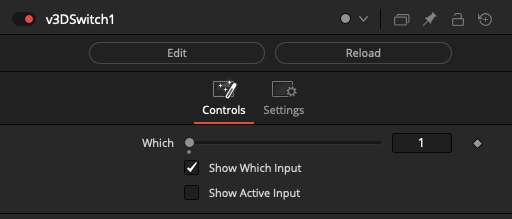
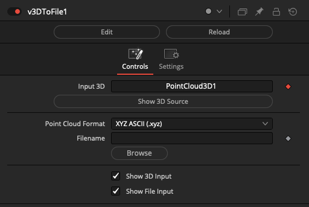
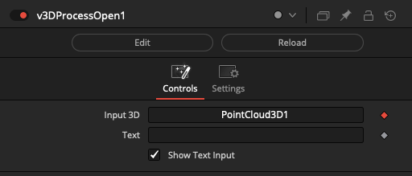
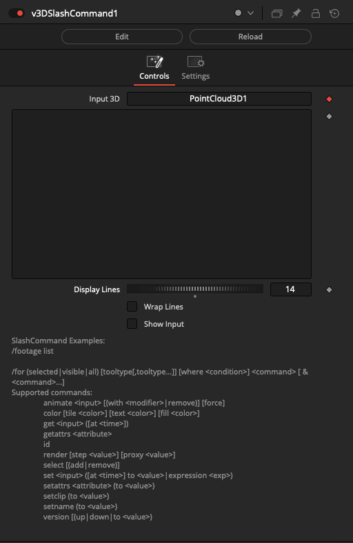
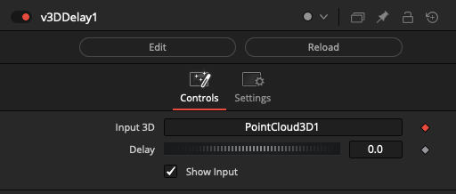

# 3D Nodes

## Node Listing

Flow:
- v3DSwitch

IO:
- v3DToFile

Script:
- v3DProcessOpen
- v3DSlashCommand

Utility:
- v3DDelay

## Node Docs

### v3DSwitch

Switch between Fusion 3D objects

The "Which" control uses an integer number that starts at 1 and counts upwards to define the input connection port that is passed through to the output connection.

If you are using a logical comparator that works on a false/true based 0-1 number range and want to connect it to a v3DSwitch node's Which input connection, that works on a 1+ number range, simply insert a vNumberAdd node set to increment the number upwards by 1.

The "Show Which Input" checkbox is used to hide the Number datatype based input connection for the Which parameter in the Nodes view.

The "Show Active Input" checkbox is used as a visualization and diagnostics mode. When enabled, this control automatically toggles the visibility off for the inactive connection wirelines fed into the switch node. This approach makes it possible to visually see in a quick glance the source comp branch that is selected as the input and used by the Which control. All other inputs will be turned into hidden wireless inputs when not in use.

### v3DToFile

Writes PointCloud3D data from the Fusion 3D node-graph to a file.

Connect a PointCloud3D node's output connection directly to the v3DToFile node:

    PointCloud3D.Output -> v3DToFile.Input

The "Input 3D" connection accepts a wireless link style drag-and-drop attachment of a PointCloud3D node.

Clicking the "Show 3D Source" button will select the connected upstream node in the Nodes view, which displays the node in the Inspector view.

The "Point Cloud Format" ComboControl allows you to select the export format used. Options include: "XYZ ASCII (.xyz)", "PLY ASCII (.ply)", and "PIXAR USDA ASCII (.usda)".

The "Filename" text field supports Vonk vText based connections. This allows you to dynamically generate a filename via data node approaches.

The Filename field contents can include relative PathMap values like "Comp:/" that will be expanded at render time.

If a sub-folder is specified in the filename field, and it is missing at render time, the sub-folders will be re-created automatically when the file is saved to disk. This is helpful if you want to use per--timeline-frame numbered folders in the output filepath.

### v3DProcessOpen

Launch a command-line process via popen.

The "Input 3D" field is used to connect 3D nodes that interact with Fusion's 3D workspace.

The "Text" field is used to define the executable program name and the command-line arguments you want to run from a shell session.

Typically a vTextSubFormat node is used to build the executable command line string that is supplied to the Text input on a vImageProcessOpen node.

If you need cross-platform support, you can use a vTextCreatePlatform or vTextCreatePlatformBrowse node to automatically define the per-OS specific elements like the executable program name and its file extension (.exe, .app, .bat, .sh, .command).

### v3DSlashCommand

Run a Console Fuse SlashCommand as a node

### v3DDelay

Creates a delay while passing a Fusion 3D object.

The "Input 3D" field is used to connect 3D nodes that interact with Fusion's 3D workspace.

The delay effect is measured in seconds. This node is implemented internally using the "bmd.wait()" function.

Among several use cases one can find for a tool that can momentarily pause rendering; it can be used to simulate a slow to render comp task when testing a render farm program. It also has applications when running a command line task via the Vonk 3DProcessOpen node the system requires a momentary pause to work reliably.

