# Array Nodes

## Node Listing

Create:
- vArrayFromCSV
- vArrayFromDataWindow
- vArrayFromJSON
- vArrayFromLuaTable
- vArrayFromMediaIn
- vArrayFromMetadata
- vArrayFromXML
- vArrayFromYAML

Flow:
- vArraySwitch
- vArrayWireless

Key Value:
- vArrayGet
- vArrayGetElement
- vArrayGetIndex
- vArrayGetKey
- vArrayKeys

Script:
- vArrayDoString

Substring:
- vArraySubReturn

Temporal:
- vArrayTimeSpeed
- vArrayTimeStretch

Utility:
- vArrayConcatenate
- vArrayCountElement
- vArrayCountSubElements
- vArrayJoin
- vArrayMatch
- vArraySize
- vArraySlice
- vArrayViewer

## Node Docs

### vArrayFromCSV

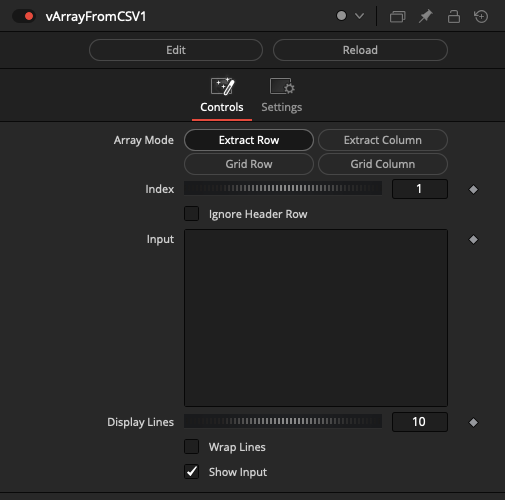

### vArrayFromDataWindow

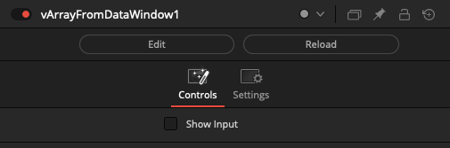

### vArrayFromJSON

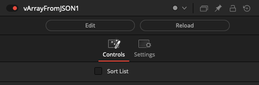

### vArrayFromLuaTable

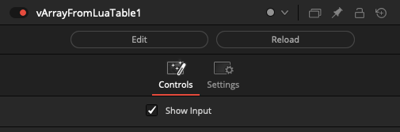

### vArrayFromMediaIn

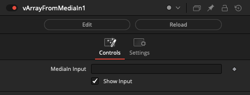

### vArrayFromMetadata

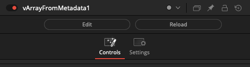

### vArrayFromXML

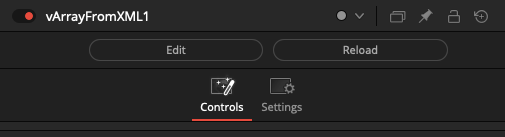

### vArrayFromYAML

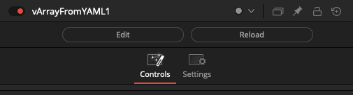

### vArraySwitch

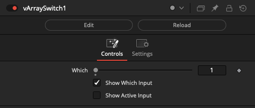

### vArrayWireless

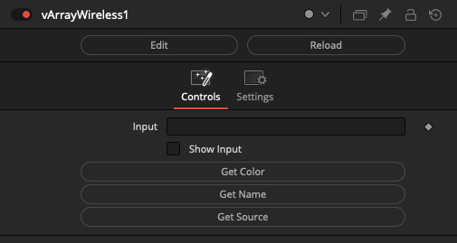

### vArrayGet

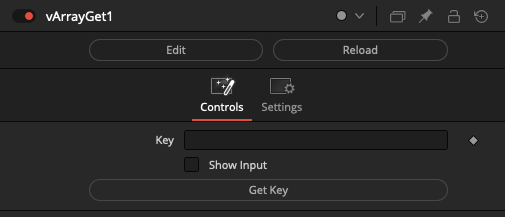

### vArrayGetElement

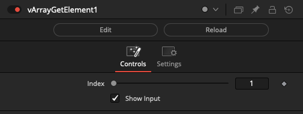

### vArrayGetIndex

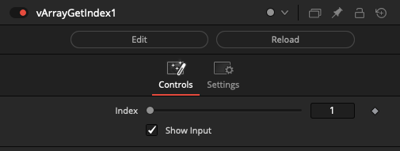

### vArrayGetKey

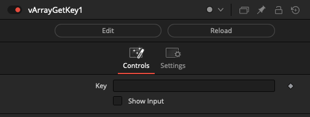

### vArrayKeys

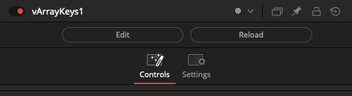

### vArrayDoString

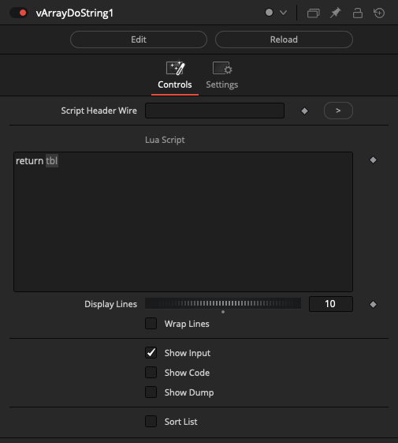

### vArraySubReturn

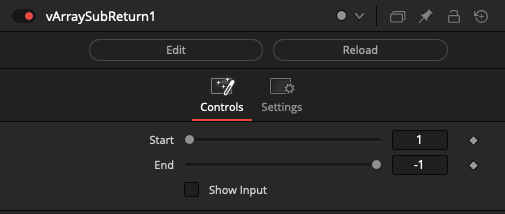

### vArrayTimeSpeed

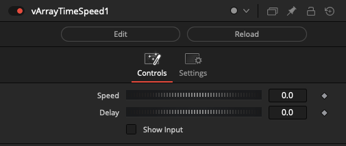

### vArrayTimeStretch

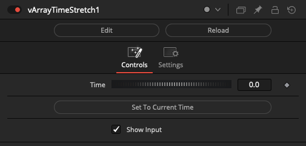

### vArrayConcatenate

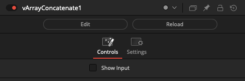

### vArrayCountElement

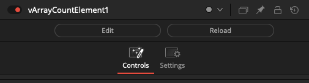

### vArrayCountSubElements

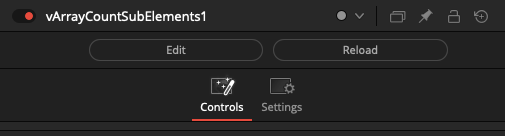

### vArrayJoin

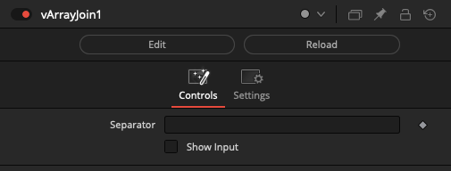

### vArrayMatch

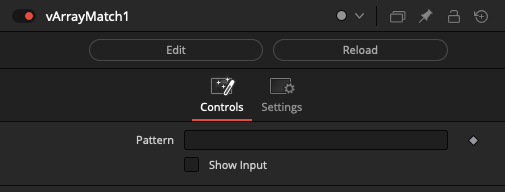

### vArraySize

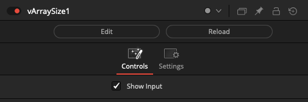

### vArraySlice

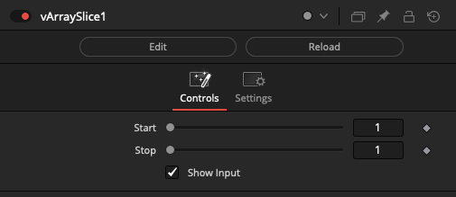

### vArrayViewer

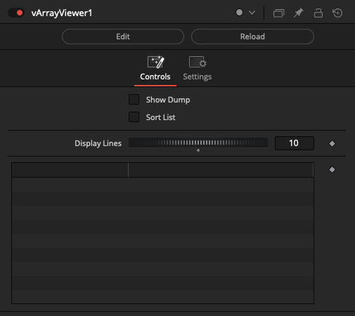
