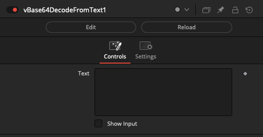
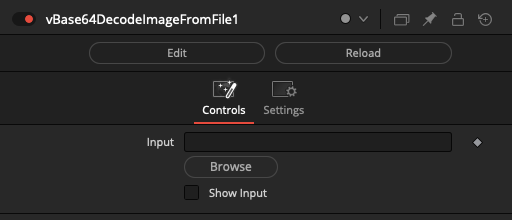
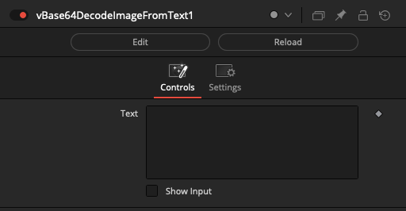
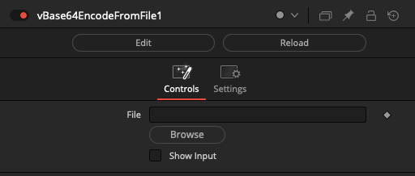
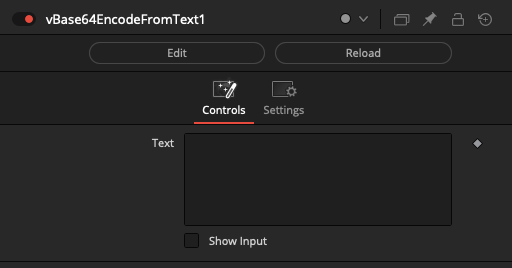
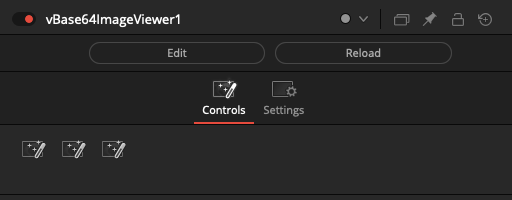
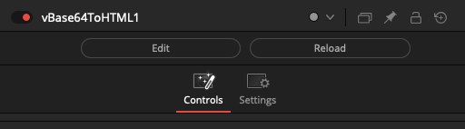

# Base64 Nodes

## Node Listing

Decode:
- vBase64DecodeFromText
- vBase64DecodeImageFromFile
- vBase64DecodeImageFromText

Encode:
- vBase64EncodeFromFile
- vBase64EncodeFromText

Utility:
- vBase64ImageViewer
- vBase64ToHTML

## Node Docs

### vBase64DecodeFromText

Base64 decodes text from a Fusion Text object.

A Base64 formatted block of text is converted back into plain ASCII text that can be passed downstream via a text data type.

The "Text" field is used to specify a block of text that is currently Base64 encoded.

The "Show Input" checkbox allows you to source the Text information from an external Text based data node connection.

### vBase64DecodeImageFromFile

Base64 decodes an image into a file.

A Base64 encoded image is extracted from an external file, and converted into an image data type that can be displayed in the Fusion viewer window context.

The "Input" field is used to specify the filepath to an image that is currently Base64 encoded.

### vBase64DecodeImageFromText

Base64 decodes an image from a Fusion Text object.

This node extracts a Base64 encoded image resource. A Base64 formatted image is extracted from a block of text, and converted into an image data type that can be displayed in the Fusion viewer window context.

The "Text" field is used to specify a block of text that holds Base64 encoded image data.

The "Show Input" checkbox allows you to source the Text information from an external Text based data node connection.

### vBase64EncodeFromFile

Base64 encodes a file into a Fusion Text object.

This node converts the contents of an external file into a Base64 format. This can help with tasks like creating PNG format imagery that can be embedded inside a Fuse GUI as a block of base64 encoded data.

The "File" input field is used to specify the filepath to a document.

### vBase64EncodeFromText

Base64 encodes text into a Fusion Text object.

This node converts a block of ASCII text into a Base64 format.

The "Text" input field is used to specify the source ASCII string to process.

### vBase64ImageViewer

Displays Bas64 encoded image content in the Inspector window.

### vBase64ToHTML

Converts a Base64 encoded PNG image into an inline HTML `` embed.

This node is useful to help prepare an inline Base64 encoded PNG image block. The most common use case for this node is to help fuse coders prepare new icons for use in a fuse's LabelControl element. This supports building Inspector view based icons for your custom fuses or macros.

In your fuse the base64 encoded image element would be placed into a variable that is linked into the LabelControl like this:

    BrandLogo = [[
    

    ]]

    InLabel = self:AddInput(BrandLogo, "Label",{
        LINKID_DataType = "Text",
        INPID_InputControl = "LabelControl",
        LBLC_MultiLine = true,
        INP_External = false,
        INP_Passive = true,
        IC_ControlPage = -1,
        IC_NoLabel = true,
        IC_NoReset = true,
    })

The "`IC_ControlPage = -1,`" tag will move the UI element above the Control Page tabs which makes the same icon visible as you switch between Control Pages.

The end result from adding the Base64 icon to a LabelControl is the ability to create a more polished UI for your fuse.
