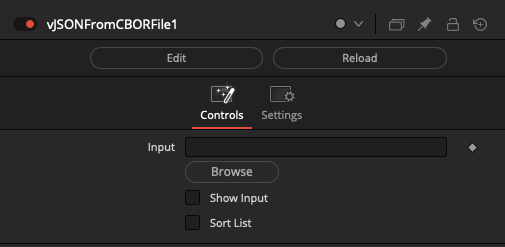
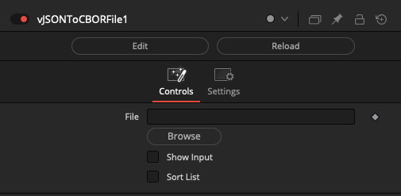
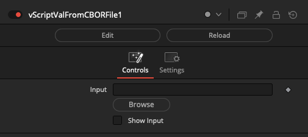
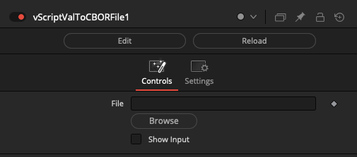

# CBOR Nodes

## Node Listing

JSON:
- vJSONFromCBORFile
- vJSONToCBORFile

ScriptVal:
- vScriptValFromCBORFile
- vScriptValToCBORFile

## Node Docs

### JSON

#### vJSONFromCBORFile

Casts a CBOR binary file into JSON text

#### vJSONToCBORFile

Casts JSON text into a CBOR binary file

### ScriptVal

#### vScriptValFromCBORFile

Reads a Fusion ScriptVal object from a CBOR binary file

#### vScriptValToCBORFile

Writes a Fusion ScriptVal object to a CBOR binary file

