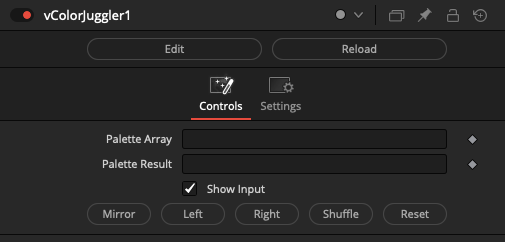

# Color Nodes

## Node Listing

- vColorJuggler
- vColorPermutations
- vColorSet

## Node Docs

### vColorJuggler

A color node that works with a "Palette Array".

### vColorPermutations

A color node that works with a "Palette Array".

### vColorSet

This node was created by Chad Capeland.

The "Palette Array" field allows you to use HTML hex style RGB color values to fill in the background of image elements with the format of "RRGGBB" color values.

A hex number range includes the digits from 0-9 then it continues along to include the extra characters A-F as a representation of a single value.

Palette Array Sample Colors:

    "FFFFFF" = White
    "000000" = Black
    "404040" = 25% Grey
    "808080" = 50% Grey
    "BFBFBF" = 75% Grey
    "FF0000" = Red
    "00FF00" = Green
    "0000FF" = Blue
    "00FFFF" = Cyan
    "FF00FF" = Magenta
    "FFFF00" = Yellow

The "Preserve Alpha" checkbox is used to retain the alpha channel input data.

The "Multiply by Alpha" checkbox is used to perform pre-multiplication math on the imagery. This control will make the transparent areas in the image, as defined by the source alpha channel data, turn black in the RGB channels.

The "Affect Canvas" checkbox is used to extend the color fill operation beyond the current DoD (Domain of Definition) region in the viewer window. When this checkbox is enabled, the background canvas color is pre-defined, if you ever expand the image larger than its original dimensions using a Crop node.

