# Filesystem Nodes

## Node Listing

- vFileSystemChmod
- vFileSystemColorTags
- vFileSystemCreateDir
- vFileSystemDirExists
- vFileSystemFileCopy
- vFileSystemFileExists
- vFileSystemFileOpen
- vFileSystemFileSize
- vFileSystemListFiles
- vFileSystemMapPath
- vFileSystemRemoveDir
- vFileSystemRemoveFile
- vFileSystemRename
- vFileSystemSymlink
- vFileSystemTouch
- vFileSystemURLOpen

## Node Docs

### vFileSystemChmod

Change a file/folder's access permissions

The "File" textfield is used to specify a file or folder path.

The "Mode" control is used to specify the file mode (access permission) as an integer number. This is typically an octal value like "777", "755", etc.

The "Recursive" checkbox allows you to apply the access permission changes to items inside a folder.

Note: This node works on macOS and Linux systems only due to the use of the UNIX "chmod" utility.

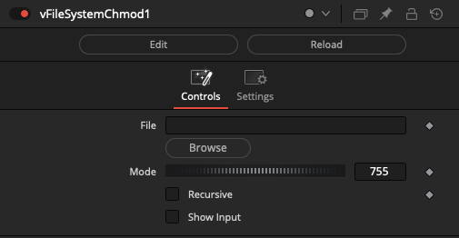

### vFileSystemColorTags

Apply macOS Finder Color tags to a file or folder

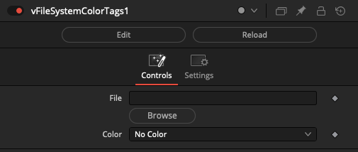

### vFileSystemCreateDir

Creates a new directory

This node will create a new directory. The "Text" field is used to define the desired folder path. Any required intermediate subfolders are created at the same time.

When enabled, the "\[x\] Use Parent Directory" checkbox allows you to enter a filepath into the "Text" field. The base folder path for the specified file will be used for the directory creation task.

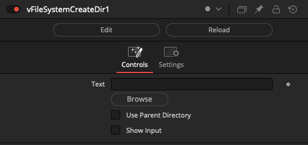

### vFileSystemDirExists

Check if a directory exists

### vFileSystemFileCopy

Copies a file

This node allows you to define a "Source File" that will be copied to the disk-based filepath defined in the "Destination File" field.

The "Create Destination Directory" checkbox is useful if you need to dynamically create the output folder at the same time.

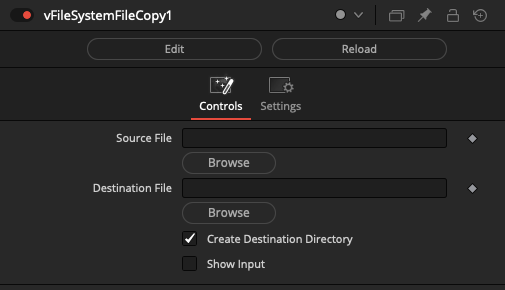

### vFileSystemFileExists

Checks if a file exists

This node reads a filepath defined in the "Text" field and checks if the document exists on disk. The output is the number 0 if the file does not exist, and the number 1 if the file does exist.

If you want to connect this node to a Switch node's "Which" field, you will have to use a vNumberAdd node to offset the value up by one to go from a 0-1 range to a 1-2 range.

### vFileSystemFileOpen

Opens a file

This node will open the "Source File" using the operating system's default file handler. The exact program launched is defined by the file extension.

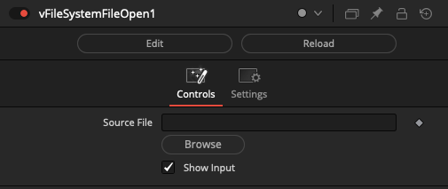

### vFileSystemFileSize

Returns the file size

This node takes a single filename as a text based input. It checks the file size of the document and returns the value in the unit of measure you specify.

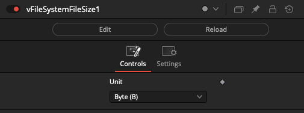

The Unit field supports a wide range of file size output scales including:

"Byte (B)", "Kilobyte (KB)", "Kibibyte (KiB)", "Megabyte (MB)", "Mebibyte (MiB)", "Gigabyte (GB)", "Gibibyte (GiB)", "Terabyte (TB)", and "Tebibyte (TiB)".

The node has two output connections labelled "Output" and "OutputUnit". The "OutputUnit" connection is handy if you need to create a visual overlay with a Text+ node of file size and want to indicate the scale of measure.

### vFileSystemListFiles

Creates a Fusion Text object with a list of the folder contents

This node scans the contents of a folder path defined in the "Text" field. The output is created as a text based multi-line list of files or folders.

The "Pattern" field is used to enter part of the filename that you would like to match in the output. An asterisk character is supported as a wildcard symbol to help with partial filename entry. The Pattern field is typically used to help find files by their extension by entering a value like "`*.exr`", "`*.png`", "`*.mov`", "`*.mp4`", etc.

The Mode control can be set to "List Files" or "List Directories". This allows you to filter the output.

If you enable the "Export Fullpath" checkbox the full absolute filepath for each item is returned. If the checkbox is disabled, only the filename of the resource is returned without any folder path elements included.

The "Expand PathMaps" checkbox will automatically convert any relative filepaths into absolute filepaths on the output.

The "Skip Hidden Files" checkbox is used to ignore hidden files like "`.DS_Store`" and "Thumbs.db" documents, along with UNIX style filenames that start with a period. This helps reduce clutter on file listing based outputs.

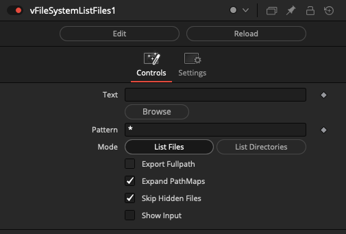

### vFileSystemMapPath

Expands a PathMap

This node automatically converts a relative filepath into an absolute filepath on the output.

This is useful if you want to supply an executable program name, or a filename to an operation like the ProcessOpen node that carries out command-line tasks.

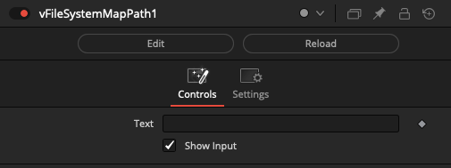

### vFileSystemRemoveDir

Remove a directory

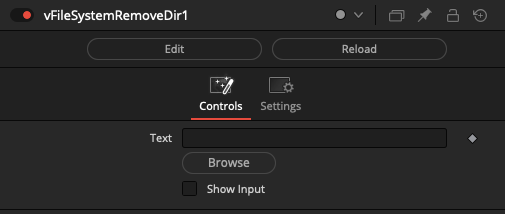

### vFileSystemRemoveFile

Remove a file

### vFileSystemRename

Rename a file or folder. This node can also be used to move files on disk.

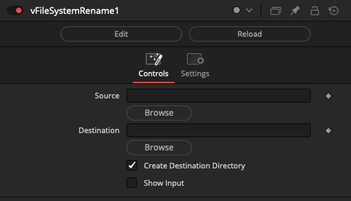

### vFileSystemSymlink

Creates a Symbolic Link to a file or folder on macOS, Linux, and Windows

A Symlink (also known as a Symbolic link) can be thought of as a fancier (and far more posh) Linux file system style version of a Windows shortcut, or a macOS alias. This node creates Symlinks that are known as "soft-links".

If you are working with locally stored and managed temp files on a render node, instead of copying an image sequence, and doubling disk space usage, you can Symlink the files and save your storage for new data. Be sure to document in your workflow notes that these files are interim scratch files that are to be automatically cleaned up/removed, and not to be backed up or managed as assets.

Symlinks can be an attractive technique to use if you are copying a large quantity of files on disk, merely for the purpose of renaming the files temporarily in order to unify the naming convention of an image sequence. This happens when you are trying to manage original "camera named" footage into something tidy and symmetrical. This type of operation is typically done for convenience when doing data processing in a temp folder where you need to separate the intermediate files, and your output files from the source media.

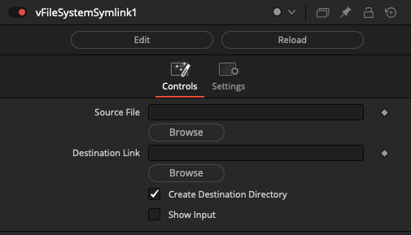

How to tell a file is a Symlink:

**macOS / Linux**

If you are looking at files on disk and trying to tell if it is a symlink or not, you can type "ls -la" into a Terminal window on macOS/Linux and you will see a file is indicated as a soft-link with an arrow listed next to the filename in the output like this:

    % ls -la
    CameraA-Link.0001.jpg -> /Users/vfx/Reactor/Deploy/Comps/KartaVR/WarpStitch/WarpStitch Under the Bridge/Media/CameraA.0001.jpg

In the macOS Finder folder browsing window a symlinked file has an "arrow icon" overlaid over the document icon.

**Windows**

If you are looking at files on disk and trying to tell if it is a symlink or not, you can type "dir" into a Command Prompt window on Windows and you will see a file is indicated as a soft-link with the word "`<SYMLINK>`" in the directory contents listing output like this:

    dir
     Volume in drive C has no label.
     Volume Serial Number is X00X-XX00

     Directory of C:\Users\vfx\AppData\Local\Temp\Vonk\0001

    08/20/2022  10:51 PM    <DIR>       .
    08/20/2022  10:51 PM    <DIR>       ..
    08/20/2022  10:51 PM    <SYMLINK>   CameraA-Link.0001.jpg [C:\ProgramData\Blackmagic Design\Fusion\Reactor\Deploy\Comps\KartaVR\WarpStitch\WarpStitch Under the Bridge\Media\CameraA.0001.jpg]
                1 File(s)           0 bytes
                2 Dir(s)  277,488,435,200 bytes free

In the Windows Explorer folder browsing window a symlinked file has an "arrow icon" overlaid over the document icon as well.

**Windows and Symlink Based File Permissions**

If you want to create a symlink without using Administrator permissions on Windows systems, you need to open the Windows operating system "Settings \> Privacy & security \> For developers" preference to enable the "Developer Mode".

### vFileSystemTouch

Touch a file/folder's creation and modification dates on macOS and Linux

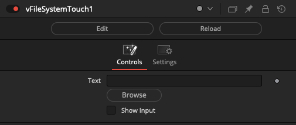

### vFileSystemURLOpen

Opens a file

This node opens a URL in an external web-browser. This is useful if you need to display reference material, or assist a user in checking out an asset from a web-based content management system.

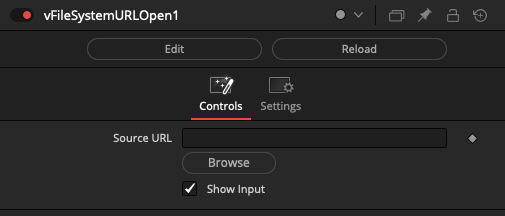
