# Gradient Nodes

## Node Listing

Array:
- vGradientFromArray

Create:
- vGradientCreate

Flow:
- vGradientSwitch
- vGradientWireless

Image:
- vGradientToImage

Number:
- vGradientToNumber

Pixel:
- vGradientFromPixel
- vScriptValFromPixel

Script:
- vGradientDoString

ScriptVal:
- vGradientFromScriptVal
- vGradientToScriptVal

Temporal:
- vGradientAccumulator
- vGradientTimeSpeed
- vGradientTimeStretch

Utility:
- vGradientColorCount
- vGradientMerge
- vGradientNormalizePosition
- vGradientSlice
- vGradientSort
- vGradientSwatchViewer
- vGradientViewer

## Node Docs

### vGradientFromArray

Create a Gradient from an array

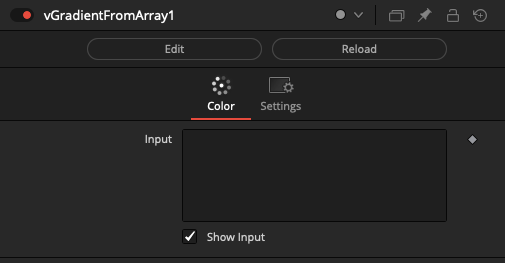

### vGradientCreate

Create a Fusion Gradient object

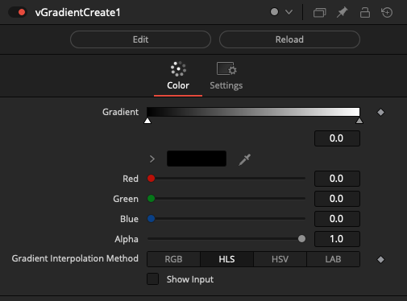

### vGradientSwitch

Switch between Fusion Gradient objects

The "Which" control uses an integer number that starts at 1 and counts upwards to define the input connection port that is passed through to the output connection.

If you are using a logical comparator that works on a false/true based 0-1 number range and want to connect it to a vGradientSwitch node's Which input connection, that works on a 1+ number range, simply insert a vNumberAdd node set to increment the number upwards by 1.

The "Show Which Input" checkbox is used to hide the Number datatype based input connection for the Which parameter in the Nodes view.

The "Show Active Input" checkbox is used as a visualization and diagnostics mode. When enabled, this control automatically toggles the visibility off for the inactive connection wirelines fed into the switch node. This approach makes it possible to visually see in a quick glance the source comp branch that is selected as the input and used by the Which control. All other inputs will be turned into hidden wireless inputs when not in use.

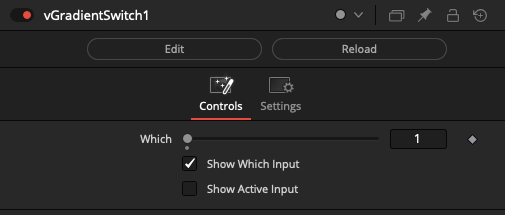

### vGradientWireless

Create wireless links between gradient objects

The vGradientWireless node allows you to connect to other matrix based nodes in your comp without drawing the connection wirelines visually in the Flow/Nodes view. This can be helpful if you need to reduce clutter.

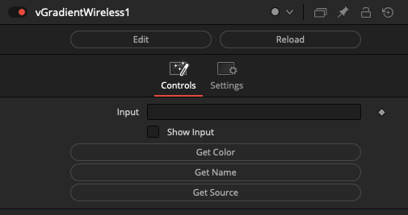

### vGradientToImage

Create an image from a Fusion Gradient object

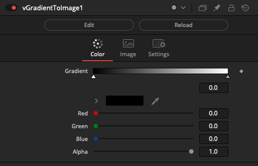

### vGradientToNumber

Return the Gradient color as Numbers

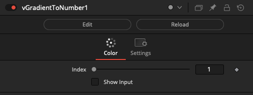

### vGradientFromPixel

Create a Fusion Gradient object from pixels in an image

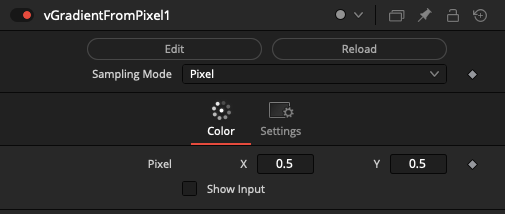

### vScriptValFromPixel

Return a ScriptVal with the RGB color from pixels in an image

### vGradientDoString

Return a Gradient object from running a string of Lua code

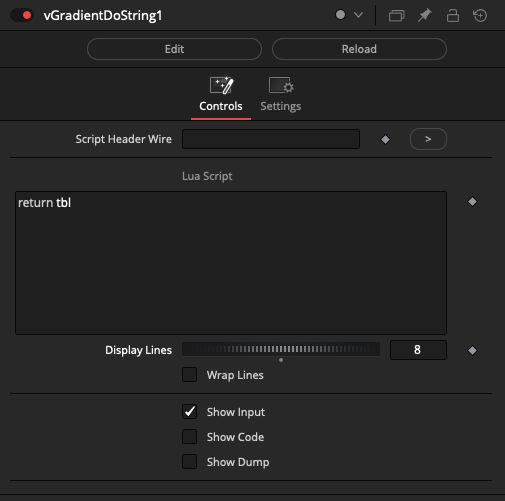

The code you run is expected to return a Gradient formatted Lua table structure:

    return {}

or

    return tbl

or

    return {
        {
            P = 0,
            R = 1,
            G = 0,
            B = 0,
            A = 1.0
        },
        {
            P = 0.5,
            R = 0,
            G = 1,
            B = 0,
            A = 1.0
        },
        {
            P = 1,
            R = 0,
            G = 0,
            B = 1,
            A = 1.0
        }
    }

### vGradientFromScriptVal

Create a Gradient from a ScriptVal object

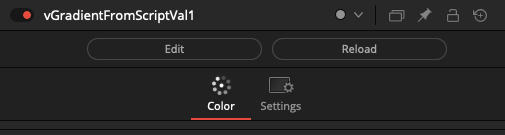

### vGradientToScriptVal

Create a ScriptVal object from a Gradient

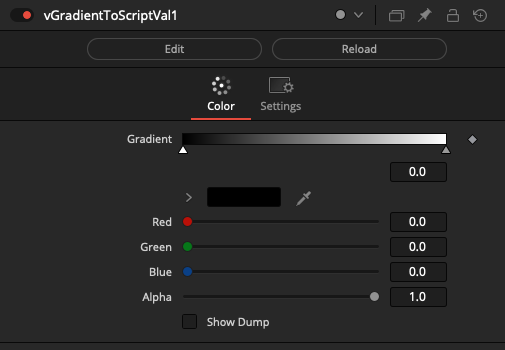

### vGradientAccumulator

Temporally concatenate Gradients

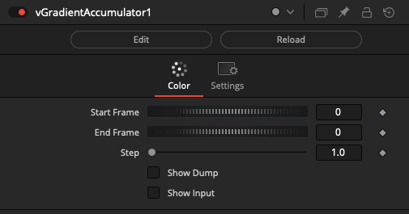

### vGradientTimeSpeed

Time based operation on Gradient objects

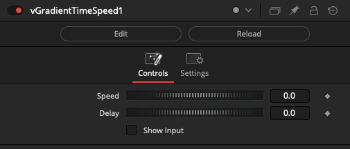

### vGradientTimeStretch

Time based operation on Gradient objects

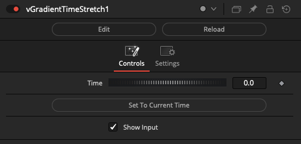

### vGradientColorCount

Return the Gradient color count as a number

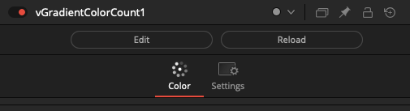

### vGradientMerge

Merge several Gradients into a single output

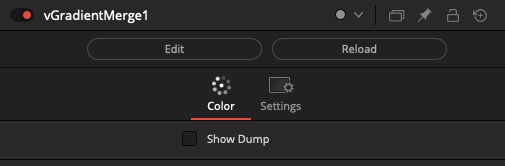

### vGradientNormalizePosition

Normalizes the position of colors in a Gradient to a uniform spacing from 0-1

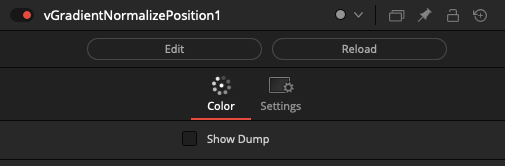

### vGradientSlice

Extracts a range of color indexes from a Gradient

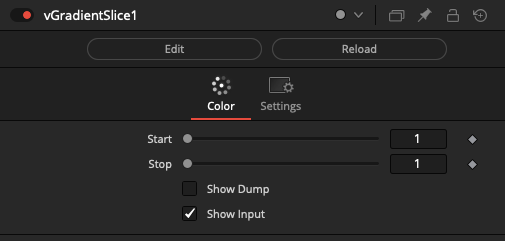

### vGradientSort

Sort the gradient by color

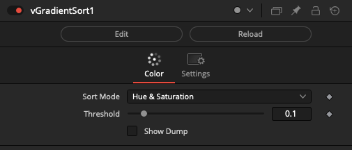

### vGradientSwatchViewer

View a Gradient object in the Inspector

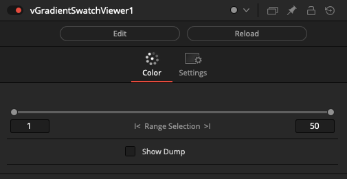

### vGradientViewer

View a Gradient object in the Inspector

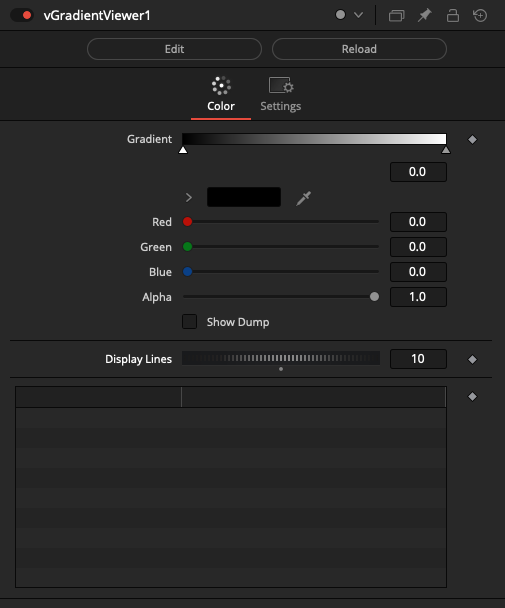
