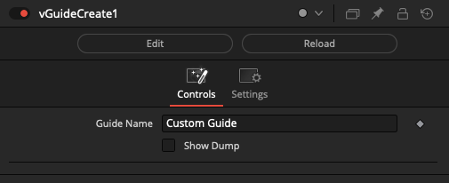
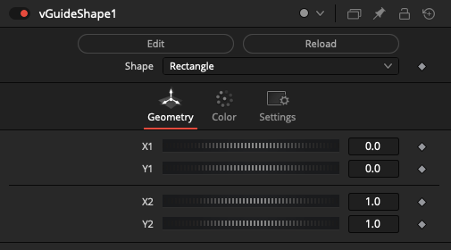
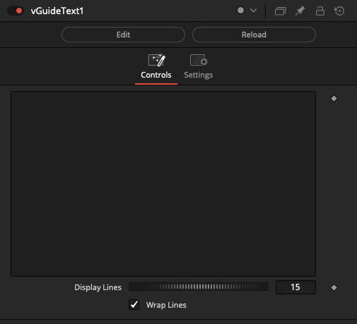
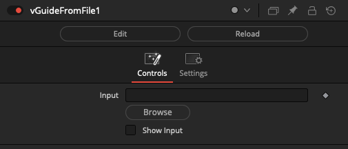
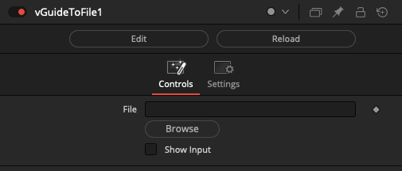

# Guide Nodes

The Vonk guide nodes allow you to create Fusion viewer window guide overlay shapes. These custom guide (*.guide) files are saved to the "Guides:/" PathMap folder.

## Node Listing

Create:
- vGuideCreate
- vGuideShape
- vGuideText

IO:
- vGuideFromFile
- vGuideToFile

## Node Docs

### Create

#### vGuideCreate

Create a vGuide object

#### vGuideShape

Create a new guide element

#### vGuideText

Create a vGuide object from Lua table formatted text

### IO

#### vGuideFromFile

Reads a vGuide object from a file

#### vGuideToFile

Writes a vGuide object to a file

