# Image Nodes

## Node Listing

Create:
- vImageCreateTiles

Flow:
- vImageHook
- vImageRouter
- vImageSwitch
- vImageWireless

IO:
- vImageEXRFromFile
- vImageEXRToFile
- vImageFromClipboard
- vImageFromColor
- vImageFromFile
- vImageFromNet
- vImageFromZip
- vImageToFile

Matte:
- vCryptomatte

Script:
- vImageProcessOpen
- vImageSlashCommand

Shape:
- vImageCreateLine

Utility:
- vImageDelay

## Node Docs

### vImageCreateTiles

Creates an image grid layout from an image sequence

This node makes it easy to create tiled "texture atlas" like grid layouts. If you need the imagery to be scaled down to a specific size, attach a resize or scale node to the image stream before you connect it to the vImageCreateTiles node.

The "Tiles X" control specifies how many images are stacked horizontally.

The "Tiles Y" control specifies how many images are stacked vertically.

The "Reverse X Order" and "Reverse Y Order" checkboxes are used to provide control over the image placement ordering when the grid layout is built. This allows you to start frame 1 at either of the 4 corners of the frame border.

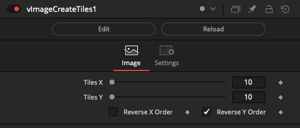

### vImageHook

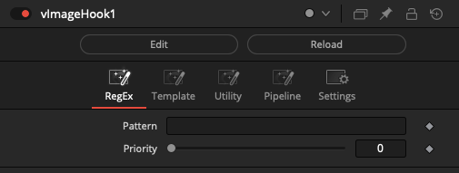

### vImageRouter

Control the output routing of a Fusion Image object

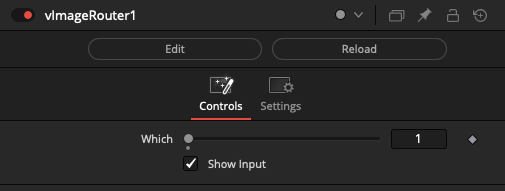

### vImageSwitch

Switches between Fusion Image objects

The "Which" control uses an integer number that starts at 1 and counts upwards to define the input connection port that is passed through to the output connection.

If you are using a logical comparator that works on a false/true based 0-1 number range and want to connect it to a vNumberSwitch node's Which input connection, that works on a 1+ number range, simply insert a vNumberAdd node set to increment the number upwards by 1.

The "Show Which Input" checkbox is used to hide the Number datatype based input connection for the Which parameter in the Nodes view.

The "Show Active Input" checkbox is used as a visualization and diagnostics mode. When enabled, this control automatically toggles the visibility off for the inactive connection wirelines fed into the switch node. This approach makes it possible to visually see in a quick glance the source comp branch that is selected as the input and used by the Which control. All other inputs will be turned into hidden wireless inputs when not in use.

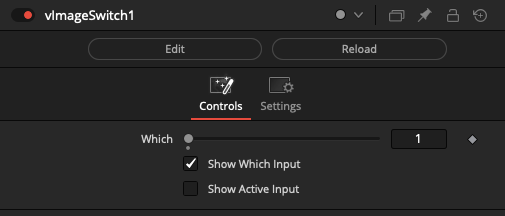

### vImageWireless

The vImageWireless node allows you to connect to other image based nodes in your comp without drawing the connection wirelines visually in the Flow/Nodes view. This can be helpful if you need to reduce clutter.

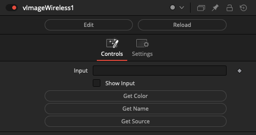

### vImageEXRFromFile

Reads an EXR image from a file

The "Filename" control is used to define the image filename to load. It can be driven externally by a Text data type connection to the node.

The "EXR Part Number" control allows you to select another part element from a multi-part image document. This control can be a bit temperamental so make sure to save the comp document first before changing this value to avoid any loss of time and productivity.

The "Time Mode" control allows you to adjust how the frame number for image sequences is processed.

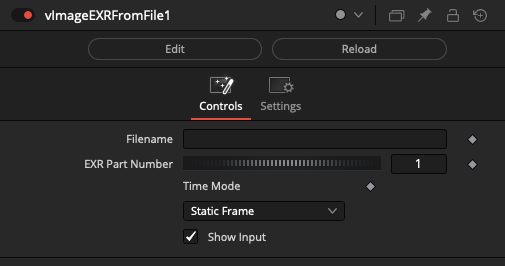

### vImageEXRToFile

Saves an EXR image to disk

The "Filename" control can be driven externally by a Text data type connection to the node.

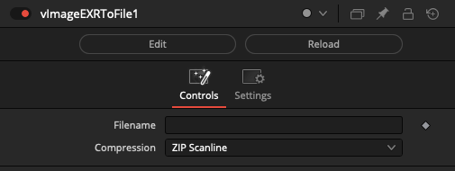

### vImageFromClipboard

Grabs, saves, then loads the current clipboard image

The "Grab" button is used to capture the clipboard contents. It is a handy way to quickly load an image into the compositing node graph without needing to worry about the filename.

This node was designed to work with Fusion Standalone v9 on Windows.

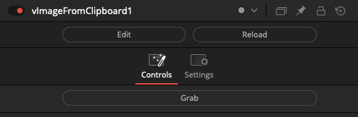

### vImageFromColor

Creates an image from a color

This node can act as a fuse based alternative to a Background node if you need to create a fixed size image and fill the image canvas with a flat color.

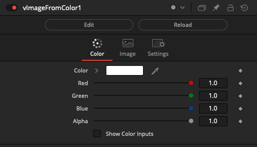

### vImageFromFile

Reads an Image object from a file

The "Input" control is used to define the image filename to load. It can be driven externally by a Text data type connection to the node.

The "Time Mode" control allows you to adjust how the frame number for image sequences is processed.

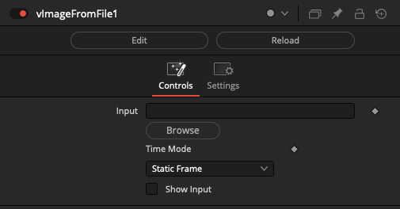

### vImageFromNet

Reads an Image object from a network URL

The "Input" control is used to define the image URL such as an http://, https://, or file:/// based resource. The URL can be driven externally by a Text data type connection to the node.

The "File Type" ComboBox control helps Fusion decode the exact type of content being downloaded when the media is loaded into the Fusion viewer window context.

An example image you can use to test this node is an Eastern Canada weather satellite URL:

    https://weather.gc.ca/data/satellite/goes_ecan_1070_100.jpg

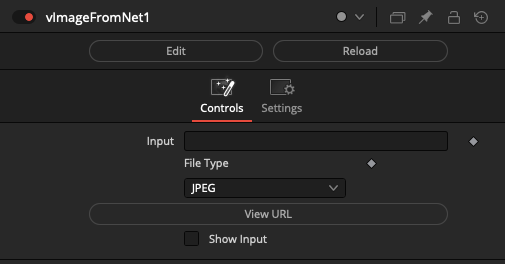

### vImageFromZip

Reads an Image object from a zip archive

This node accesses an image resource that is stored inside a Zip archive using the Fusion v16+/Resolve v15+ based ZipIO library.

The "Zip File" field is used to define the filename of the zip archive.

The "Extract Image" field is used to define the image resource that is stored inside the zip archive.

Both attributes can be driven externally by a Text data type connection to the node.

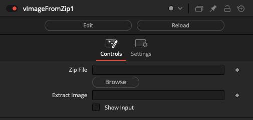

### vImageToFile

Saves a jpg/exr/png/bmp/raw/fusepic image sequence to disk

The "File" control can be driven externally by a Text data type connection to the node.

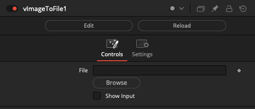

### vCryptomatte

This node is a version of the Cryptomatte fuse that supports an exposed Text data type based input connection to the "Matte List".

This is handy if you want to use the Vonk JSON + Metadata + Array features to create technical animations that browse through every matte element stored in the image's manifest records.

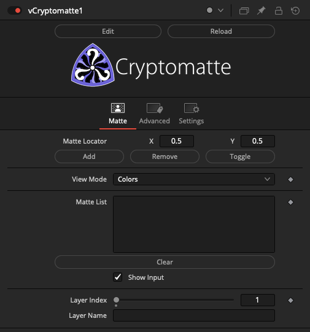

### vImageProcessOpen

Launch a command-line process via popen.

The "Input 3D" field is used to connect 3D nodes that interact with Fusion's 3D workspace.

The "Text" field is used to define the executable program name and the command-line arguments you want to run from a shell session.

Typically a vTextSubFormat node is used to build the executable command line string that is supplied to the Text input on a vImageProcessOpen node.

If you need cross-platform support, you can use a vTextCreatePlatform or vTextCreatePlatformBrowse node to automatically define the per-OS specific elements like the executable program name and its file extension (.exe, .app, .bat, .sh, .command).

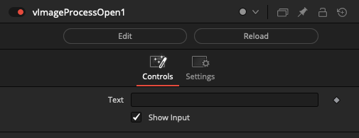

### vImageSlashCommand

Run a Console Fuse SlashCommand as a node

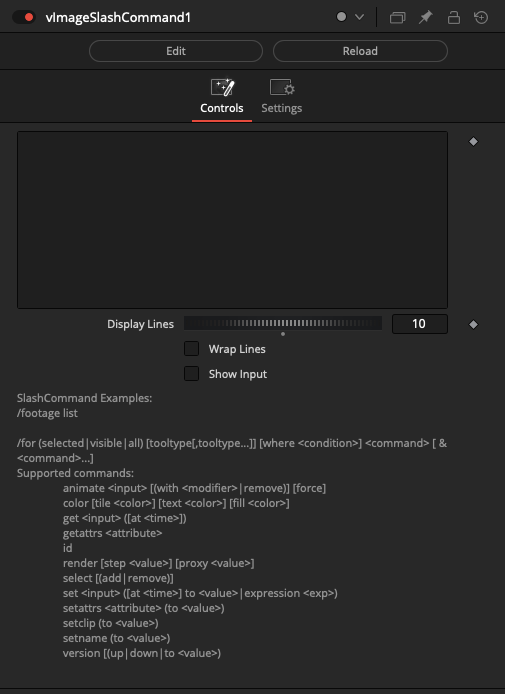

### vImageCreateLine

Creates a Line Shape object

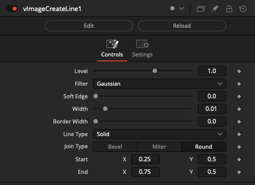

### vImageDelay

Creates a Delay while passing a Fusion Image object

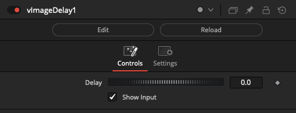

The delay effect is measured in seconds. This node is implemented internally using the "`bmd.wait()`" function.

Among several use cases one can find for a tool that can momentarily pause rendering; it can be used to simulate a slow to render comp task when testing a render farm program. It also has applications when running a command line task via the Vonk ProcessOpen node and the system requires a momentary pause.
