# JSON Nodes

## Node Listing

Array:
- vJSONFromArray

Flow:
- vJSONSwitch
- vJSONWireless

IO:
- vJSONFromFile
- vJSONFromNet
- vJSONToFile

Key Value:
- vJSONGet
- vJSONGetElement
- vJSONSet

Script:
- vJSONDoString

Temporal:
- vJSONTimeSpeed
- vJSONTimeStretch

Utility:
- vJSONCountElement
- vJSONViewer

## Node Docs

### vJSONFromArray

Casts a JSON Array to JSON Text

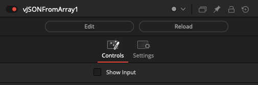

### vJSONSwitch

Switch between Fusion JSON text objects

The "Which" control uses an integer number that starts at 1 and counts upwards to define the input connection port that is passed through to the output connection.

If you are using a logical comparator that works on a false/true based 0-1 number range and want to connect it to a vJSONSwitch node's Which input connection, that works on a 1+ number range, simply insert a vNumberAdd node set to increment the number upwards by 1.

The "Show Which Input" checkbox is used to hide the Number datatype based input connection for the Which parameter in the Nodes view.

The "Show Active Input" checkbox is used as a visualization and diagnostics mode. When enabled, this control automatically toggles the visibility off for the inactive connection wirelines fed into the switch node. This approach makes it possible to visually see in a quick glance the source comp branch that is selected as the input and used by the Which control. All other inputs will be turned into hidden wireless inputs when not in use.

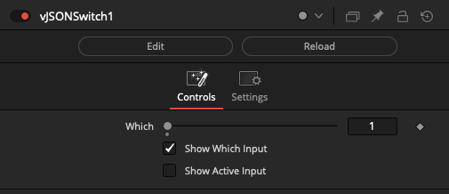

### vJSONWireless

Create wireless links between JSON text objects

The vJSONWireless node allows you to connect to other USD based nodes in your comp without drawing the connection wirelines visually in the Flow/Nodes view. This can be helpful if you need to reduce clutter.

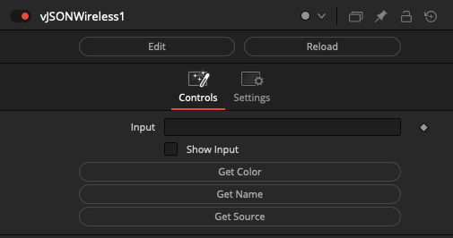

### vJSONFromFile

Reads a JSON string from a file

The "Input" text field is used to specify the disk-based filename of the JSON document to be read.

The JSON file will be loaded when the node is viewed/rendered. The contents of the JSON file is returned via a text based data type output connection on the node.

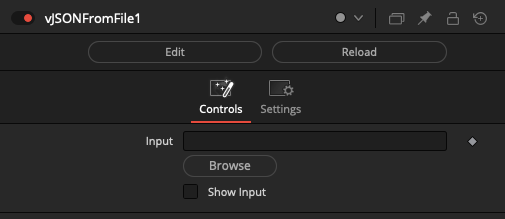

### vJSONFromNet

Reads a JSON string from a network URL

The network-based JSON resource downloading functionality provided by this node makes it possible to drive a composite from an external cloud based datasource.

This means IoT (Internet of Things) electronic sensors, sports statistics, financial data, or any other web enabled datasource can be used on-the-fly to supply Text, Number, Matrix, Array, or other values to nodes in the comp.

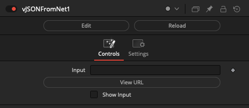

### vJSONToFile

Writes a JSON string into a file

The "File" text field is used to specify the filename of the JSON document to be written to disk.

The JSON file will be saved when the node is viewed/rendered. The contents of the JSON file is sourced from the text based input connection on the node.

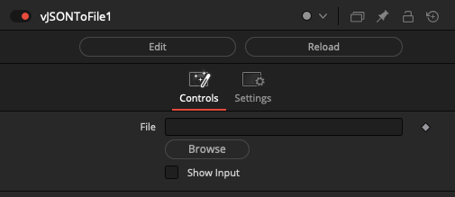

### vJSONGet

Gets the value of a JSON key

The "Key" text-field is used to select and isolate a specific entry from a JSON file.

The output from the vJSONGet node is a text based data type.

You can stack several vJSONGet nodes in a row to browse upwards in the hierarchy of a nested JSON structure.

It is possible to translate this text based output from this node into numerical values via the vNumberFromText node. This is a useful step if you want to perform math operations downstream of this node, or if you need to connect a numerical value to an Inspector based attribute on another node.

### vJSONGetElement

Gets the element of a JSON array

The "Index" control is used to access individual entries from a JSON array type of object.

The node expects a text based JSON array object as the input.

The output from the vJSONGetElement node is a text based data type. It is possible to translate the text based output from this node into numerical values via the vNumberFromText node.

The first item is accessed at Index position 1.

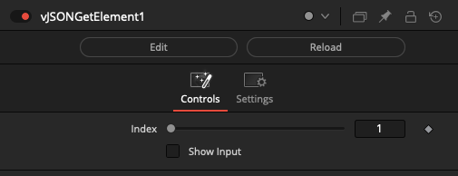

### vJSONSet

Sets a new key value pair in a JSON table

The "Key" text-field lets you enter the name of the JSON element to be modified/inserted. The 2nd text field is used for the "Value" field which holds the actual data you want to store.

The vJSONSet node makes it possible to create new JSON data structures that can be saved to disk using a vJSONToFile node.

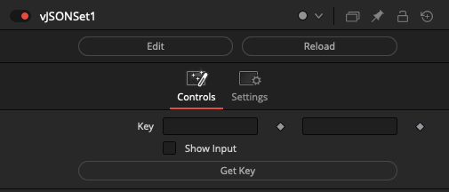

### vJSONDoString

Return JSON text from running a string of Lua code

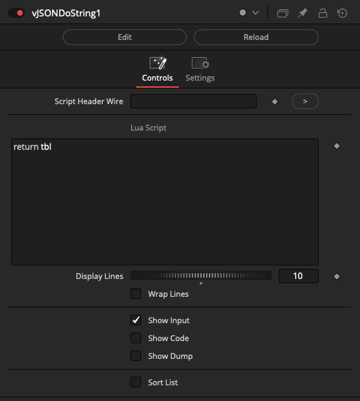

### vJSONTimeSpeed

Time based operation on JSON

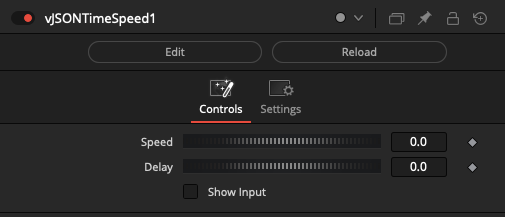

### vJSONTimeStretch

Time based operation on JSON

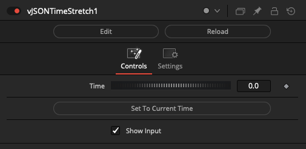

### vJSONCountElement

Counts the elements in a JSON array

The node expects a text based JSON array object as the input.

This node returns a number data type that indicates how many array elements exist at this level in a JSON hierarchy. This return value could be used to drive a vTextAccumulator node's EndFrame attribute if you wanted to increment through each of the array elements.

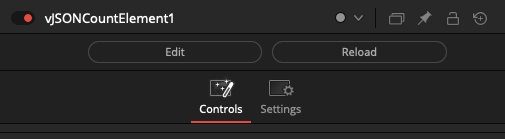

### vJSONViewer

View JSON text in the Inspector

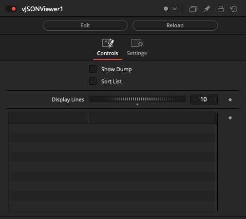
