# Matrix Nodes

## Node Listing

Array:
- vMatrixFromArray

Color:
- vMatrixColorTransform

Create:
- vMatrixCreate

Flow:
- vMatrixLink
- vMatrixSwitch
- vMatrixWireless

Operators:
- vMatrixDeterminant
- vMatrixDivide
- vMatrixDivideNumber
- vMatrixInvert
- vMatrixMultiply

Temporal:
- vMatrixTimeSpeed
- vMatrixTimeStretch

Transform:
- vMatrixFromRotation
- vMatrixFromScale
- vMatrixFromTranslation
- vMatrixToEuler
- vMatrixToRotation
- vMatrixToScale
- vMatrixToTranslation
- vMatrixTranspose

Utility:
- vMatrixConcatenateHorizontal
- vMatrixConcatenateVertical
- vMatrixSlice
- vMatrixViewer

## Node Docs

### vMatrixFromArray

Creates a matrix from an array

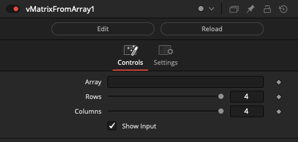

### vMatrixColorTransform

Animatible/Modifiable ColorMatrix

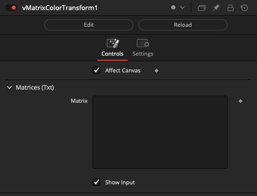

### vMatrixCreate

Creates a 4x4 matrix

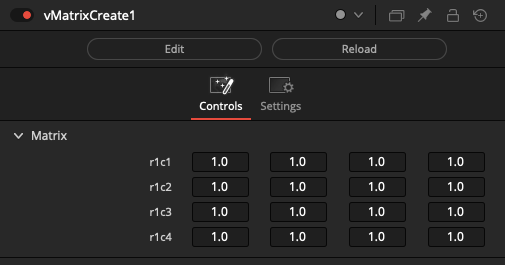

### vMatrixLink

Links to a matrix

This allows you to access a matrix that is stored using image metadata.

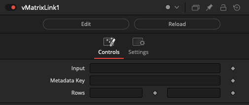

### vMatrixSwitch

Switch between vMatrix objects

The "Which" control uses an integer number that starts at 1 and counts upwards to define the input connection port that is passed through to the output connection.

If you are using a logical comparator that works on a false/true based 0-1 number range and want to connect it to a vMatrixSwitch node's Which input connection, that works on a 1+ number range, simply insert a vNumberAdd node set to increment the number upwards by 1.

The "Show Which Input" checkbox is used to hide the Number datatype based input connection for the Which parameter in the Nodes view.

The "Show Active Input" checkbox is used as a visualization and diagnostics mode. When enabled, this control automatically toggles the visibility off for the inactive connection wirelines fed into the switch node. This approach makes it possible to visually see in a quick glance the source comp branch that is selected as the input and used by the Which control. All other inputs will be turned into hidden wireless inputs when not in use.

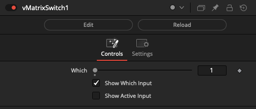

### vMatrixWireless

Create wireless links between vMatrix objects

The vMatrixWireless node allows you to connect to other matrix based nodes in your comp without drawing the connection wirelines visually in the Flow/Nodes view. This can be helpful if you need to reduce clutter.

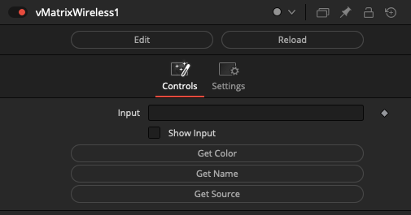

### vMatrixDeterminant

Calculates the determinant of a matrix

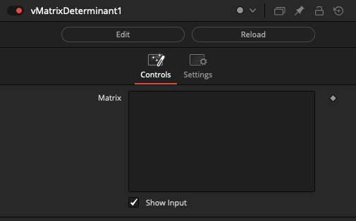

### vMatrixDivide

Divides a matrix by a number

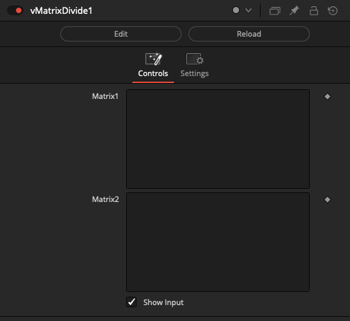

### vMatrixDivideNumber

Divides a matrix by a number

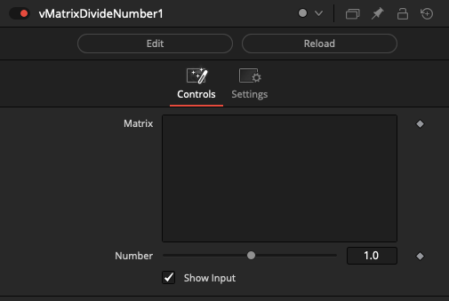

### vMatrixInvert

Inverts a matrix

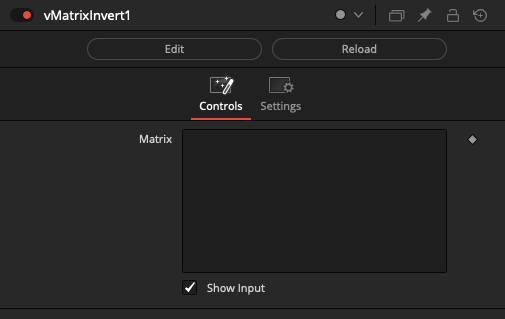

### vMatrixMultiply

Multiplies two matrices

It is possible combine separate rotation, translation, and scale matrices using a series of connected vMatrixMultiply nodes.

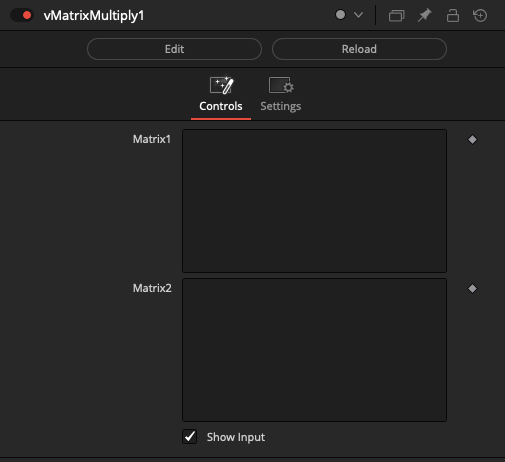

### vMatrixTimeSpeed

Time based operation on a vMatrix

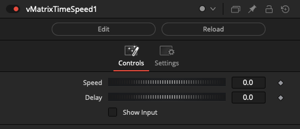

### vMatrixTimeStretch

Time based operation on a vMatrix

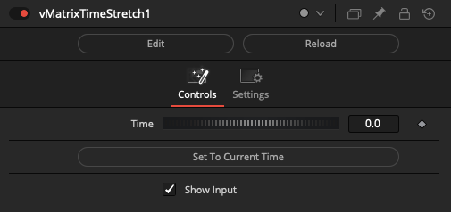

### vMatrixFromRotation

Creates a rotation matrix

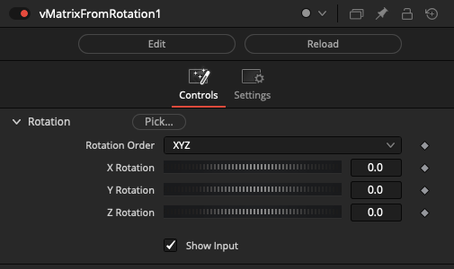

### vMatrixFromScale

Creates a scale matrix

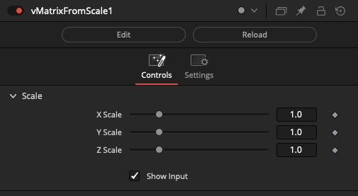

### vMatrixFromTranslation

Creates a translation matrix

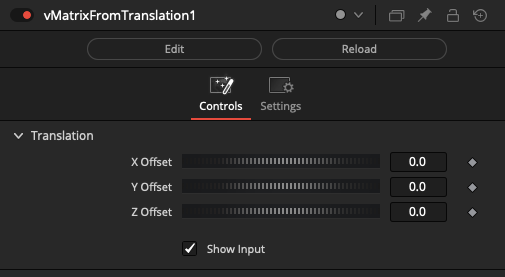

### vMatrixToEuler

Converts a matrix to [Euler angles](https://en.wikipedia.org/wiki/Euler_angles)

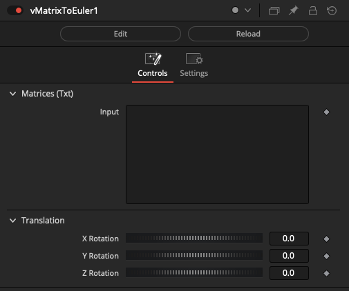

### vMatrixToRotation

Decomposes a rotation from a matrix in [Euler angles](https://en.wikipedia.org/wiki/Euler_angles). This returns XYZ rotation values from a 4x4 vMatrix input.

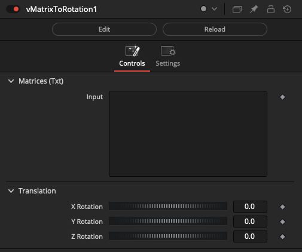

### vMatrixToScale

Decomposes scale from a matrix. This returns XYZ scale values from a 4x4 vMatrix input.

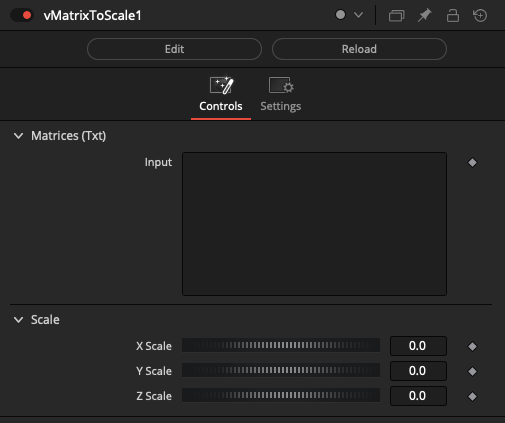

### vMatrixToTranslation

Decomposes translation from a matrix. This returns XYZ rotation values from a 4x4 vMatrix input.

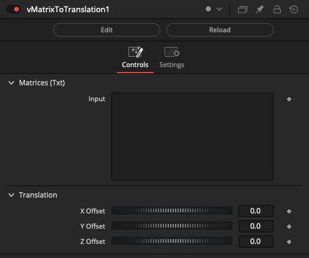

### vMatrixTranspose

Transposes a matrix

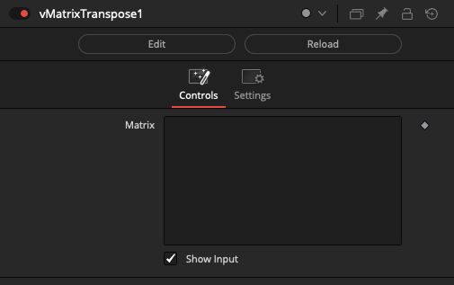

### vMatrixConcatenateHorizontal

Concatenates two matrices horizontally

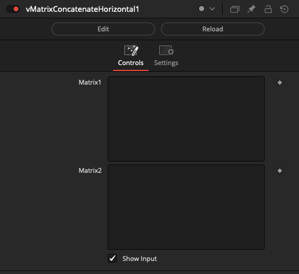

### vMatrixConcatenateVertical

Concatenates two matrices vertically

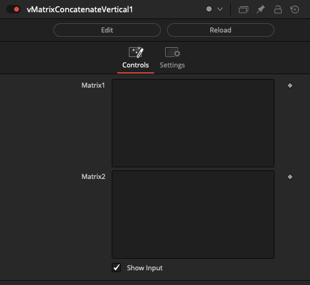

### vMatrixSlice

Slices a matrix

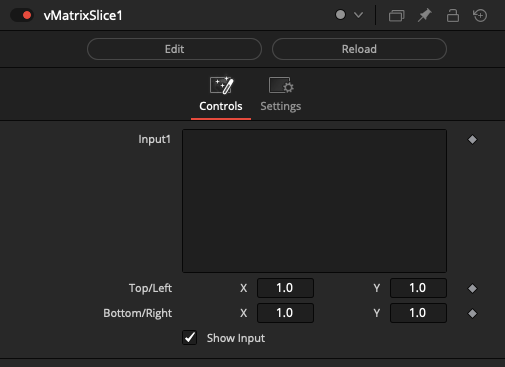

### vMatrixViewer

View vMatrix content in the Inspector

This allows you to see the XYZ translation, rotation, and scale values for a vMatrix.

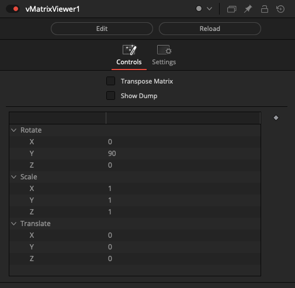
