# Number Nodes

## Node Listing

Array:
- vNumberFromArray

Comp:
- vNumberCompCurrentTime
- vNumberCompFPS
- vNumberCompFrameFormat
- vNumberCompGlobalEnd
- vNumberCompGlobalStart
- vNumberCompProxy
- vNumberCompProxyScale
- vNumberCompRenderEnd
- vNumberCompRenderStart
- vNumberCompReqTime

Create:
- vNumberCreate
- vNumberCreateArch
- vNumberCreateBool
- vNumberCreateMultiButton
- vNumberCreatePlatform
- vNumberCreateRandom
- vNumberIntegerCreate
- vNumberRange

Flow:
- vNumberSwitch
- vNumberWireless

Logic:
- vNumberAnd
- vNumberEqual
- vNumberGreater
- vNumberGreaterEqual
- vNumberLess
- vNumberLessEqual
- vNumberNot
- vNumberNotEqual
- vNumberOr
- vNumberTernary

Matrix:
- vNumberFromMatrix
- vNumberToMatrix

Operators:
- vNumberAbsolute
- vNumberAdd
- vNumberCeil
- vNumberClamp
- vNumberDivide
- vNumberEase
- vNumberFactorial
- vNumberFloor
- vNumberFractional
- vNumberIntegral
- vNumberMax
- vNumberMin
- vNumberMix
- vNumberModulus
- vNumberMultiply
- vNumberPartialPermutation
- vNumberPower
- vNumberReciprocal
- vNumberSign
- vNumberSmoothstep
- vNumberSquareRoot
- vNumberStep
- vNumberSubtract

Resolve:
- vNumberResolvePID
- vNumberResolveTimelineFPS

Script:
- vNumberDoString
- vNumberProcessOpen
- vNumberSlashCommand

Temporal:
- vNumberTimeSpeed
- vNumberTimeStretch
- vNumberXSheet

Text:
- vNumberFromCSV
- vNumberFromText
- vNumberXYZFromCSV

Trigonometry:
- vNumberArcCosine
- vNumberArcSine
- vNumberArcTangent
- vNumberTwoArgumentArcTangent
- vNumberCosine
- vNumberDegreesToRadians
- vNumberHyperbolicCosine
- vNumberHyperbolicSine
- vNumberHyperbolicTangent
- vNumberRadiansToDegrees
- vNumberSine
- vNumberTangent

Utility:
- vNumberDelay
- vNumberEndPID
- vNumberViewer

Vector:
- vNumberFromVector

## Node Docs

### Array

#### vNumberFromArray

Creates a Number from an array

The "Index" control allows you to select the array item (cell) to return as a number based value.

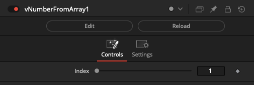

### Comp

#### vNumberCompCurrentTime

Returns the comp's Current Time

The current time represents the point where the timeline playhead is positioned regardless of any temporal effects that might be happening.

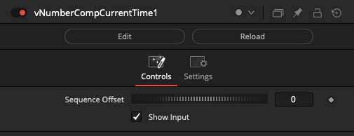

#### vNumberCompFPS

Returns the comp's frame rate

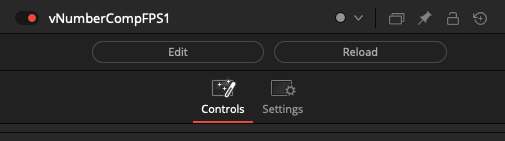

#### vNumberCompFrameFormat

Returns the comp's frame format

This node outputs a Width and Height parameter derived from the current comp's FrameFormat settings.

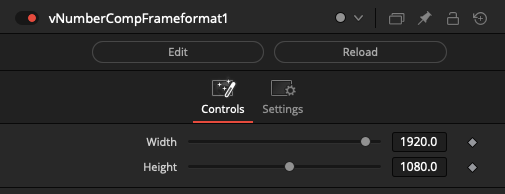

#### vNumberCompGlobalEnd

Returns the comp's Global End

This is the last frame of the full Fusion timeline range. This number is not always set to the same range as the render end timeline control.

#### vNumberCompGlobalStart

Returns the comp's Global Start

This is the first frame of the full Fusion timeline range. This number is not always set to the same range as the render start timeline control.

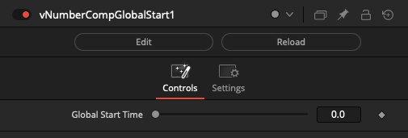

#### vNumberCompProxy

Returns the comp's Proxy state

The True and False inputs on the node let you define a custom value that is returned for the Proxy logic state.

Setting the True and False inputs to a value of "True = 2" & "False = 1" makes it easier to directly connect the vNumberCompProxy output to a Switch node's Which input that starts the first switchable input connection as "Which = 1".

Note: There is a slight instability that can occur with this node if you rapidly toggle the "Prx" state On/Off while playing back footage in the Fusion timeline with the vNumberCompProxy node active. A solution to this issue is being explored.

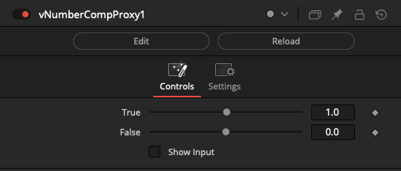

#### vNumberCompProxyScale

Returns the comp's Proxy Scale

#### vNumberCompRenderEnd

Returns the comp's Render End

This is the last renderable frame when a batch render is carried out.

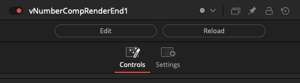

#### vNumberCompRenderStart

Returns the comp's Render Start

This is the first renderable frame when a batch render is carried out.

#### vNumberCompReqTime

Returns the comp's request time

This is the currently requested frame that is being processed at render time. It supports temporal effects like the vTextAccumulator node that iterates over a frame duration.

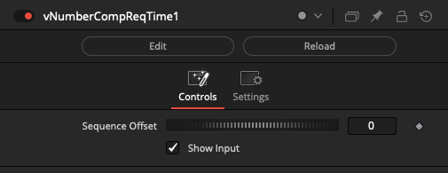

### Create

#### vNumberCreate

Creates a Fusion Number object

This node is the starting point for most number data type based node graphs. The output is a floating point number that can go up to "1e+38".

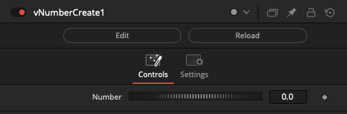

#### vNumberCreateArch

Creates a unique Fusion Number object per CPU architecture

If the fuse is rendered on a 32-bit Intel/AMD CPU based system a value of 1 is returned. (Note: Fusion Studio v8+ were only released as 64-bit builds so it is of low likelihood you are going to see an x86 value returned from this node.)

If the fuse is rendered on a 64-bit Intel/AMD CPU based system a value of 2 is returned.

If the fuse is rendered on an ARM 64-bit system, like an Apple Silicon CPU, a value of 3 is returned.

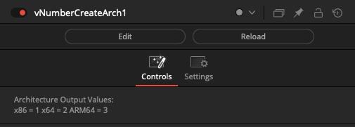

#### vNumberCreateBool

Returns a 0-1 range integer Fusion Number object

This node uses a checkbox control to output a true (1) or false (0) logic state.

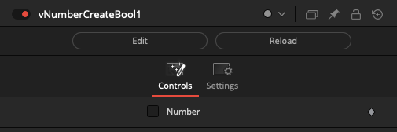

Usage tip: This node's boolean like checkbox value can be used to drive a Switch node's "Which" control. This checkbox control makes it a single click operation in a macro node (MacroOperator or GroupOperator) to be able to toggle between an input1 / input2 connection. To do this you simply have to insert an vNumberAdd node, (that is set to increment the value up by 1), between the vNumberCreate node's output (0-1) logic state, and the Switch node:

    vNumberCreateBool.Output > vNumberAdd.Term1 > Switch.Which

Node setting to change:

    vNumberAdd.Term2 = 1

#### vNumberCreateMultiButton

Creates a Fusion Number object using a MultiButton control for the input

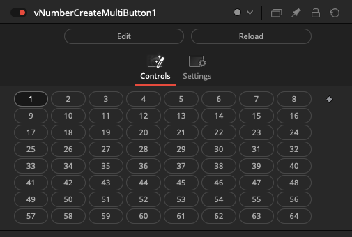

#### vNumberCreatePlatform

Creates a unique Fusion Number object per OS platform

If the fuse is rendered on a macOS system a value of 1 is returned.

If the fuse is rendered on a Windows system a value of 2 is returned.

If the fuse is rendered on a Linux system a value of 3 is returned.

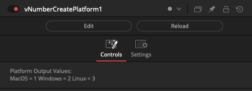

#### vNumberCreateRandom

Creates a Fusion Number object

This node uses a pseudo-random number generator to create a number that fits within the upper and lower range that is defined. If you animate the seed value, the number will change on each frame.

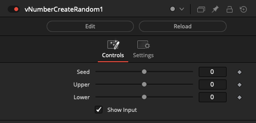

#### vNumberIntegerCreate

Creates an integer Fusion Number object

This node creates whole number based values with no floating point decimal based component. This node is an excellent choice if you want to drive the "Which" attribute on any of the Switch nodes available in Vonk.

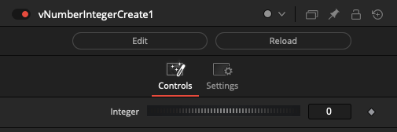

#### vNumberRange

Creates a Fusion Number object

The range node creates a list of numbers that vary between the "From" and "To" values. The "Step" control increases the incremental rate of change in the output.

If the "From" value was set to 0, and the "To" value was set to 5 the output from the node would be formatted like:

\[0,1,2,3,4,5\]

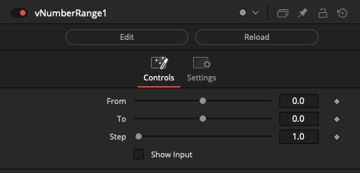

### Flow

#### vNumberSwitch

Switches between Fusion Number objects

The "Which" control uses an integer number that starts at 1 and counts upwards to define the input connection port that is passed through to the output connection.

If you are using a logical comparator that works on a false/true based 0-1 number range and want to connect it to a vNumberSwitch node's "Which" input connection, that works on a 1+ number range, simply insert a vNumberAdd node set to increment the number upwards by 1.

The "Show Which Input" checkbox is used to hide the Number datatype based input connection for the Which parameter in the Nodes view.

The "Show Active Input" checkbox is used as a visualization and diagnostics mode. When enabled, this control automatically toggles the visibility off for the inactive connection wirelines fed into the switch node. This approach makes it possible to visually see in a quick glance the source comp branch that is selected as the input and used by the Which control. All other inputs will be turned into hidden wireless inputs when not in use.

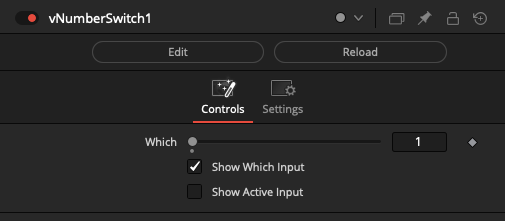

#### vNumberWireless

The vNumberWireless node allows you to connect to other number based nodes in your comp without drawing the connection wirelines visually in the Flow/Nodes view. This can be helpful if you need to reduce clutter.

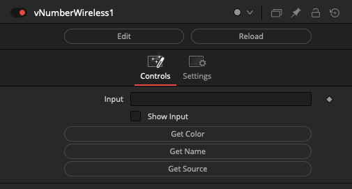

### Logic

#### vNumberAnd

Performs a logical AND operation on two numbers

#### vNumberEqual

Compares two numbers to see if they are equal

A zero (false) or one (true) based number is returned from the comparator operation.

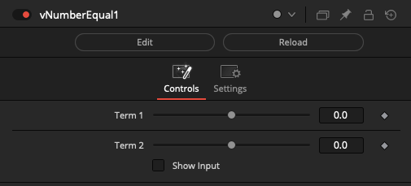

#### vNumberGreater

Compares two numbers to see if Term 1 is greater than Term 2

A zero (false) or one (true) based number is returned from the comparator operation.

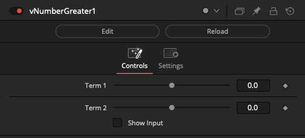

#### vNumberGreaterEqual

Compares two numbers to see if Term 1 is greater than or equal to Term 2

A zero (false) or one (true) based number is returned from the comparator operation.

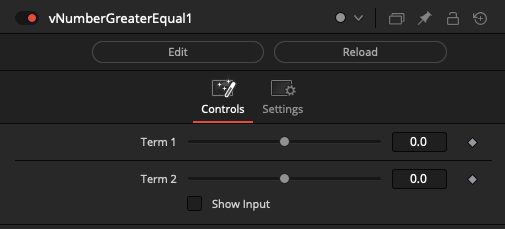

#### vNumberLess

Compares two numbers to see if Term 1 is less than Term 2

A zero (false) or one (true) based number is returned from the comparator operation.

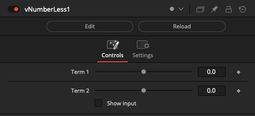

#### vNumberLessEqual

Compares two numbers to see if Term 1 is less than or equal to Term 2

A zero (false) or one (true) based number is returned from the comparator operation.

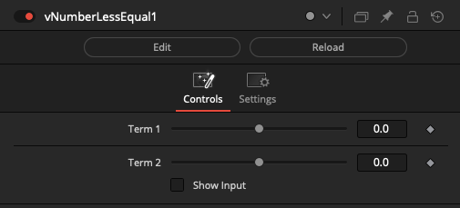

#### vNumberNot

Performs a logical NOT operation on a number

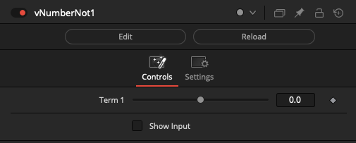

#### vNumberNotEqual

Compares two numbers to see if they are not equal

A zero (false) or one (true) based number is returned from the comparator operation.

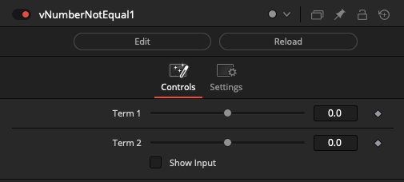

#### vNumberOr

Performs a logical OR operation on two numbers

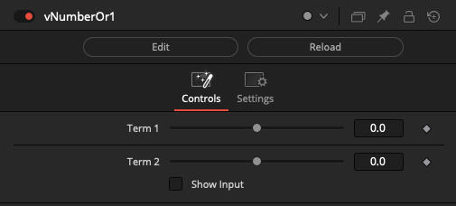

#### vNumberTernary

Compare a value and return one of two possible results

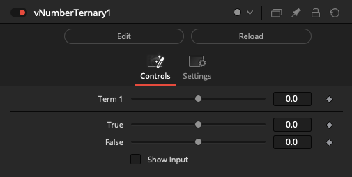

### Matrix

#### vNumberFromMatrix

Returns a number from a matrix

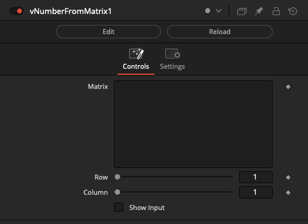

#### vNumberToMatrix

Returns a matrix from a number

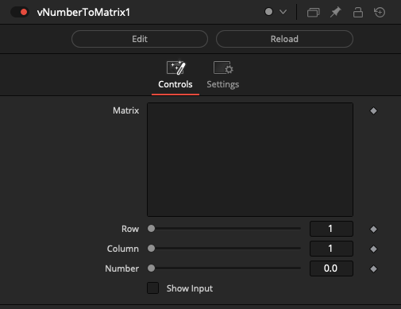

### Operators

#### vNumberAbsolute

Returns the absolute value of a number

This node is handy if you need to remove the negative sign (-) element from a value so you only have the positive component of the number remaining.

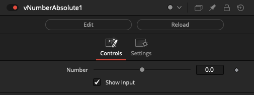

#### vNumberAdd

Returns the sum of two numbers

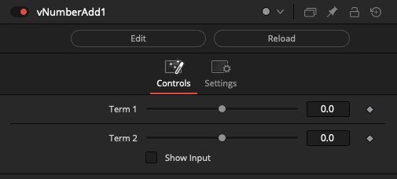

#### vNumberCeil

Returns the integer no greater than a number

This provides a way to round a floating point number to a whole number (an integer value) by rounding upwards to remove the digits to the right of the decimal place.

Ceil (ceiling) is the counterpoint to the floor rounding method.

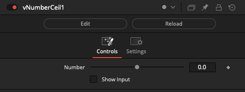

#### vNumberClamp

Clamps a number to specific boundaries

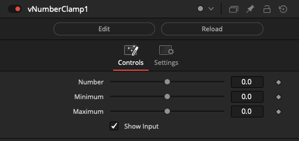

#### vNumberDivide

Returns the quotient of two numbers

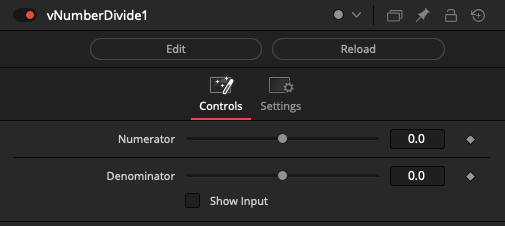

#### vNumberEase

Performs a specific interpolation between two numbers during a defined time duration

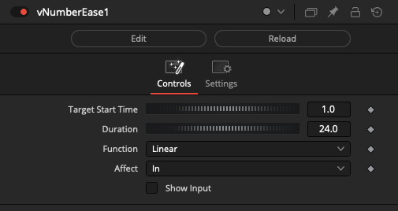

#### vNumberFactorial

Returns the product of all positive integers less than or equal to InNumber
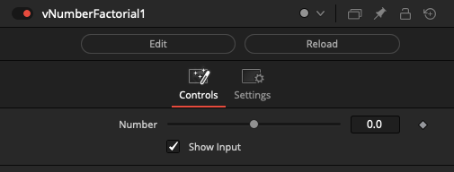

#### vNumberFloor

Returns the integer no less than a number

This provides a way to round a floating point number to a whole number (an integer value) by rounding downwards to remove the digits to the right of the decimal place.

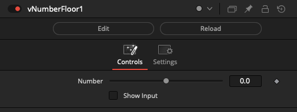

#### vNumberFractional

Returns the fractional part of a number

#### vNumberIntegral

Returns the integral part of a number

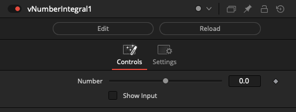

#### vNumberMax

Returns the maximum of two numbers

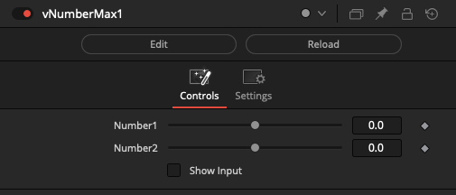

#### vNumberMin

Returns the minimum of two numbers

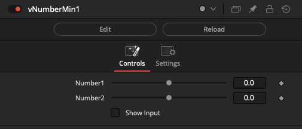

#### vNumberMix

Performs a linear interpolation between two numbers

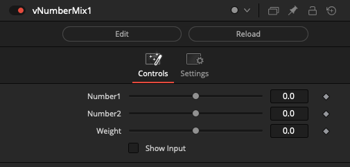

#### vNumberModulus

Returns the remainder of the division of x by y that rounds the quotient towards zero

If a vNumberCompReqTime or vNumberCompCurrentTime node is piped into the "Dividend" input connection, you can use the modulus operator to create a looping number range with the Divisor control.

For example, a Divisor value of 10 will cause the output from modulus to cycle from 0-9 in loops 5 times as the playhead advances through a render start/end frame range of 0 - 50.

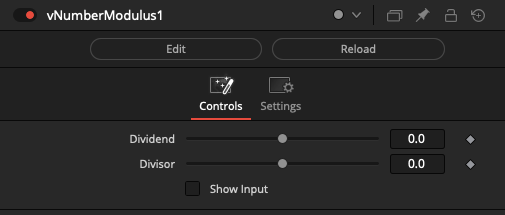

#### vNumberMultiply

Returns the product of two numbers

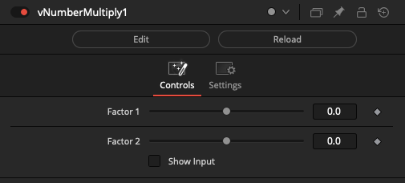

#### vNumberPartialPermutation

Returns the sum of two numbers

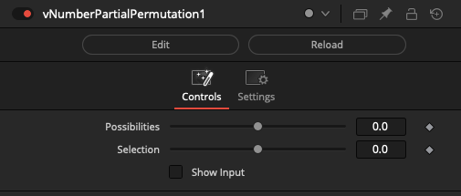

#### vNumberPower

Returns the power of a number

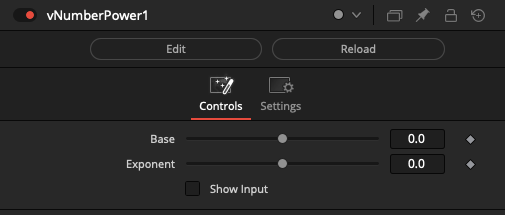

#### vNumberReciprocal

Returns the reciprocal of a number

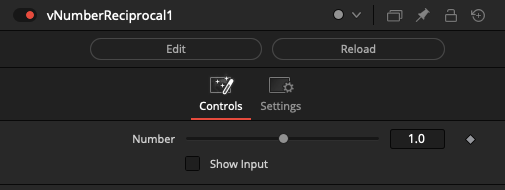

#### vNumberSign

Returns the sign of a number

The output from the node will be either "-1", "0", or "1".

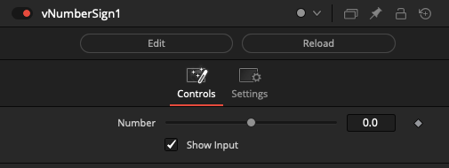

#### vNumberSmoothstep

Generates a smoothstep function

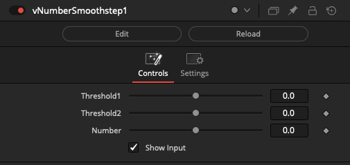

#### vNumberSquareRoot

Returns the square root of a number

#### vNumberStep

Generates a step function by comparing two values

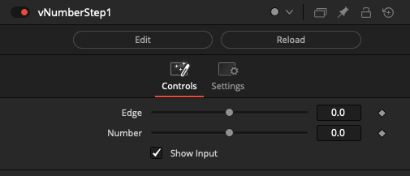

#### vNumberSubtract

Returns the difference of two numbers

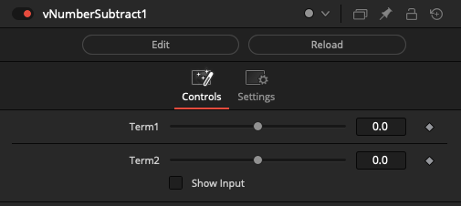

### Resolve

#### vNumberResolvePID

Returns the Resolve/Fusion PID (Process ID)

A PID value is an integer style number that is used by the operating system to track a running executable.

Often PID values are the identifier used to tell an external program to gracefully quit. A PID number can also be used by the "renice" terminal utility to help balance the compute load on a system by scaling back the resource hogging level of a single dominant program that is reducing the overall interactivity of the host computer.

#### vNumberResolveTimelineFPS

Returns the Resolve Timeline frame rate

This node is useful if you need to perform math operations that need to be informed of the Resolve project's current frame rate value.

### Script

#### vNumberDoString

Return a Number object from running a string of Lua code

#### vNumberProcessOpen

Launch a command-line process via popen

#### vNumberSlashCommand

Run a Console Fuse SlashCommand as a node

### Temporal

#### vNumberTimeSpeed

Time based operation on numbers

#### vNumberTimeStretch

Time based operation on numbers

#### vNumberXSheet

Time based operation on numbers

### Text

#### vNumberFromCSV

Creates a Fusion Number object by extracting a single cell from a CSV formatted block of text

The "Row" control is used to define the CSV line number to read.

The "Column" control is used to increment through each set of comma separated entries on a single line of CSV input data.

The "Ignore Header Row" checkbox will offset the first index position to start at line 2 in the CSV file. This will skip over a labelled header row in the source document to avoid that information being accessed as part of the ingested data.

#### vNumberFromText

Returns a number from a Fusion Text object

This node converts an ASCII text based string that holds numerical content like "5" into an actual number data type that can have math operations performed on the value. This is a useful step if you need to connect a numerical value to an Inspector based attribute on another node.

#### vNumberXYZFromCSV

Creates a set of XYZ Fusion Number objects by extracting three cells from a CSV formatted block of text

### Trigonometry

#### vNumberArcCosine

Returns the inverse cosine for a number in radians

#### vNumberArcSine

Returns the inverse sine for a number in radians

#### vNumberArcTangent

Returns the inverse tangent for a number in radians

#### vNumberTwoArgumentArcTangent

Returns the arc tangent of y/x (in radians) but uses the signs of both parameters to find the quadrant of the result

#### vNumberCosine

Returns the cosine for a number in radians

#### vNumberDegreesToRadians

Returns the radian value as a number in degrees

#### vNumberHyperbolicCosine

Returns the hyperbolic cosine for a number in radians

#### vNumberHyperbolicSine

Returns the hyperbolic sine of a number in radians

#### vNumberHyperbolicTangent

Returns the hyperbolic tangent of a number in radians

#### vNumberRadiansToDegrees

Returns the degree value as a number in radians

#### vNumberSine

Returns the sine for a number in radians

#### vNumberTangent

Returns the tangent for a number in radians

### Utility

#### vNumberDelay

Creates a Delay while passing a Fusion Number object

The delay effect is measured in seconds. This node is implemented internally using the "`bmd.wait()`" function.

Among several use cases one can find for a tool that can momentarily pause rendering; it can be used to simulate a slow to render comp task when testing a render farm program. It also has applications when running a command line task via the Vonk ProcessOpen node and the system requires a momentary pause.

#### vNumberEndPID

Quit a program using its PID (Process ID) on macOS and Linux

It is possible to use the following terminal command to list a specific program's PID value:

    ps aux | grep writeInSomeProgramNameHere

A sample output from this usage of the ps aux + grep command is:

    % ps aux | grep safari
    vfx             10239   0.0  0.0 408637584   1760 s000  S+  4:21PM   0:00.00 grep safari

You can see a list of running programs and their PID values in the terminal using the "top" utility:

    % top
    Processes: 540 total, 3 running, 537 sleeping, 2455 threads                     16:24:24
    Load Avg: 1.05, 1.09, 1.17  CPU usage: 2.1% user, 2.48% sys, 95.50% idle
    SharedLibs: 670M resident, 122M data, 71M linkedit.
    MemRegions: 79919 total, 3430M resident, 570M private, 2089M shared.
    PhysMem: 15G used (2487M wired), 204M unused.
    VM: 204T vsize, 3823M framework vsize, 0(0) swapins, 0(0) swapouts.
    Networks: packets: 14481172/7542M in, 10866206/9338M out.
    Disks: 1618664/32G read, 799320/24G written.

    PID COMMAND     %CPU TIME   #TH   #WQ  #PORT MEM    PURG   CMPRS  PGRP  PPID
    171 WindowServer 6.5  47:39.13 17   3   1775- 220M-  9600K- 7792K  171   1
    10555  top          5.2  00:00.58 1/1   0   27+   6545K  0B     0B  10555 10519
    466 Terminal    2.0  00:03.48 6/1   1   258+  44M   15M 1664K  466   1
    **10239  Safari     1.4  00:31.49 6     2   514   62M   0B  0B  10239 1**

It is also possible to see programs and their PID values in the macOS "Activity Monitor.app" utility. In the top right corner of the Activity Monitor window you can type in the name of the program in the search field to filter the results in the view down to what matters.

#### vNumberViewer

View the Fusion number object in the Inspector

### Vector

#### vNumberFromVector

Returns a number from a vector

