# Point Nodes

## Node Listing

Create:
- vPointCreate
- vPointCreateImage
- vPointCreateRandom
- vPointFromMousePos

Flow:
- vPointSwitch
- vPointWireless

Number:
- vPointFromNumber
- vPointToNumber

Operators:
- vPointAbsolute
- vPointAdd
- vPointClamp
- vPointDivide
- vPointMix
- vPointModulus
- vPointMultiply
- vPointPower
- vPointSubtract

Temporal:
- vPointTimeSpeed
- vPointTimeStretch

Text:
- vPointFromText
- vPointToText

Utility:
- vPointAngle
- vPointDelay
- vPointLength

## Node Docs

### vPointCreate

Create a Fusion Point object

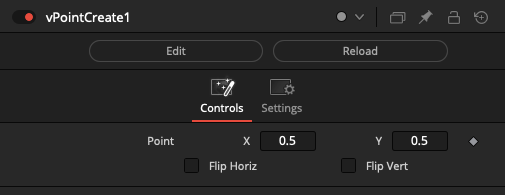

### vPointCreateImage

Create a Fusion Point object with an image visible in the background

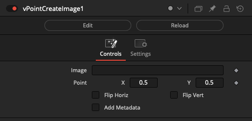

The "Add Metadata" checkbox creates image output metadata entries for the point coordinates formatted as:

    XOffset = 0.5
    YOffset = 0.5

If you enable the viewer window's "Metadata" sub-viewer entry you can quickly see the information that is appended to the image output stream.

### vPointCreateRandom

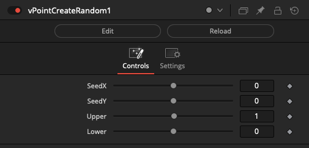

### vPointFromMousePos

Return a Fusion Point object that holds the current mouse X & Y cursor position

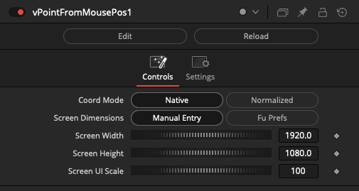

**Coord Mode**

The "Coord Mode" multi-button control allows you to define the units used when reporting the mouse position. The "Native" option will return the original unmodified "raw" cursor position coordinates. The "Normalized" option will return a 0-1 range value for the X/Y cursor position.

**Screen Dimensions**

The normalization process can be carried out using either the "Manual Entry" option which is based upon manually entered screen width and height parameters along with a screen ui size scaling parameter, or through using the "Fu Prefs" option which is based upon the existence of a Fusion preferences "Layout" page based saved window size value.

If no Fusion preferences based window sizing parameters are found you will see an error reported to the Console window when the "Fu Prefs" option is enabled. The message reported is:

    [Error] The Fusion window size preference is undefined. Please save an initial window position in the Layout Preference section.

Note: Make sure to load the vPointFromMousePos node's output into the left or right viewer window before displaying a downstream node like a b-spline shape and a Transform node that is driven by the mouse position value via a "Connect To" approach.

Failure to view the vPointFromMousePos node before displaying the downstream node will likely lead to lockups in Fusion v18+.

### vPointSwitch

Switch between Fusion Point objects

The "Which" control uses an integer number that starts at 1 and counts upwards to define the input connection port that is passed through to the output connection.

If you are using a logical comparator that works on a false/true based 0-1 number range and want to connect it to a vPointSwitch node's Which input connection, that works on a 1+ number range, simply insert a vNumberAdd node set to increment the number upwards by 1.

The "Show Which Input" checkbox is used to hide the Number datatype based input connection for the Which parameter in the Nodes view.

The "Show Active Input" checkbox is used as a visualization and diagnostics mode. When enabled, this control automatically toggles the visibility off for the inactive connection wirelines fed into the switch node. This approach makes it possible to visually see in a quick glance the source comp branch that is selected as the input and used by the Which control. All other inputs will be turned into hidden wireless inputs when not in use.

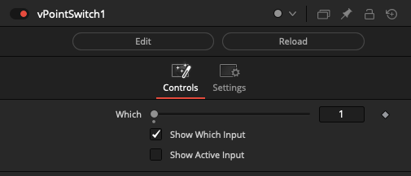

### vPointWireless

The vPointWireless node allows you to connect to other 2D Point datatype based nodes in your comp without drawing the connection wirelines visually in the Flow/Nodes view. This can be helpful if you need to reduce clutter.

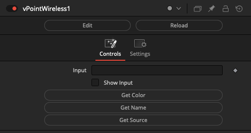

### vPointFromNumber

Return a Fusion Point object from two numbers

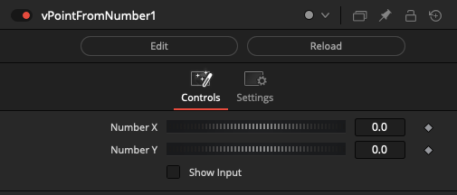

### vPointToNumber

Return a pair of numbers from a Fusion Point object

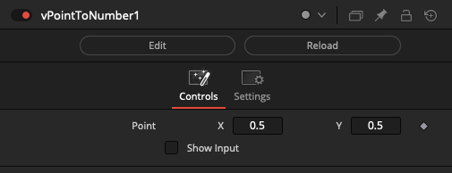

### vPointAbsolute

Returns a Fusion Point object with an absolute value

This will remove a negative sign from any point value that is below 0.

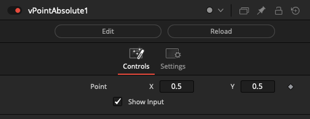

### vPointAdd

Returns the sum of two Fusion Point objects

This node can be used to apply a positive offset to the origin of the 1st point by the 2nd point's displacement distance.

### vPointClamp

Clamp a Fusion Point object to specific boundaries

This acts as a hard limiter on the range of numbers that can pass through the Point control. Numbers that exist below the minimum range, or above the maximum range are clipped to those boundaries.

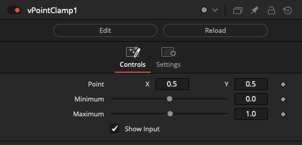

### vPointDivide

Returns the quotient of two Fusion Point objects

This node can be used to apply a scale reducing effect to the origin of the 1st point by the 2nd point's displacement distance.

### vPointMix

Performs linear interpolation between two Fusion Point objects

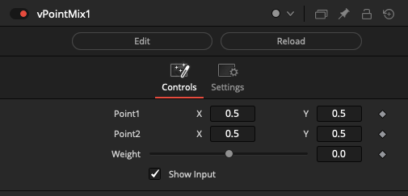

### vPointModulus

Returns the remainder of the division of a Fusion Point object that rounds the quotient towards zero

The "Divisor X" and "Divisor Y" controls make it possible to create a looping effect that wraps the Point locator on each axis of motion so it stays within a range of 0 to (one less than the Divisor value).

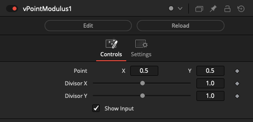

### vPointMultiply

Returns the product of two Fusion Point objects

This node can be used to apply a scale enlargement effect to the origin of the 1st point by the 2nd point's displacement distance.

### vPointPower

Returns the power of a Fusion Point object

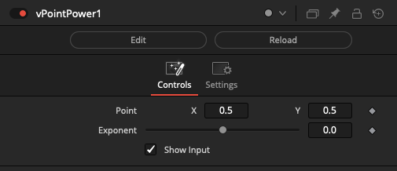

### vPointSubtract

Returns the difference of two Fusion Point objects

This node can be used to apply a negative offset to the origin of the 1st point by the 2nd point's displacement distance.

### vPointTimeSpeed

Time based operations on a Fusion Point object

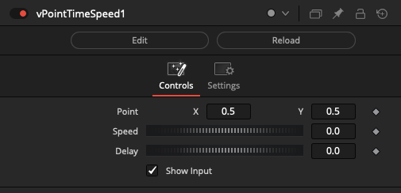

### vPointTimeStretch

Time based operations on a Fusion Point object

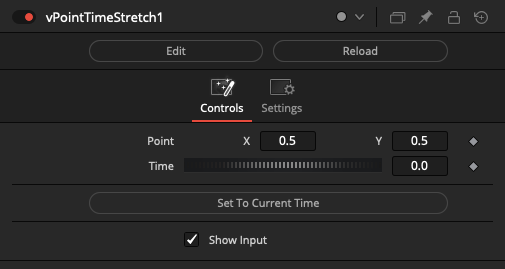

### vPointFromText

Returns a Fusion Point object from two Text inputs

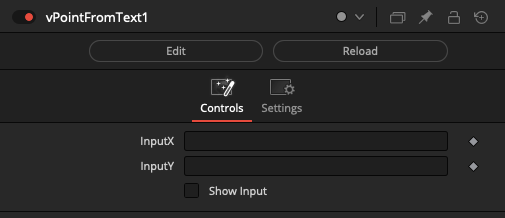

### vPointToText

Return a pair of Text objects from a Fusion Point object

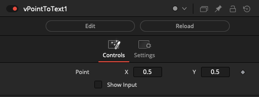

### vPointAngle

Measure the angle in degrees between two Fusion Point objects

The output from this node is a Number datatype that reports the angle between Point1 and Point2.

### vPointDelay

Creates a Delay while passing a Fusion Point object

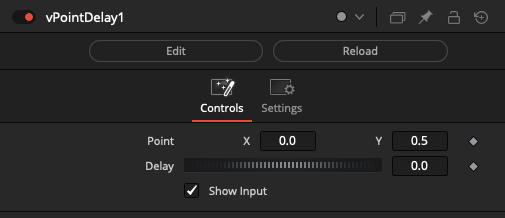

### vPointLength

Measure the distance between two Fusion Point objects

The output from this node is a Number datatype that reports the distance between Point1 and Point2.

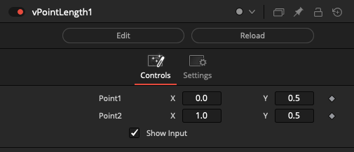

If you have an image loaded in the viewer window, and then select the vPointLength node to edit its attributes in the Inspector tab, you will see the Point1 and Point2 locator handle overlays onscreen.
