# ScriptVal Nodes

## Node Listing

Array:
- vScriptValFromArray
- vScriptValToArray

Create:
- vScriptValCreate
- vScriptValFromApp
- vScriptValFromCSV
- vScriptValFromDate
- vScriptValFromListFiles
- vScriptValFromPingHosts
- vScriptValFromPrefs
- vScriptValFromRegistry

Custom Data:
- vScriptValFromCustomData
- vScriptValToCustomData

Flow:
- vScriptValSwitch
- vScriptValWireless

Font:
- vScriptValFontMetrics
- vScriptValFromListFonts

Image:
- vScriptValFromEXRFile

IO:
- vScriptValFromBinaryFile
- vScriptValFromClipboard
- vScriptValFromFile
- vScriptValToBinaryFile
- vScriptValToClipboard
- vScriptValToFile

JSON:
- vScriptValFromJSON
- vScriptValToJSON

Key Value:
- vScriptValGetElementToNumber
- vScriptValGetElementToTable
- vScriptValGetElementToText
- vScriptValGetElementXYZToNumber
- vScriptValGetToNumber
- vScriptValGetToTable
- vScriptValGetToText
- vScriptValKeysToTable
- vScriptValKeysToText
- vScriptValRemoveElement
- vScriptValSetFromNumber
- vScriptValSetFromTable
- vScriptValSetFromText
- vScriptValTrimElement

Meta:
- vScriptValFromMetadata
- vScriptValToMetadata

Number:
- vScriptValFromNumber
- vScriptValToNumber

Point:
- vScriptValFromPoint
- vScriptValToPoint

Script:
- vScriptValDoFile
- vScriptValDoString
- vScriptValDoStringMultiplex

Shape:
- vScriptValCreatePolyline

Temporal:
- vScriptValAccumulator
- vScriptValTimeSpeed
- vScriptValTimeStretch

Text:
- vScriptValFromText
- vScriptValToText

Utility:
- vScriptValCount
- vScriptValDump
- vScriptValMerge
- vScriptValViewer

XML:
- vScriptValFromXML
- vScriptValToXML

YAML:
- vScriptValFromYAML

## Node Docs

### vScriptValFromArray

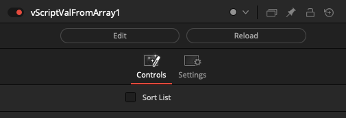

### vScriptValToArray

### vScriptValCreate

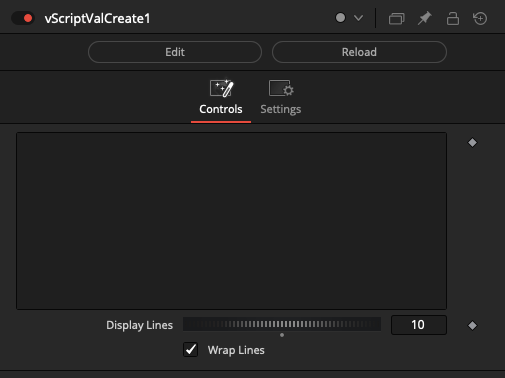

### vScriptValFromApp

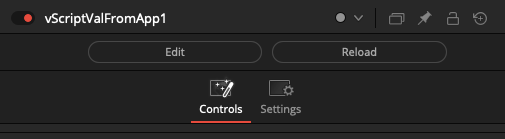

### vScriptValFromCSV

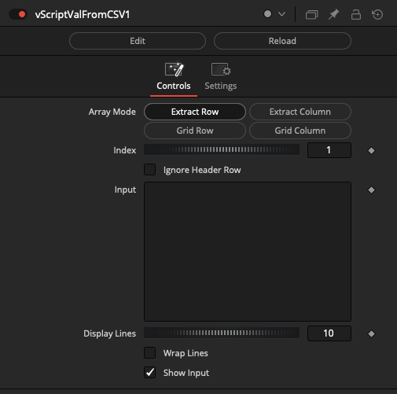

### vScriptValFromDate

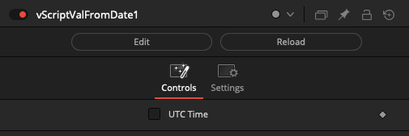

### vScriptValFromListFiles

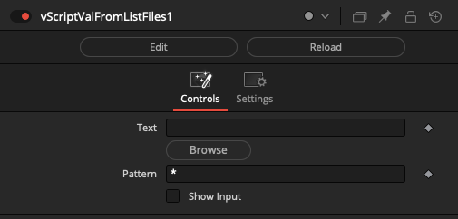

### vScriptValFromPingHosts

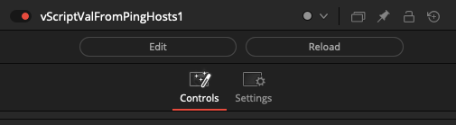

### vScriptValFromPrefs

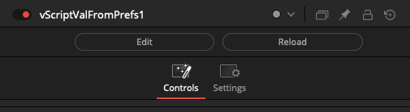

### vScriptValFromRegistry

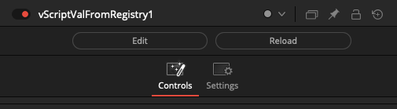

### vScriptValFromCustomData

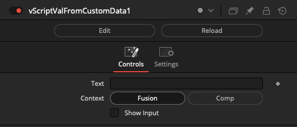

### vScriptValToCustomData

### vScriptValSwitch

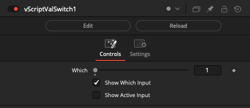

### vScriptValWireless

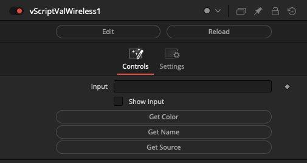

### vScriptValFontMetrics

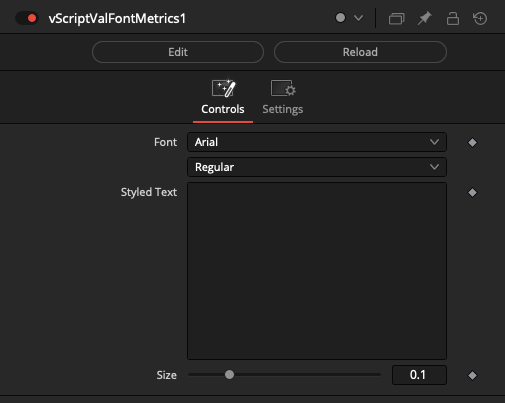

### vScriptValFromListFonts

### vScriptValFromEXRFile

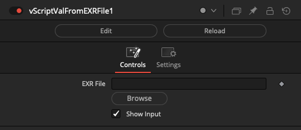

### vScriptValFromBinaryFile

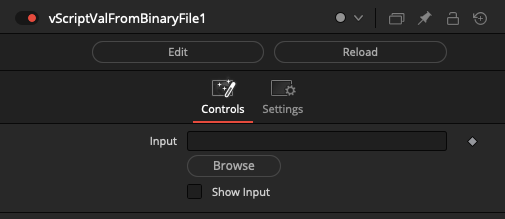

### vScriptValFromClipboard

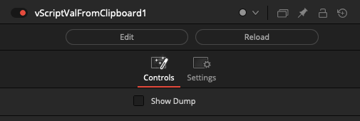

### vScriptValFromFile

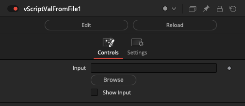

### vScriptValToBinaryFile

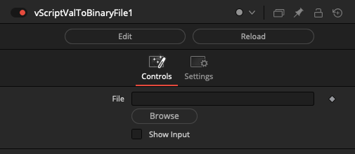

### vScriptValToClipboard

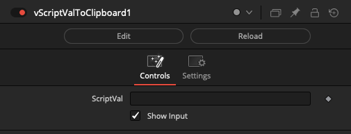

### vScriptValToFile

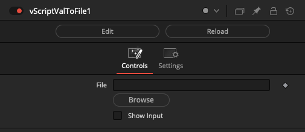

### vScriptValFromJSON

### vScriptValToJSON

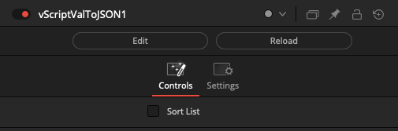

### vScriptValGetElementToNumber

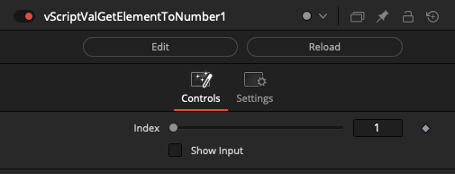

### vScriptValGetElementToTable

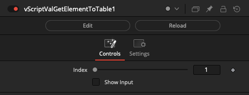

### vScriptValGetElementToText

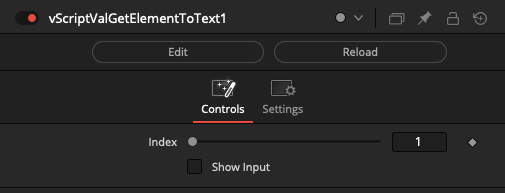

### vScriptValGetElementXYZToNumber

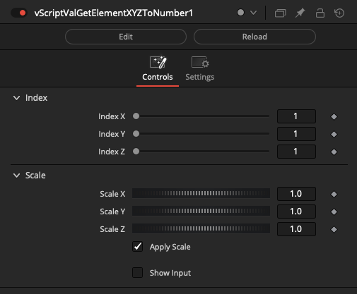

### vScriptValGetToNumber

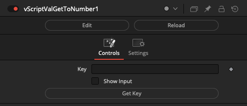

### vScriptValGetToTable

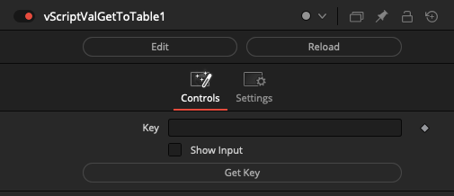

### vScriptValGetToText

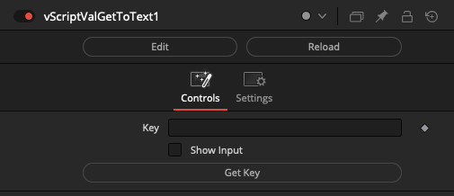

### vScriptValKeysToTable

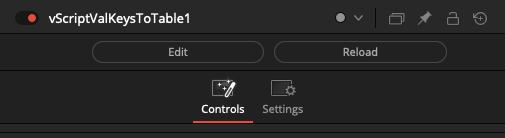

### vScriptValKeysToText

### vScriptValRemoveElement

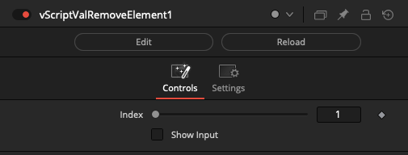

### vScriptValSetFromNumber

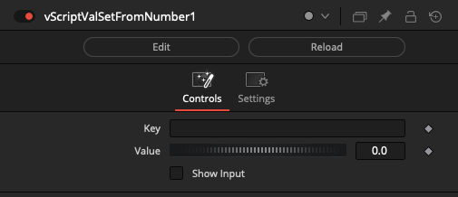

### vScriptValSetFromTable

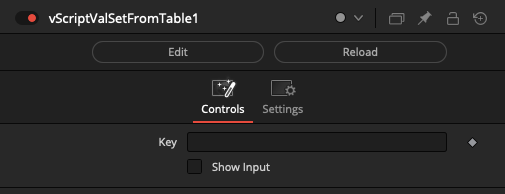

### vScriptValSetFromText

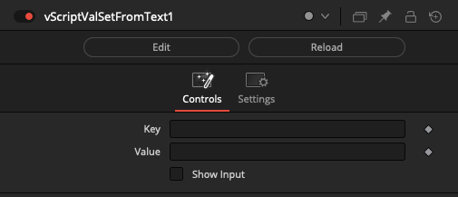

### vScriptValTrimElement

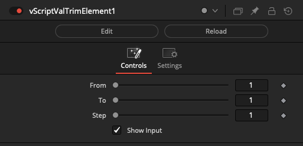

### vScriptValFromMetadata

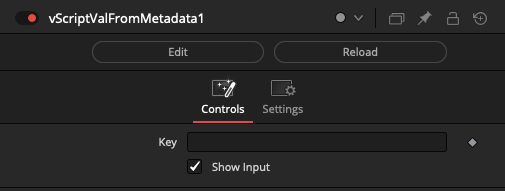

### vScriptValToMetadata

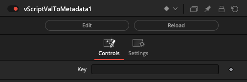

### vScriptValFromNumber

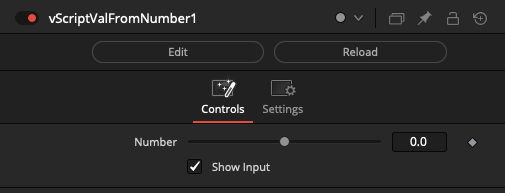

### vScriptValToNumber

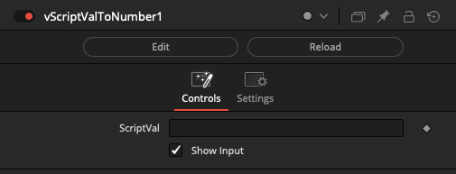

### vScriptValFromPoint

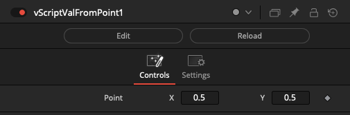

### vScriptValToPoint

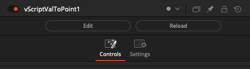

### vScriptValDoFile

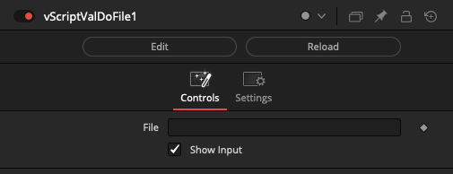

### vScriptValDoString

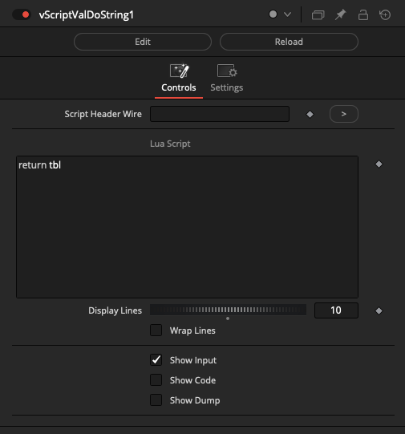

### vScriptValDoStringMultiplex

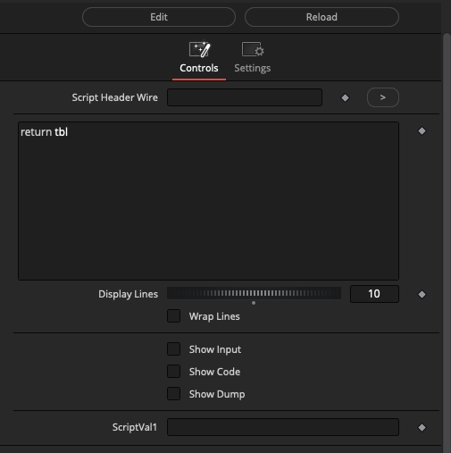

### vScriptValCreatePolyline

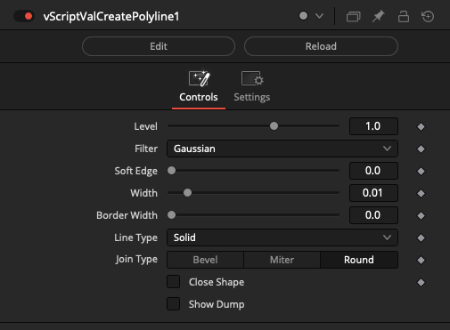

### vScriptValAccumulator

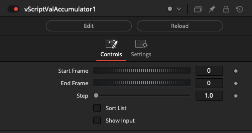

### vScriptValTimeSpeed

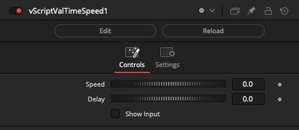

### vScriptValTimeStretch

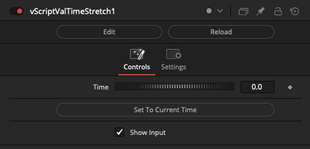

### vScriptValFromText

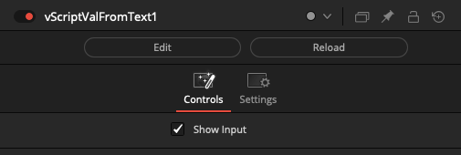

### vScriptValToText

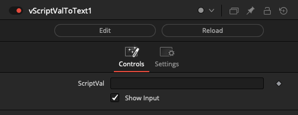

### vScriptValCount

### vScriptValDump

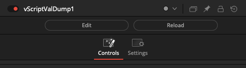

### vScriptValMerge

### vScriptValViewer

### vScriptValFromXML

### vScriptValToXML

### vScriptValFromYAML

