# Text Nodes

## Node Listing

Case:
- vTextCaseAlternate
- vTextCaseInvert
- vTextCaseLower
- vTextCaseRandom
- vTextCaseSentence
- vTextCaseTitle
- vTextCaseUpper

Comp:
- vTextCompAppUUID
- vTextCompCurrentTime
- vTextCompFilename
- vTextCompName
- vTextCompReqTime

Create:
- vTextCreate
- vTextCreateArch
- vTextCreateBrowse
- vTextCreateMultiline
- vTextCreateMultilineCode
- vTextCreatePlatform
- vTextCreatePlatformBrowse
- vTextDate
- vTextEnv
- vTextFromArray
- vTextFromASCII
- vTextFromCSV
- vTextFromHex
- vTextFromNumber
- vTextFromNumberPadded
- vTextToHex
- vTextUUID
- vTextUUIDStatic

Decode:
- vTextDecodeUrl

Encode:
- vTextEncodeUrl

Flow:
- vTextSwitch
- vTextWireless

Font:
- vTextFontMetrics

IO:
- vTextFromClipboard
- vTextFromComp
- vTextFromFile
- vTextFromNet
- vTextFromZip
- vTextToClipboard
- vTextToFile

Logic:
- vTextEqual
- vTextNotEqual
- vTextTernary

Order
- vTextOrderReverse
- vTextOrderShuffle

Fusion
- vTextRenderComp
- vTextRenderManager

Resolve
- vTextResolvePID
- vTextResolveProjectName

Script:
- vTextDoAction
- vTextDoString
- vTextExecute
- vTextProcessOpen
- vTextRunScript
- vTextShellBG
- vTextSlashCommand

Substring:
- vTextMerge
- vTextSubFormat
- vTextSubFormatMultiline
- vTextSubJoin
- vTextSubReplace
- vTextSubReturn
- vTextSubSplit
- vTextSubStripLeft
- vTextSubStripRight

Subtitle:
- vTextFromSubtitle

Temporal:
- vTextAccumulator
- vTextTimeSpeed
- vTextTimeStretch

Utility:
- vTextDelay
- vTextDump
- vTextFromCSVViewer
- vTextLength
- vTextLineCount
- vTextNormalizeSlashes
- vTextParseFilename
- vTextParseFilenameOutputs
- vTextReadLine
- vTextSortLines
- vTextToHTMLViewer
- vTextViewer

## Node Docs

Case

#### vTextCaseAlternate

Alternates the case of a Fusion Text object

A Text based input of "hello world!" would be converted to "hElLo wOrLd!" where every 2nd letter is formatted as a capital letter.

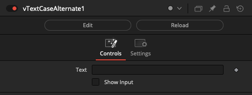

#### vTextCaseInvert

Inverts the case of a Fusion Text object

A Text based input of "Hello World!" would be converted to "hELLO wORLD!". Every uppercase letter in the output becomes lower case, and every lowercase letter becomes an uppercase letter.

#### vTextCaseLower

Converts the case of a Fusion Text object to lower

A Text based input of "Hello World!" would be converted to "hello world!".

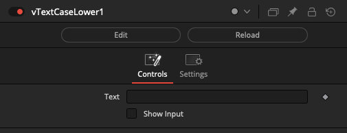

#### vTextCaseRandom

Changes the case of a Fusion Text object in a random fashion

A Text based input of "hello world!" would be converted to an output like "hellO WoRlD!".

#### vTextCaseSentence

Converts the case of a Fusion Text object to sentence

A Text based input of "hello world!" would be converted to "Hello world!" with the initial letter in each sentence having a capitalized letter.

#### vTextCaseTitle

Converts the case of a Fusion Text object to title

A Text based input of "hello world!" would be converted to "Hello World!".

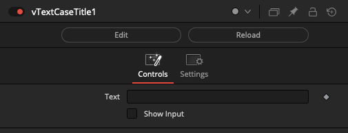

#### vTextCaseUpper

Converts the case of a Fusion Text object to upper

A Text based input of "hello world!" would be converted to "HELLO WORLD!".

### Comp

#### vTextCompAppUUID

Returns the Fusion application process UUID

A UUID value is formatted like: 11625315-7785-4eb4-8b2f-d6dca235c42

This node is powered by the Lua function "bmd.getappuuid()".

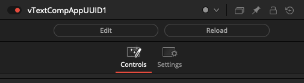

#### vTextCompCurrentTime

Returns the comp's current time value

The current time represents the point where the timeline playhead is positioned regardless of any temporal effects that might be happening.

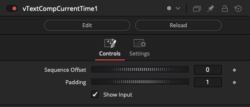

#### vTextCompFilename

Returns the full path of a comp

An example output from this node would be an absolute filepath based string like:

"C:/ProgramData/Blackmagic Design/Fusion/Reactor/Deploy/Comps/Kartaverse/Vonk Ultra/Demo Text/Demo Text.comp"

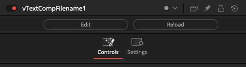

#### vTextCompName

Returns the name of the comp

An example output from this node would be the base filename for the currently open .comp file like: "Demo Text.comp"

If the currently open composite is an unsaved document the node would output a string like:

"Composition1"

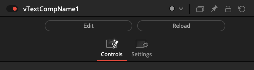

#### vTextCompReqTime

Returns the comp's request time

This is the currently requested frame that is being processed at render time. It supports temporal effects like the vTextAccumulate node that iterates over a frame duration.

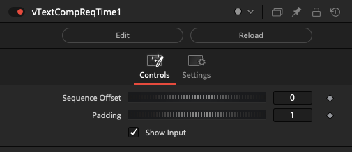

### Create

#### vTextCreate

Creates a Fusion Text object

This is the standard starting point for generating new Text data type based content.

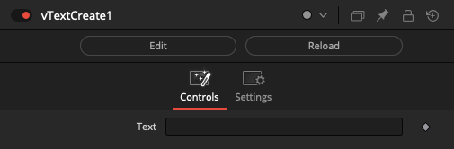

#### vTextCreateArch

Creates a unique Fusion Text object per CPU architecture

This node provides a series of text fields that allow you to enter three different string values. The correct string that matches the current CPU architecture will be returned when the comp is rendered.

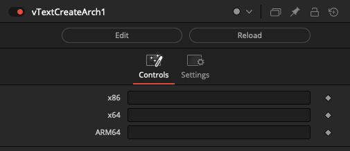

#### vTextCreateBrowse

Creates a Fusion Text object with a file browser dialog

This node is used to create filepath based Text data type content. The Browse button displays a file picker dialog.

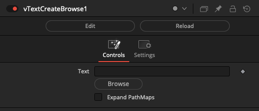

#### vTextCreateMultiline

Creates a multi-line Fusion Text object

The "Text" field supports entering multi-line text blocks that can include indentation, tabs, newlines, returns and other plain-text formatting variations.

If you need to view this multi-line text based content downstream in the comp, try the vTextViewer node.

This node is especially useful if you needed to create the original textual contents used for a shell script that you would save to disk using the vTextToFile node, and then run with a vTextProcessOpen node.

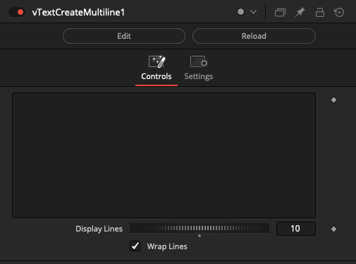

#### vTextCreateMultilineCode

Create a multi-line Fusion Text object with syntax highlighting

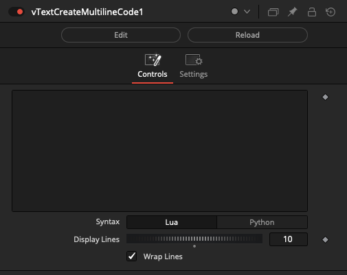

#### vTextCreatePlatform

Creates a unique Fusion Text object per OS platform

This node provides a series of text fields that allow you to enter three different string values. The correct string that matches the current operating system platform will be returned when the comp is rendered.

This node is a handy way to define the correct parameters to use with a vTextSubFormat or ProcessOpen node.

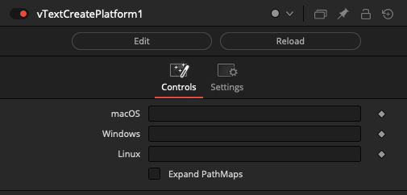

#### vTextCreatePlatformBrowse

Creates a unique Fusion Text object per OS platform

This node provides a series of Browse buttons and text fields that allow you to enter three different string values. The correct string that matches the current operating system platform will be returned when the comp is rendered.

This node is a handy way to define the correct parameters to use with a vTextSubFormat or ProcessOpen node.

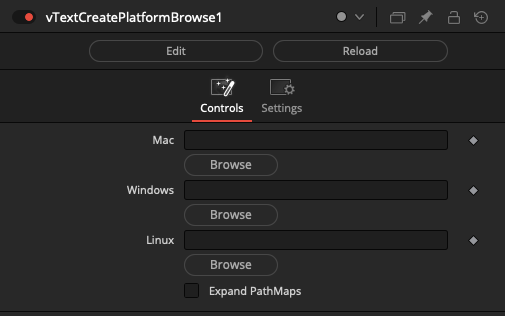

#### vTextDate

Creates a date and time based Fusion Text object

The "Text" field is used to enter the string formatting pattern used to generate a date based output. The default value is "`%Y-%m-%d`" which creates a result like "2022-05-24".

The Lua documentation on the [Date function](https://www.lua.org/pil/22.1.html) provides more details about the supported values you can enter into the Text field in this node.

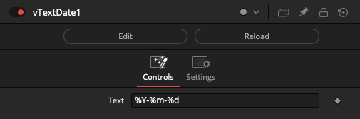

#### vTextEnv

Creates an environment variable based Fusion Text object

This node will read an environment variable and return the result as a string. This is useful if you need to access a value like a SITE, SHOW, or SHOT env variable inside your composite.

The "Text" field is used to enter the environment variable name like "PATH", "HOME", "USER", etc...

If you need to troubleshoot the active environment variables on your Windows system using the Command Prompt you can type in "set". In the macOS/Linux terminal program you can type in "env \| sort" to see an alphabetically sorted list of the active environment variables.

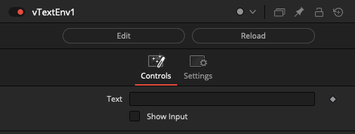

#### vTextFromArray

Creates Text from an array

The "Index" control is used to extract an individual element from a JSON based array. The output is a text based data type.

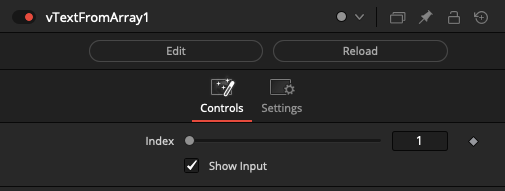

#### vTextFromASCII

Converts an ASCII code number to text

The "Number" control is used to enter an ASCII code value. The result is a single character placed inside a text data type based output.

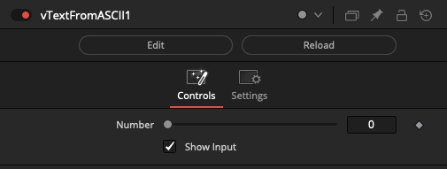

#### vTextFromCSV

Creates a Fusion Text object by extracting a single cell from a CSV formatted block of text

The "Row" control is used to define the CSV line number to read.

The "Column" control is used to increment through each set of comma separated entries on a single line of CSV input data.

The "Ignore Header Row" checkbox will offset the first index position to start at line 2 in the CSV file. This will skip over a labelled header row in the source document to avoid that information being accessed as part of the ingested data.

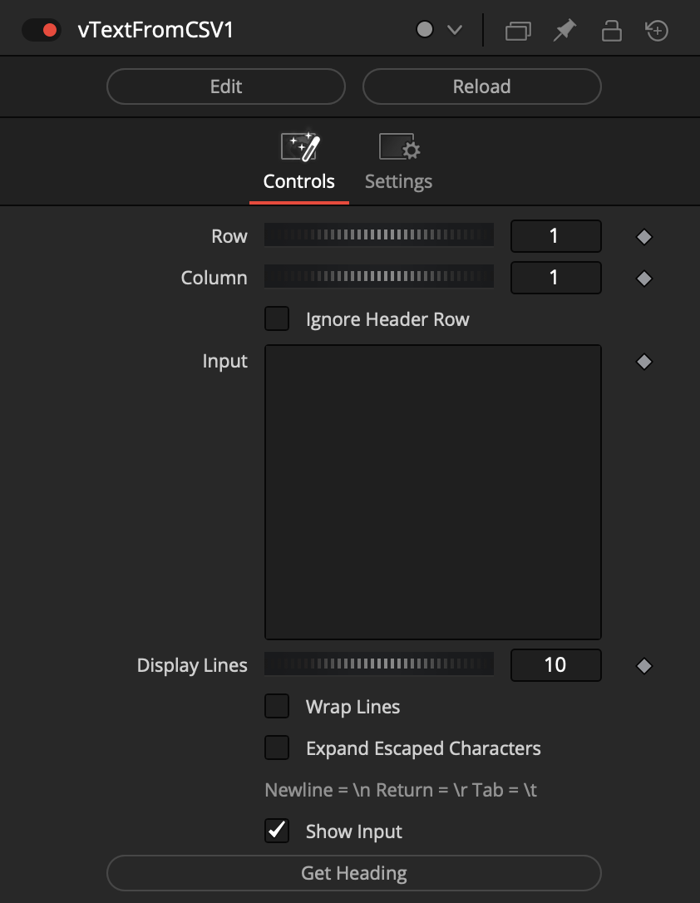

#### vTextFromHex

Converts a Base16 Hex encoded string to ASCII text

The "Input" field is used to supply the block of HEX encoded content.

The "Separator" text field allows you to enter a value like a space, a tab, a dash, a semicolon, or other character that is present between the Base16 encoded number groups. This user supplied separator information is then used to guide the decoding process.

The "Remove Non-Printable Characters" control will automatically remove any ASCII characters that are control characters. In software like the macOS based BBEdit text editor, a non-printable character in a text file would be described as a "Gremlin" and this process would be called "Zapping Gremlins".

A sample Hex string that says "Hello World!" is "48656C6C6F20576F726C6421".

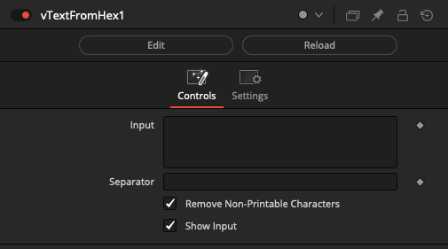

#### vTextFromNumber

Converts a number to text

This node takes a number based input value that is converted automatically into a Text data type on the output. This makes it possible to supply a numerical value to a node like vTextSubFormat that only works with Text based inputs.

The "Number" field holds the source numerical value.

If the "Show Input" checkbox is enabled, the Number field based value can come from an external source.

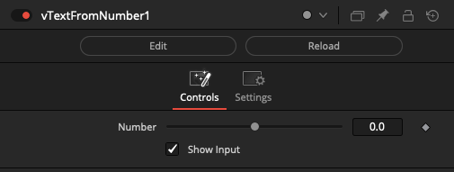

#### vTextFromNumberPadded

Converts a number to a leading zero padded text

This node is excellent for creating fixed length numbers thanks to the built-in "Padding" control.

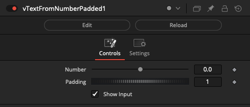

#### vTextToHex

Converts a string into Base16 Hex encoded text

The "Separator" text field allows you to enter a value like a space, a tab, a dash, a semicolon, or other character you want to use between the Base16 encoded output number groups.

The "Remove Non-Printable Characters" control will automatically remove any ASCII characters that are control characters.

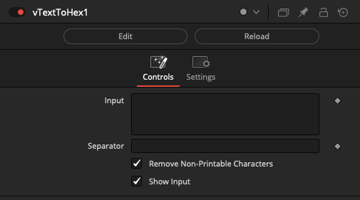

#### vTextUUID

Creates a UUID Fusion Text object

A per-frame (Universally Unique IDentifier) value is generated by this node. This value can be used to help with naming temporary items on disk, or for other tasks where an incrementing index based identifier is not appropriate.

A UUID value is formatted like: `11625315-7785-4eb4-8b2f-d6dca235c424`

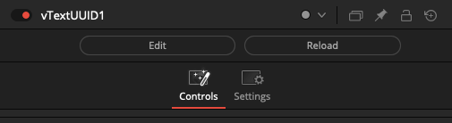

#### vTextUUIDStatic

Creates a UUID Fusion Text object

A static non-animated UUID (Universally Unique IDentifier) value is generated by this node. This value can be used to help with naming temporary items on disk, or for other tasks where an incrementing index based identifier is not appropriate.

A UUID value is formatted like: `11625315-7785-4eb4-8b2f-d6dca235c424`

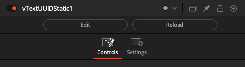

### Decode

#### vTextDecodeUrl

URL-decodes a Fusion Text object

### Encode

#### vTextEncodeUrl

URL-encodes a Fusion Text object

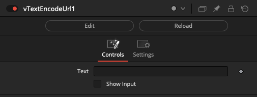

### Flow

#### vTextSwitch

Switches between Fusion Text objects

The "Which" control uses an integer number that starts at 1 and counts upwards to define the input connection port that is passed through to the output connection.

If you are using a logical comparator that works on a false/true based 0-1 number range and want to connect it to a vTextSwitch node's Which input connection, that works on a 1+ number range, simply insert a vNumberAdd node set to increment the number upwards by 1.

The "Show Which Input" checkbox is used to hide the Number datatype based input connection for the Which parameter in the Nodes view.

The "Show Active Input" checkbox is used as a visualization and diagnostics mode. When enabled, this control automatically toggles the visibility off for the inactive connection wirelines fed into the switch node. This approach makes it possible to visually see in a quick glance the source comp branch that is selected as the input and used by the Which control. All other inputs will be turned into hidden wireless inputs when not in use.

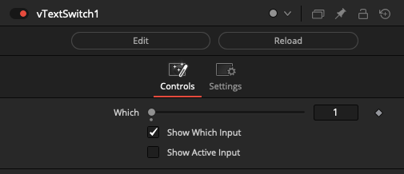

#### vTextWireless

The vTextWireless node allows you to connect to other text based nodes in your comp without drawing the connection wirelines visually in the Flow/Nodes view. This can be helpful if you need to reduce clutter.

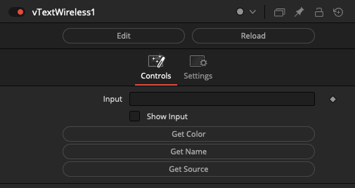

### Font

#### vTextFontMetrics

Return font measurements as Fusion Number objects

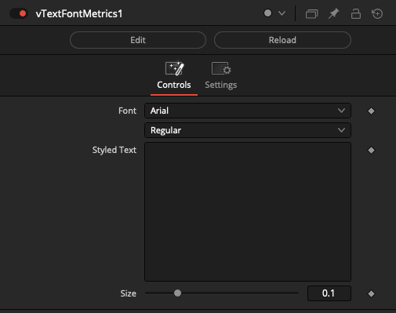

### IO

#### vTextFromClipboard

Grabs the current clipboard text

The "Sort List" checkbox works on a line-by-line basis to alphabetically sort the results generated by the node.

The "Remove Quotes" checkbox is used to strip out any quote symbols found in the clipboard text. This is useful if you are trying to make an IFL like list and the source text was added to the clipboard buffer using the Windows "File Explorer" right-click based "Copy as path" contextual menu item.

This node works on Windows, macOS, and Linux.

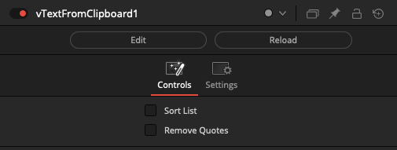

#### vTextFromComp

Reads text strings from a Fusion .comp file

This node tunnels inside of an external Fusion .comp file on disk and extracts string elements. These text strings are typically filepaths.

The "File" text field specifies which .comp file should be parsed.

The "Match" text field helps sort the content returned to filter the results.

The "File Exists" checkbox lets you further filter the results by looking on disk to see if the text string lines up with an actual file that exists.

The "Expand PathMaps" checkbox will automatically convert any relative filepaths into absolute filepaths on the output.

The "Sort List" checkbox works on a line-by-line basis to alphabetically sort the results generated by the node.

The "Remove Duplicates" checkbox is used to remove any line entry that is a duplicate entry, meaning the content is not unique.

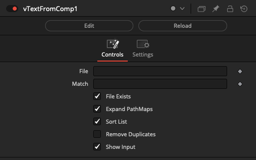

#### vTextFromFile

Reads a Text string from a file

This node is used to access a block of text from a plain-text format style of document stored on disk. This is useful for accessing CSV (Comma Separated Value), TSV (Tab Separated Value), IFL (Image File Lists), or other external data resources.

The "Input" text field is used to specify the disk-based filename of the plain-text document to be read.

The "Remove Non-Printable Characters" checkbox is used to remove ASCII invisible control characters from the text stream. This allows the node to be used to extract ASCII strings from binary files.

The output from this node is a text data type.

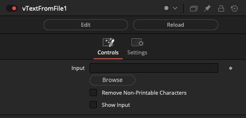

#### vTextFromNet

Reads a Text string from a network URL

The "Input" text-field is used to supply the http://, https://, or file:// based URL.

The network-based text resource downloading functionality provided by this node makes it possible to drive a composite from an external cloud based datasource like a CSV (Comma Separated Value), TSV (Tab Separated Value), SVG (Scalable Vector Graphics), Fusion Macro .setting, Fusion .comp, etc.

This means IoT (Internet of Things) electronic sensors, sports statistics, financial data, or any other web enabled datasource can be used on-the-fly to supply Text, Number, Matrix, Array, or other values to nodes in the comp.

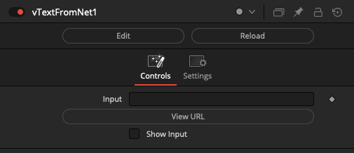

#### vTextFromZip

Reads a Text string from a zip archive

This node accesses a plain-text formatted resource that is stored inside a Zip archive using the Fusion v16+/Resolve v15+ based ZipIO library.

The "Zip File" field is used to define the filename of the zip archive.

The "Extract File" field is used to define the resource that is stored inside the zip archive.

Both attributes can be driven externally by a Text data type connection to the node.

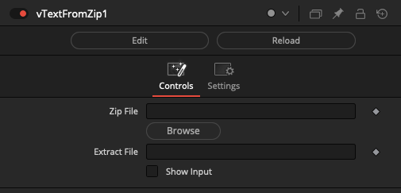

#### vTextToClipboard

Send text to the clipboard

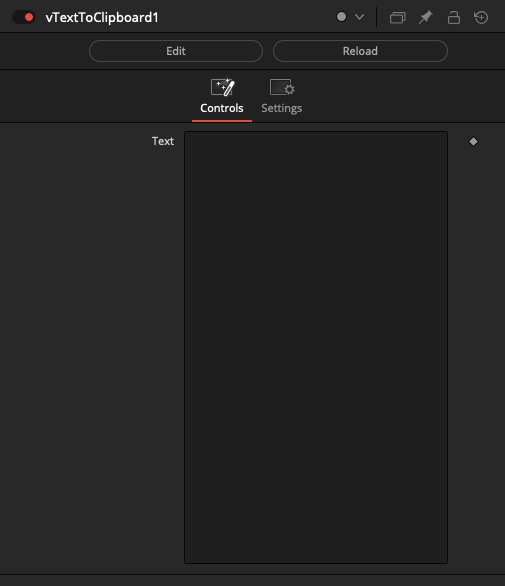

#### vTextToFile

Writes a Text string to a file

The "Input" text-field holds the textual content that is saved to disk.

The "File" text-field specifies the filename for the document.

Both of these controls can be driven externally by enabling the "Show Input" checkbox. You would then connect vTextCreate or vTextSubFormat like text based data nodes to the input connections on the vTextToFile node.

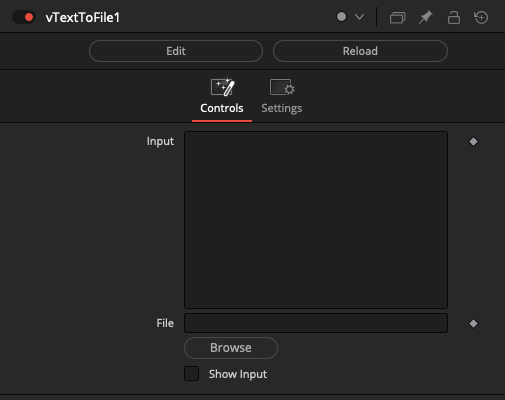

### Logic

#### vTextEqual

Compares two strings to see if they are equal

The result is a false/true based number result of 0-1.

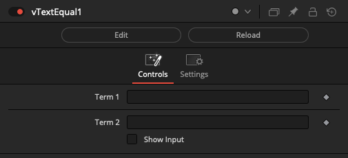

#### vTextNotEqual

Compares two strings to see if they are not equal

The result is a false/true based number result of 0-1.

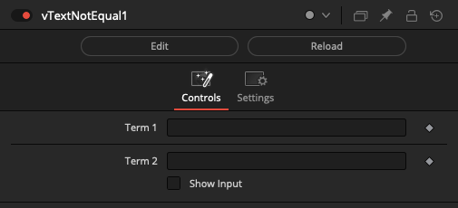

#### vTextTernary

Compare a value and return one of two possible strings as the result

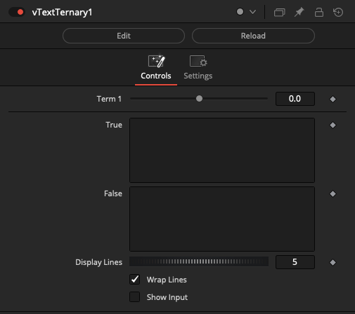

### Order

#### vTextOrderReverse

Reverses the order of a Fusion Text object

The "Text" field contents will be output letter-by-letter in a right-to-left mirrored fashion that reverses the text's placement.

If you typed in "Hello Shuffle World!" the output would be "!dlroW elffuhS olleH".

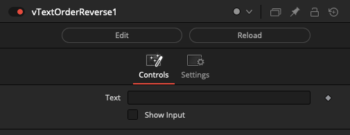

#### vTextOrderShuffle

Shuffles the order of a Fusion Text object

The "Text" field contents will be output with a randomized order. This is done using an approach known as a [Fisher--Yates](https://en.wikipedia.org/wiki/Fisher%E2%80%93Yates_shuffle) shuffle.

If you typed in "Hello Shuffle World!" the output would be "Wdool uhSffod rlHoe!".

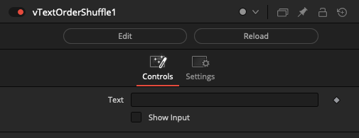

### Fusion

#### vTextRenderComp

Launches a command-line Fusion Render Node based .comp or .dfq process via popen

This node currently works on macOS and Linux. Windows support is a WIP task that is yet to be completed.

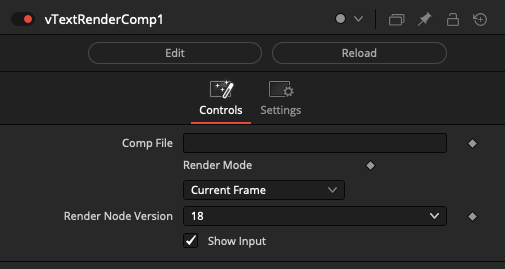

The Fusion composite specified in the "Comp File" field will be batch rendered in the background by the Fusion Render Node executable.

The "Render Mode" control allows you to adjust how the composite will be rendered.

If "Current Frame" is selected, the parent comp's current frame will be passed to the Fusion Render Node program as the frame to render in the child comp.

If "Comp Frame Range" is selected, the parent comp's Render Start - Render End frame range will be sent to the Fusion Render Node program as the frame range to render in the child comp.

If "Comp Frame Range" is selected, the parent comp's Render Start - Render End frame range will be sent to the Fusion Render Node program as the frame range to render in the child comp.

If "Custom Frame Range" is selected, a set of numerical input controls will be displayed. These controls allow you to manually drive the frame range used by the Fusion Render Node program on the fly.

The "Render Node Version" control allows you to choose the exact Fusion Render Node executable version number you would like to launch when the .comp file is rendered. This allows you the flexibility to target a different Fusion Render node release than you are using to run the GUI session inside of Fusion Studio.

#### vTextRenderManager

Submit a .comp or .dfq file to the Fusion Studio Render Manager. The vTextRenderManager node is processed when you hit the "render" button in the comp, so it avoids accidentally launching unintended job tasks in an interactive Fusion session.

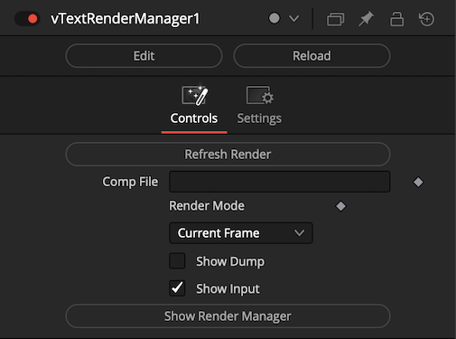

The vTextRenderManager tool allows you to use Vonk Ultra nodes to build the name of a .comp file, and then it can be submitted to the render manager for processing.

If you are on a single user artist system, you can submit your Fusion Studio based comps to the Fusion Render Manager and a GUI session of Fusion will be used to render the output. If you have any Fusion Render Node systems connected to the Fusion Render Manager, you have the option to further accelerate your workflows with distributed rendering.

The "Render Mode" control allows you to adjust how the composite will be rendered.

If "Current Frame" is selected, the parent comp's current frame will be passed to the Fusion Render Node program as the frame to render in the child comp.

If "Comp Frame Range" is selected, the parent comp's Render Start - Render End frame range will be sent to the Fusion Render Manager as the frame range to render in the child comp.

If "Comp Frame Range" is selected, the parent comp's Render Start - Render End frame range will be sent to the Fusion Render Manager as the frame range to render in the child comp.

If "Custom Frame Range" is selected, a set of numerical input controls will be displayed. These controls allow you to manually drive the frame range used by the Fusion Render Manager.

If "Predefined Frame Range" is selected, the frame range defined in the original .comp file on disk is used for the rendering task.

##### Multi-View Rendering Tasks

If you are processing immersive content, or volumetric video the vTextRenderManager is a huge help.

The design goal with the vTextRenderManager node is that you start by using Vonk filesystem nodes to copy Fusion .comp templates into project sub-folders.

The comps would be built with relative PathMap based file paths. Then you would kick off the rendering task for these .comp files with the vTextRenderManager node.

This allows you to process media from multi-view camera arrays or other complex file structure based media hierarchies.

##### Side by Side Scripting of Comp Renders

Fusion has a really neat hidden capability called SxS (side-by-side) scripting. It works with comp files and allows you to make adjustments on the fly when the comp is loaded and rendered. This takes comp template creation and automation to the next level!

With SxS scripting, you can place a custom lua script in the same folder as your comp file. If the script has the same base filename it will be run as soon as the comp is rendered.

Example SxS Script and Comp Filenames:

- Example.comp
- Example.lua

### Resolve

#### vTextResolvePID

Returns the Resolve/Fusion PID (Process ID)

A PID value is an integer style number that is used by the operating system to track a running executable.

Often PID values are the identifier used to tell an external program to gracefully quit. A PID number can also be used by the "renice" terminal utility to help balance the compute load on a system by scaling back the resource hogging level of a single dominant program that is reducing the overall interactivity of the host computer.

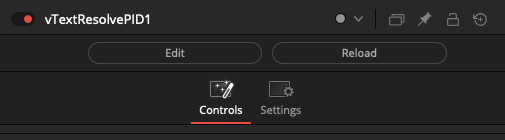

#### vTextResolveProjectName

Returns the current Resolve project name

This node outputs a Text based string that holds the name of the current Resolve editing project as listed in the Resolve "Project Manager" window.

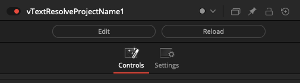

### Script

#### vTextDoAction

Executes Fusion actions

The "Action Name" text field is where the action you want to run is entered.

The "Action Params" text field contents are placed inside a Lua table like element {}. This information is used to specify any extra attributes you would like to pass along to the action when it is run.

The "Wrap Lines" checkbox makes it possible to enable/disable line wrapping in the text preview area.

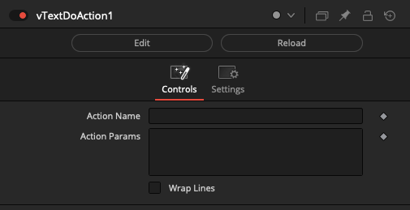

DoAction is launched via the "self.Comp:Execute()" function so it is run asynchronously.

#### vTextDoString

Return a Text object from running a string of Lua code

The node automatically creates new text input connections as needed.

The text based input data can be accessed in the script using a Lua table variable named "tbl".

The text based output connection on the node receives the data that is defined by the "return" command.

The "Script Header Wire" input is used to specify a text datatype connection of code that is appended to the top of the Lua Script field contents when run. The script content connected to the Script Header Wire field is typically sourced from a vTextCreateMultiline or vTextFromFile node.

In your Lua Script code you can iterate through each record in the Lua table data using:

    for i, v in ipairs(tbl) do
    end

If you need to temporarily troubleshoot the internals of what your code is doing in the vTextDoString node there are two diagnostic checkbox controls labelled "Show Code" and "Show Dump". The output from those options is displayed in the Console window. For performance reasons you probably want to leave those options turned off most of the time when rendering long sequences in Fusion to reduce the Console logging overhead.

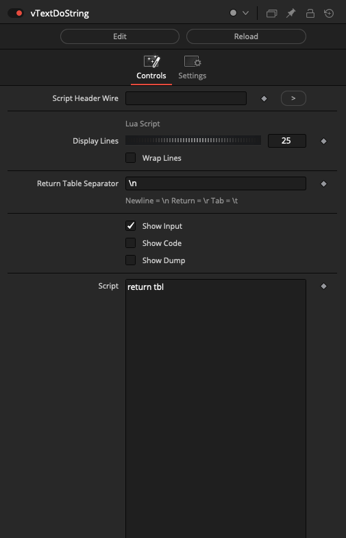

#### vTextExecute

Executes code sourced from a Fusion Text object

The "Script Language" control is used to define if you want to use Lua or Python code in the text input field. This code is executed asynchronously by the Fusion API function "`self.Comp:Execute()`".

In the code block you can return a value from the executed script to the node graph with the function "`OutText()`". An example of that would be '`OutText("Hello World")`'. The output from the vTextExcute node is a text based filepath that holds any results you might have written to disk using the function "OutText()".

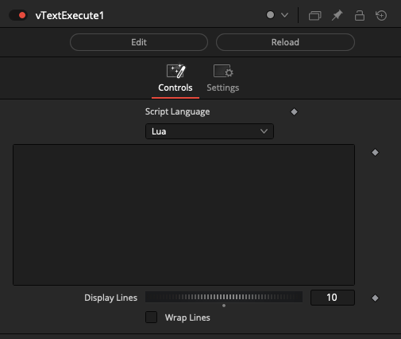

#### vTextProcessOpen

Launches a command-line process via popen

The "Text" field is used to define the executable program name and the command-line arguments you want to run from a shell session. The output from the shell session is returned to the node's output connection as a text data type result.

Typically a vTextSubFormat node is used to build the executable command line string that is supplied to the Text input on a vTextProcessOpen node. If you need cross-platform support you can use a vTextCreatePlatform or vTextCreatePlatformBrowse node to automatically define the per-OS specific elements like the program name to run.

If you need to access more complex automation techniques, or dynamically define custom environment variables, it is possible to use a vTextToFile node to export a dynamically created .bat (Windows), .sh (Linux), .command (macOS) script file to the TEMP folder on disk. Then the vTextProcessOpen node could be used to execute this document by specifying in the "Text" field both the shell interpreter to use, like "/bin/zsh" or "/bin/zsh", and the external script file to run:

"Text" field contents:

    "/bin/zsh"  "/tmp/Vonk_Temp_Script.command"

"Vonk_Temp_Script.command" File Contents:

    #!/bin/zsh
    say Hello Vonk World!

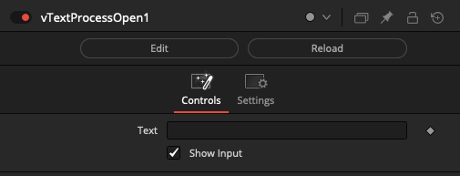

#### vTextRunScript

Runs an external Lua script

The "File" text-field is used to specify an external .lua script file.

This node is powered by the Lua "`dofile()`" function.

Note: This node is effectively deprecated please use vTextDoString Instead.

#### vTextShellBG

Launch a command-line shell task in the background via `bmd.executebg()`

The "Wait" checkbox can be used to make the node act in a blocking fashion that will pause the rendering of this branch of the comp until the launched process has completed and exited.

Note: Make sure to write in the absolute filepath for the executable program you want to run. You can discover this by typing "which SomeProgramName" into the Terminal window on macOS/Linux:

    which open
    /usr/bin/open

Also, the vTextShellBG node is used to launch a program with its command line arguments specified. It is not a full terminal environment so shell redirection approaches and expanding environment variable tokens in the command string are not supported. If you need those extended command line scripting features, write out a temporary .bat/.sh/.command file to disk then use vTextShellBG to run the script.

#### vTextSlashCommand

Run a Console Fuse SlashCommand as a node

A SlashCommand is a type of Lua or Python script in Fusion that is normally launched from the Console window by prefacing a command with a leading "/" character.

### Substring

#### vTextMerge

Dynamically joins strings into one

Merge together several strings that are connected to the node's text based input connections. The combined strings are joined with the addition of a user defined separator character.

#### vTextSubFormat

Formats a template string with input values

Each input connection on the vTextSubFormat node can be placed exactly where it is needed using a token approach. A token value is entered using curly braces that surround an integer number like "`{1}`" or "`{2}`" that represent an input connection number on the node.

#### vTextSubFormatMultiline

Formats a multi-line template string with input values

Each input connection on the vTextSubFormat node can be placed exactly where it is needed using a token approach. A token value is entered using curly braces that surround an integer number like "`{1}`" or "`{2}`" that represent an input connection number on the node.

#### vTextSubJoin

Dynamically joins strings into one

#### vTextSubReplace

Replaces substrings of a string

The "Pattern" text field uses [Lua Patterns](http://lua-users.org/wiki/PatternsTutorial) to parse the string. Additional information about patterns can be read in the [Lua manual](https://www.lua.org/manual/5.3/manual.html#6.4.1).

The 2nd text field represents the "Replace" text that will be substituted.

#### vTextSubReturn

Returns a substring of a string

This node is used to shorten a string by using the Start and End numeric fields to define the number of characters to remove.

A positive number entered in the number input fields is used to define the removal of characters by starting the counting process at the left side of the input string. A negative number in the number input fields is used to define the removal of characters starting on the right side of the input string.

This added complexity makes it easier to remove elements like a 3 letter file extension using the negative number input ability to trim off characters starting from the end (right side) of a variable length text string in a precise fashion.

#### vTextSubSplit

Returns a substring of a string

The "Pattern" text field uses [Lua Patterns](http://lua-users.org/wiki/PatternsTutorial) to parse the string into a JSON like Array object. Additional information about patterns can be read in the [Lua manual](https://www.lua.org/manual/5.3/manual.html#6.4.1).

The portion of the pattern you want to return should be placed inside a pair of parentheses characters "(" and ")".

If you wanted to return all of the characters from the input string you would use a Pattern of: `(.*)`

If you had a list of single word objects that were comma separated like: `Apple;Orange,Pear,Mango`

Then you could break the text down into individual objects using a Pattern of: `(%a+),-`

The output would be formatted as: `{"size":4,"array":["Apple","Orange","Pear","Mango"]}`

If you had a string with an IPv4 style IP address in it like "192.168.1.1", you could break the text down into individual digits groupings using a Pattern of: `(%d+)`

The output would be formatted as: `{"size":4,"array":["192","168","1","1"]}`

#### vTextSubStripLeft

Strips a leading substring of a string

The "Strip" text field is used to define the text you would like to remove from the (left side) of the input text data that is connected to the node. This type of text editing would sometimes be called removing a leading prefix element from a string.

#### vTextSubStripRight

Strips a trailing substring of a string

The "Strip" text field is used to define the text you would like to remove from the (right side) of the input text data that is connected to the node. This type of text editing would sometimes be called removing a trailing postfix element from a string.

### Subtitle

#### vTextFromSubtitle

Creates a Fusion Text object by extracting text from SRT Subtitles

### Temporal

#### vTextAccumulator

Temporally concatenates a text string over a frame range

This node can be thought of as a text based merge node that works across a time range. It can be used to create IFL (image file lists) or other types of results that are built over time by dynamically generated strings of text.

The "Start Frame" control will often be driven by a vNumberCompRenderStart or vNumberCompGlobalStart node.

The "End Frame" control will often be driven by a vNumberCompRenderEnd or vNumberCompGlobalEnd node.

The "Step" control allows for frame skipping to occur.

The "Separator" text field is used to define the character placed between each text element that is concatenated (merged) together. You might want to use a separator like a space, a comma, a semicolon, or a newline (\\n), return (\\r), or a tab (\\t).

The "Sort List" checkbox works on a line-by-line basis to alphabetically sort the results generated by the node.

The "Remove Duplicates" checkbox can be used to remove any lines that have an identical output that pre-exists in the results.

The counterpoint to the vTextAccumulator node is the vTextReadLine node that can break apart a multi-line text block into single line elements.

If you want to stop a vTextAccumulator node from re-rendering on subsequent frames in the Fusion timeline, you can add a "vTextTimeSpeed" node right afterwards and set the Speed to 0 and the Delay to 0.

#### vTextTimeSpeed

Time based operation on text

#### vTextTimeStretch

Time based operation on text

#### vTextDelay

Creates a Delay while passing a Fusion Text object

The delay effect is measured in seconds. This node is implemented internally using the "`bmd.wait()`" function.

Among several use cases one can find for a tool that can momentarily pause rendering; it can be used to simulate a slow to render comp task when testing a render farm program. It also has applications when running a command line task via the Vonk ProcessOpen node and the system requires a momentary pause.

### Utility

#### vTextDump

Dump the contents of a Fusion Text object to the Console window

The vTextDump node is handy for printing diagnostic logging information to the Console during a complex workflow. This could include status results, frame counts, or any other information. You can see this output text in the Console view, or for a job that is sent to be processed by Fusion Render Node the terminal/command prompt output will show the log results.

If you want to build an elaborate block of text to be output by the "vTextDump" node, you can assemble the compound string using the "vTextSubFormatMultiline" node where each input connection is able to be sourced from separate data nodes.

Vonk number datatype content can be translated into a text format using the "vTextFromNumber" node. If you require leading zero based frame padding, look at the "vTextFromNumberPadded" node. The "vTextCompCurrentTime1" node returns the current timeline frame number in a format that can be used directly with the input connections on a "vTextSubFormatMultiline" node.

Tip: The "Shift + 0" hotkey is useful if you need to quickly toggle the visibility of the Console window in Resolve or Fusion Studio. Alternatively, clicking on the "Console" tab button at the top left of the Fusion Studio user interface will carry out a similar task.

#### vTextExpandEscapedCharacters

Process escaped newline, return and tab characters in a Fusion Text object

#### vTextFromCSVViewer

View a CSV row or column in the Inspector

#### vTextLength

Returns the length of a string

The vTextLength node counts the number of characters present in a string. It returns the text length value as an integer based Number data type.

If the text "Hello" was input to the vTextLength node, the output would be a string length measurement of the number 5.

#### vTextLineCount

Returns the line count of a multi-line string

This node is especially useful if you are working with IFL (Image File Lists), or CSV (Comma Separated Value) / TSV (Tab Separated Value) text files. It gives you a quick indication of how many rows of text are in the supplied multi-line block of text.

The output from the node is a Number data type that indicates the total line count. If the text file had ten lines of text supplied to the input connection, then the output from the node would be the number 10.

#### vTextNormalizeSlashes

Unifies the slash direction on filepaths

The "Slash Direction" multi-button control allows you to choose if you want Windows (\\) or Linux (/) style slashes for your output text.

The "Remove Duplicate Slashes" checkbox will replace any occurrence for two adjacent slashes with a single slash. This option is something you might not want to use if UNC file paths are common in filenames used in your pipeline.

#### vTextParseFilename

Creates a Fusion Text object by parsing a filepath

The "Text" input field supports a filepath style of string that contains absolute or relative filepaths (including the use of Fusion PathMaps).

The "Parse" ComboControl entries include:

"FullPath", "FullPathMap", "Path", "PathMap", "FullName", "Name", "CleanName", "SNum", "Number", "Extension", "Padding", "UNC", and "Path + Name".

#### vTextParseFilenameOutputs

Creates a Fusion Text object by parsing a disk based filepath

This node is a multi-output connection based variation on the more commonly used vTextParseFilename node. Each output port exports a separate part of the extracted filename components.

The use of this multi-output node is fairly rare but it does a good job of showing that multiple output connections are possible in a fuse node.

#### vTextReadLine

Creates a Fusion Text object by extracting a single line of text from a multi-line text block

The "Index" control accepts integer based number input connections. Typically a vNumberCompReqTime or vNumberCompCurrentTime node will be used to scan through the text input contents one frame at a time.

If your timeline start frame is not frame 1, you can use a vNumberAdd / vNumberSubtract node to shift the frame incrementing value that is fed into the "Index" control. This allows your starting frame of either frame 0, frame 1000, or frame 1001 to be accessed effortlessly as an index value of 1 (meaning line one).

The counterpoint to the vTextReadLine node is the vTextAccumulator node that combines single line elements of text into a multi-line text block of text.

The "Display Lines" control is used to adjust how many visible lines of text are shown in the preview area at once. This number can be lowered if you want to have the vTextViewer node shortened to reduce the amount of vertical screen space used in the Inspector.

The "Wrap Lines" checkbox makes it possible to enable/disable line wrapping in the Input field preview area.

#### vTextSortLines

Sorts a multi-line block of text

The "Sort List" checkbox will break apart a multi-line block of text and alphabetically sort the content on a line-by-line basis.

The "Remove Duplicates" checkbox is used to remove any line entry that is a duplicate entry, meaning the content is not unique.

#### vTextToHTMLViewer

View HTML code in the Inspector

#### vTextViewer

Displays the Fusion Text object contents in the Inspector

The vTextViewer node is a handy way to view multi-line text based data type content using the Inspector.

The "Display Lines" control is used to adjust how many visible lines of text are shown in the preview area at once. This number can be lowered if you want to have the vTextViewer node shortened to reduce the amount of vertical screen space used in the Inspector.

The "Wrap Lines" checkbox makes it possible to enable/disable line wrapping in the text preview area.

