# Vector Nodes

## Node Listing

Array:
- vVectorFromArray

Create:
- vVectorCreate

Operators:
- vVectorAdd
- vVectorCrossProduct
- vVectorDivideNumber
- vVectorDotProduct
- vVectorMultiplyNumber
- vVectorNormalize
- vVectorSlice
- vVectorSubtract

Point:
- vPointToVector
- vVectorFromPoint
- vVectorToPoint

Utility:
- vVectorLength

## Node Docs

### Array

#### vVectorFromArray

Creates a vector from an array

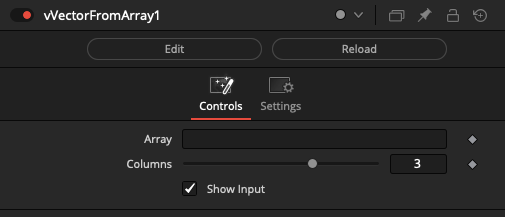

### Create

#### vVectorCreate

Creates a vector from an array

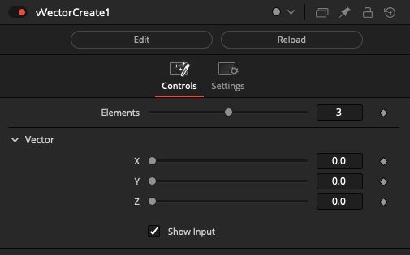

### Operators

#### vVectorAdd

Adds two vectors

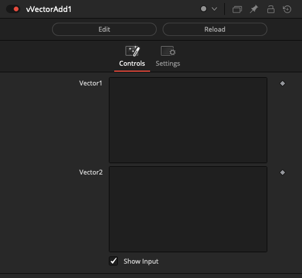

#### vVectorCrossProduct

Adds two vectors

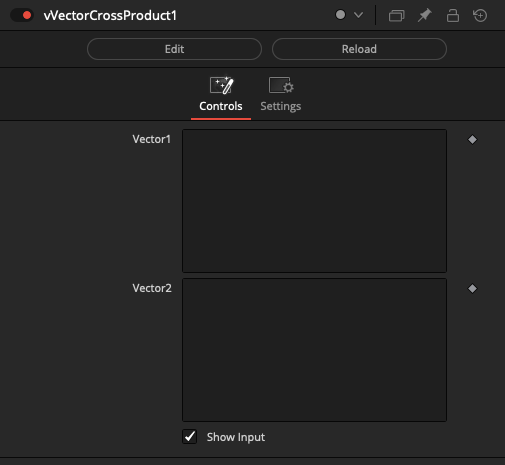

#### vVectorDivideNumber

Divides a vector by a number

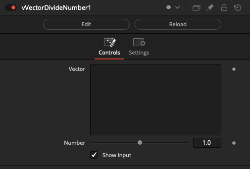

#### vVectorDotProduct

Adds two vectors

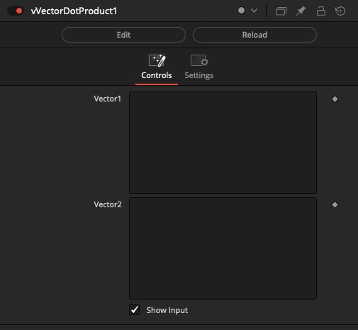

#### vVectorMultiplyNumber

Multiplies a vector by a number

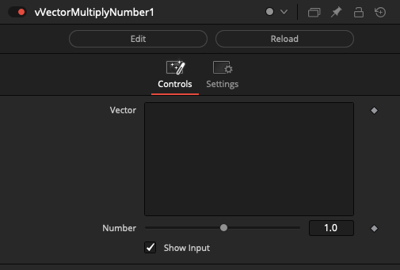

#### vVectorNormalize

Normalizes a vector

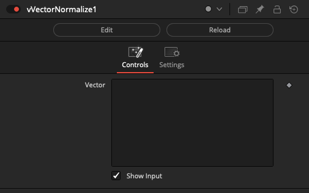

#### vVectorSlice

Slices a vector

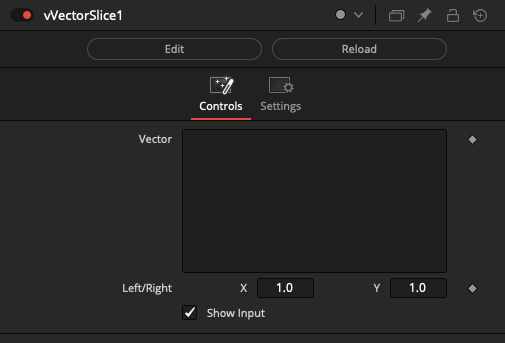

#### vVectorSubtract

Subtracts two vectors

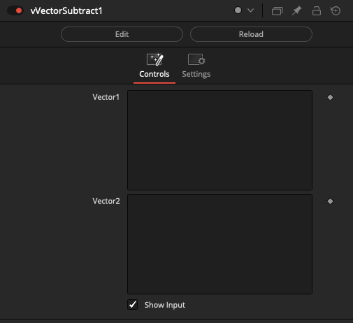

### Point

#### vPointToVector

Creates a vector from a point

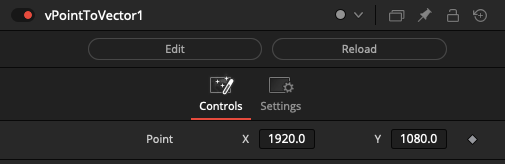

#### vVectorFromPoint

Creates a vector from a point

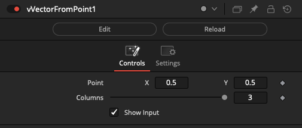

#### vVectorToPoint

Creates a point from a vector

### Utility

#### vVectorLength

Calculates the length of a vector

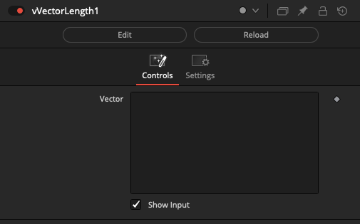
