# Array Nodes

## Node Listing

Create:

- vArrayBuffer
- vArrayCircularPoints
- vArrayCreate
- vArrayCreateJSONFont
- vArrayCreateList
- vArrayCreateMinMax
- vArrayCreateRandom
- vArrayCreateTextFont
- vArrayFromAudio
- vArrayFromOBJ
- vArrayFromXYZ
- vArrayGenerateSphere
- vArrayGenerateSpirals
- vArrayGenerateText
- vArrayLissajouseSpline
- vArrayLogarithmicSpiral
- vArrayMapGeoJSON
- vArrayPhyllotaxis
- vArrayPointParticles
- vArrayPointsHexagonGrid
- vArrayPointsOnCircle
- vArrayPointsOnCube
- vArrayPointsOnGrid
- vArrayPointsOnRectangle
- vArrayPointsOnSphere
- vArrayToOBJ
- vArrayToXYZ

Logic:

- vArrayLogicBetween

Modify:

- vArrayBoundingBox
- vArrayCameraProjection
- vArrayConvert2D-3D
- vArrayDisplaceValues
- vArrayInterpolate
- vArrayIterator
- vArrayMapRange
- vArrayMath
- vArrayPacker
- vArrayParallelPointsOffSet
- vArrayPerlin3Noise
- vArrayPointsConnect
- vArrayPointsOnArc
- vArrayRotateValues
- vArraySin
- vArraySortByDistance
- vArrayTangentVector
- vArrayTextWrap
- vArrayTranslate
- vArrayUnPacker
- vArrayWave

ShapeRender:

- vArrayShapeRender
- vArrayShapeRenderTextPath

Shapes:

- vArrayCustom2DShapes
- vArrayCustom3DShapes
- vArrayShapeText
- vArrayTangentVectorItem

Temporal:

- vArrayAccumulator
- vArrayAccumulatorOBJ

Utility:

- vArrayAppend
- vArrayAppendGroup
- vArrayInfo
- vArrayMerge
- vArrayMergeOBJ
- vArrayReducePoints
- vArraySlicer.fuse

## Node Docs

### vArrayBuffer

FIFO (first in first out) in an array

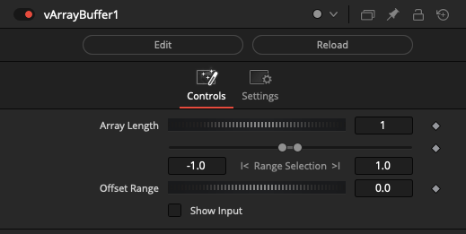

### vArrayCircularPoints

Distributes points in circular form

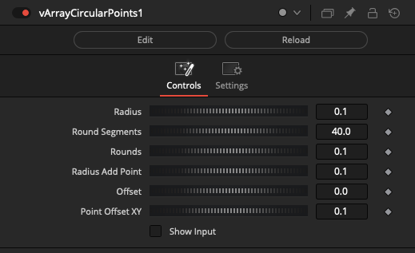

### vArrayCreate

Creates an Array

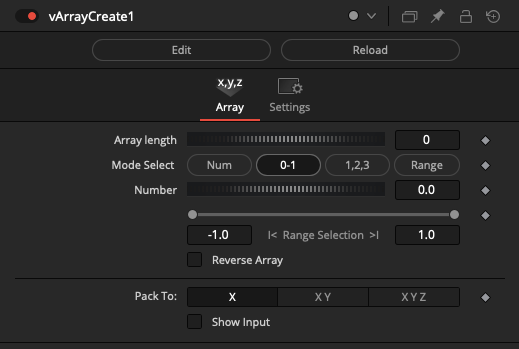

### vArrayCreateJSONFont

Generates a JSON array-based font

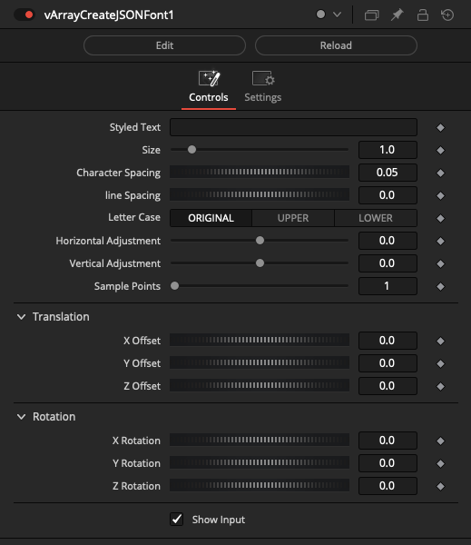

### vArrayCreateList

Creates an Array

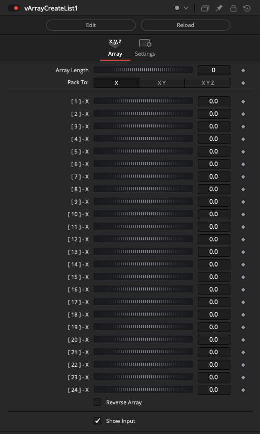

### vArrayCreateMinMax

Creates Array based on Max/Min operations

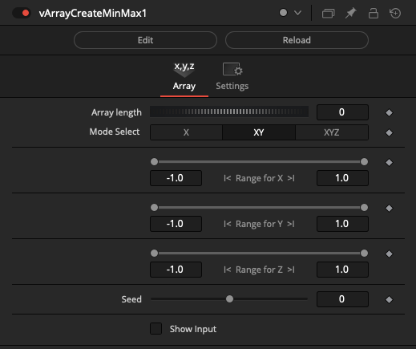

### vArrayCreateRandom

Creates a Random Array

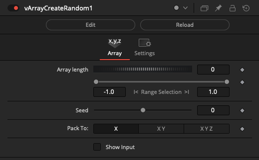

### vArrayCreateTextFont

Creates Text Font

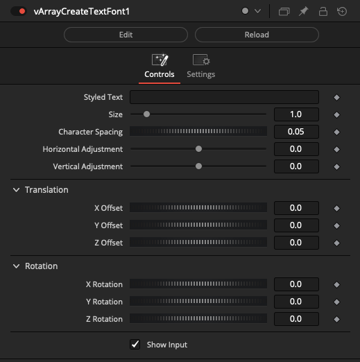

### vArrayFromAudio

Convert .wav audio data into a vArray format

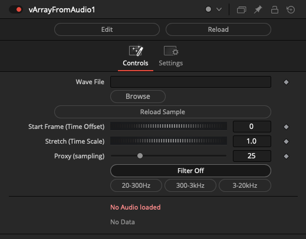

### vArrayFromOBJ

Convert Wavefront OBJ mesh data into a vArray format

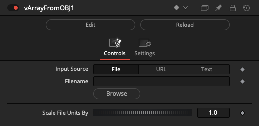

### vArrayFromXYZ

Convert ASCII XYZ point cloud data into a vArray format

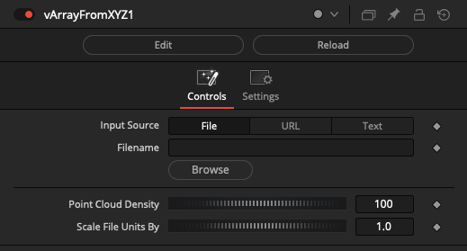

### vArrayGenerateSphere

Generates a Sphere with longitude/latitude lines

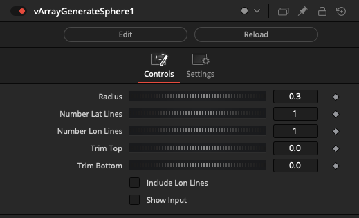

### vArrayGenerateSpirals

Generate Spiral splines

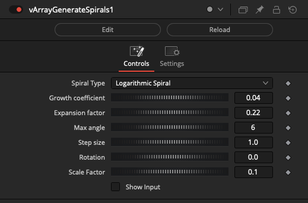

### vArrayGenerateText

Example, generating random Text and Strings

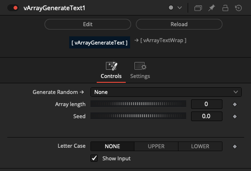

The following Generate Random options are available:

- Pick from → input Array
- Lorem ipsum

Basics:

- Bool
- Character
- Word
- Letter
- Vowel

Names:

- Name
- Male name
- Male name w/last
- Name w/last
- Female name
- Female name w/last

Numbers:

- Hash
- Integer
- Integer w/min
- Integer w/both

Color:

- rgb
- rgba
- hsl 
- hsla

Tech:

- ip
- ipv4
- ipv6

Location:

- Phone
- Address
- Street

Strings:

- String
- Syllable
- Shuffle

### vArrayLissajouseSpline

Generate a Lissajouse spline

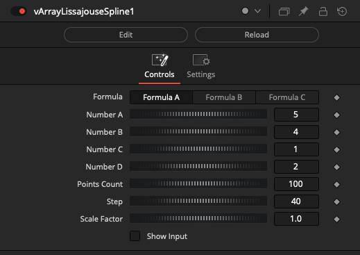

### vArrayLogarithmicSpiral

Generate a logarithmic Spiral spline

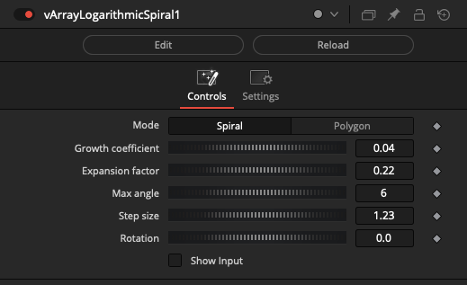

### vArrayMapGeoJSON

Map from geographic coordinates

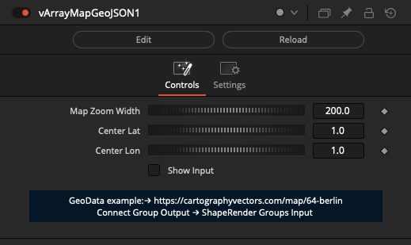

### vArrayPhyllotaxis

Generate points on Phyllotaxis

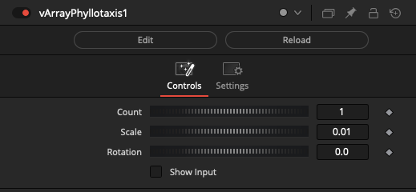

### vArrayPointParticles

Simple particle generator

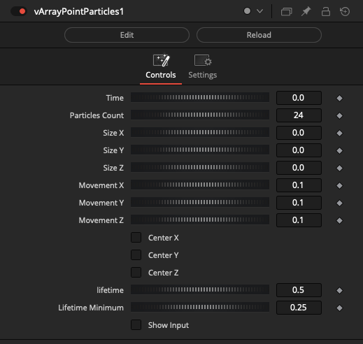

### vArrayPointsHexagonGrid

Generate points on Hexagon Grid

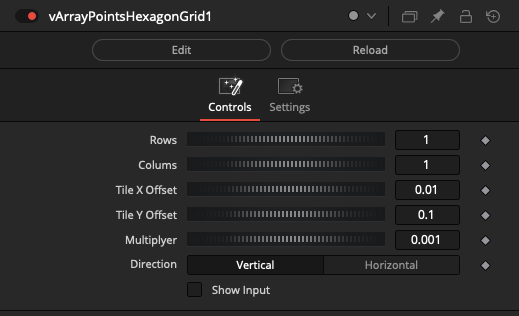

### vArrayPointsOnCircle

Generate points on Array Cricle

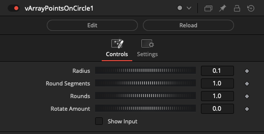

### vArrayPointsOnCube

Generate points on cube

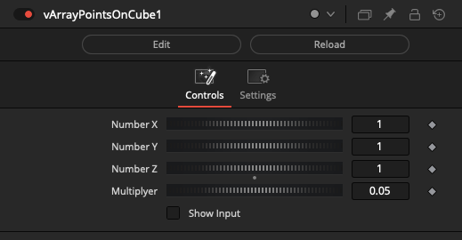

### vArrayPointsOnGrid

Generate points on Array Grid

### vArrayPointsOnRectangle

Generate points on Rectangle

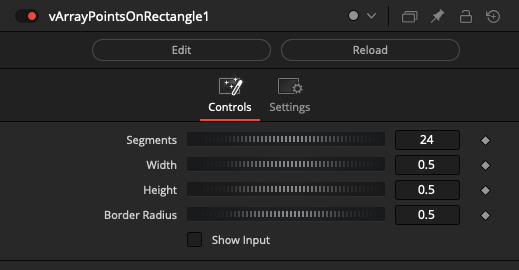

### vArrayPointsOnSphere

Generate points on Sphere

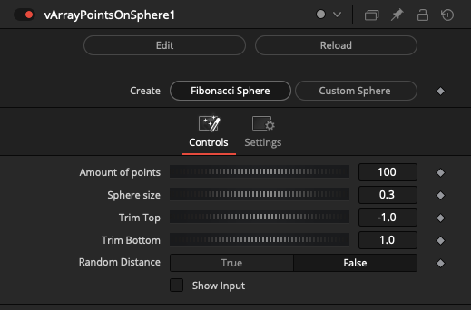

### vArrayToOBJ

Convert an Array into Wavefront OBJ ASCII Text

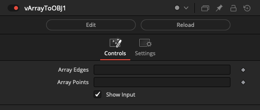

### vArrayToXYZ

Convert an Array into XYZ ASCII Text

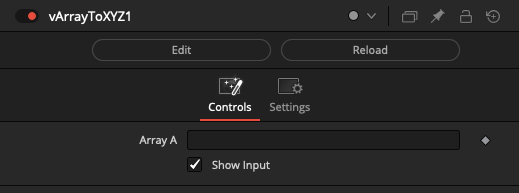

### vArrayLogicBetween

Logic Between Operations on an Array. If value of array is between min and max then the value is 1 else 0

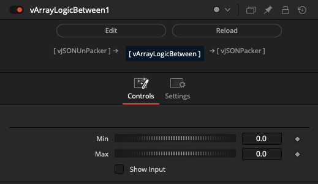

### vArrayBoundingBox

Calculate a 3D, 2D, or 1D bounding box volume from an Array of XYZ/XY/X points

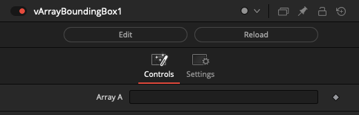

### vArrayCameraProjection

Transforms Array using a perspective projection matrix

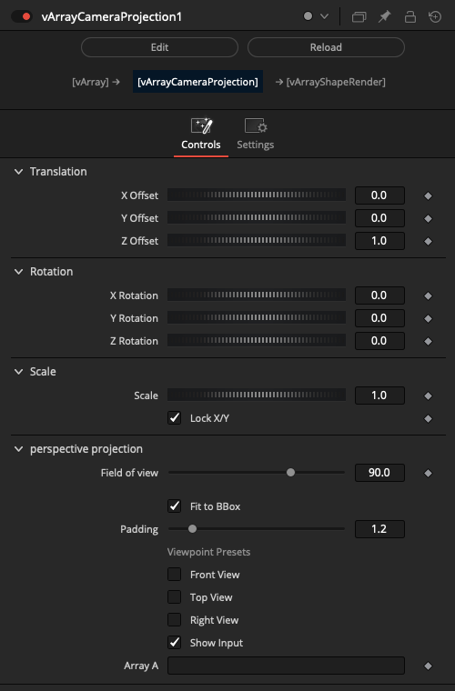

### vArrayConvert2D-3D

Convert 2D array to 3D array

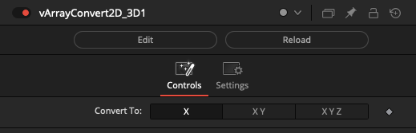

### vArrayDisplaceValues

Displace XYZ positions using noise with spherical falloff

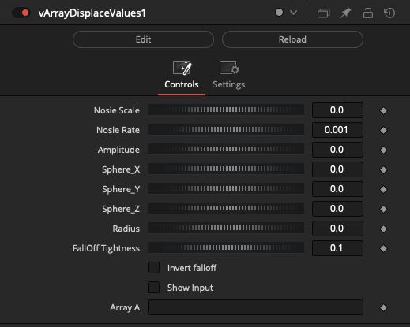

### vArrayInterpolate

Interpolate between two arrays

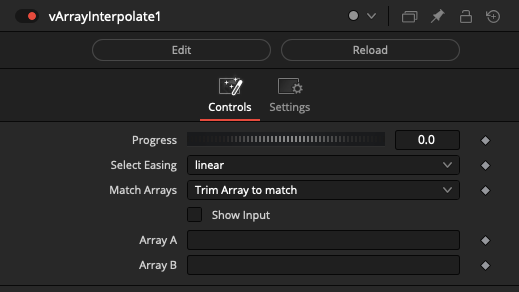

Select Easing options include:

- linear
- easeInQuad
- easeOutQuad
- easeInOutQuad
- easeInExpo
- easeOutExpo
- easeInOutExpo

Match Array options include:
- Trim Array to match
- Add Zeros to match

### vArrayIterator

Loop an array

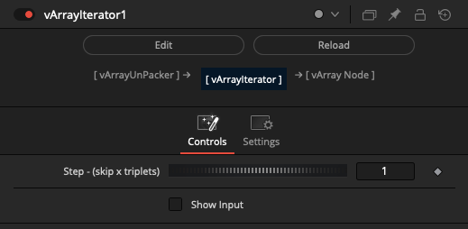

### vArrayMapRange

Map Range Operations on an Array

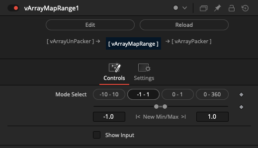

### vArrayMath

Math Operations on an Array

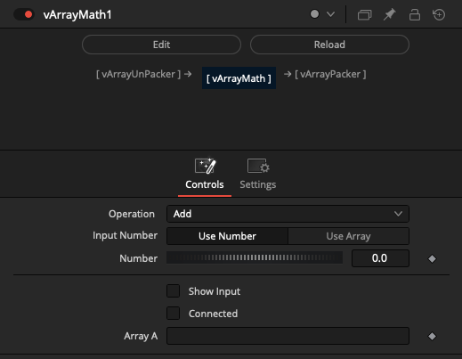

Tip: If you want to apply math operations to arrays of XY or XYZ value pairs, the vArrayUnPacker node will extract all the values into a single linear sequence of numbers. You can then use the vArrayMath node to modify the values. Then a vArrayPacker node can remux the linear sequence of numbers back into XY or XYZ value pairs.

Example Node Connections:

    vArrayGenerateSpirals.Output -> vArrayUnPacker.ArrayB
    vArrayUnPacker.Output -> vArrayMath.ArrayA 
    vArrayMath.Output -> vArrayPacker.ArrayA
    vArrayPacker.Output -> vArrayViewer.Text

The following math operations are supported:

- Subtract A-B
- Multiply
- Divide A/B
- Min
- Max
- Average
- Difference
- Modulo A/B
- Power A^B
- Arc Tangent A/B
- Sine
- Cosine
- Tangent
- Arc Sine
- Arc Cosine
- Arc Tangent
- Log
- Log 10
- Exponential
- Degrees to Radians
- Radians to Degrees
- Absolute Value
- Ceiling
- Floor
- Square Root
- Reciprocal
- Negate
- Random
- Randomseed
- Matrix Multiply

Tip: A Vonk vMatrix transform can be applied to an array when the "Operation" control is set to "Matrix Multiply", and the "Input Number" is set to "Use Array". The ideal vMatrix node to use for this application is the "vMatrixCreateTRS" node that combines translation, rotation, and scale.

Example Node Connections:

    vArrayGenerateSpirals.Output -> vArrayMath.ArrayA
    vMatrixCreateTRS1.Output -> vArrayMath.ArrayB
    vArrayMath.Output -> vArrayViewer.Text

### vArrayPacker

Pack Operations on an Array

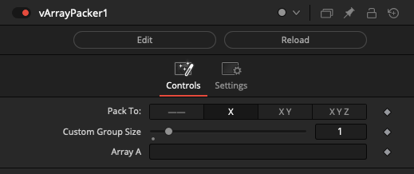

### vArrayParallelPointsOffSet

Offset the parallel points in an array

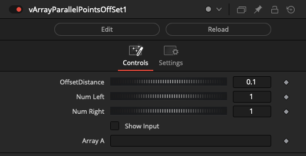

### vArrayPerlin3Noise

Perlin Noise function on array values

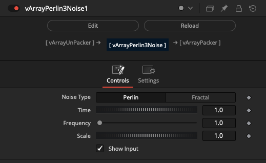

### vArrayPointsConnect

Connect points in an array

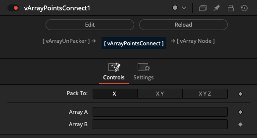

### vArrayPointsOnArc

Generate points on an arc

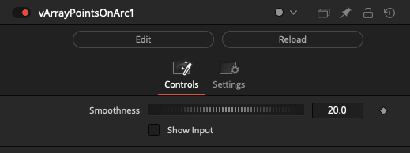

### vArrayRotateValues

Rotate Array Between Operations on an Array

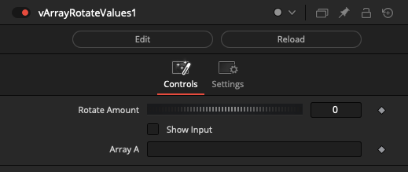

### vArraySin

Math Sin - Cos Operations on an Array

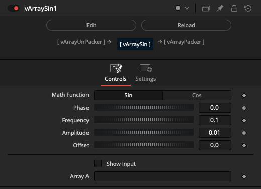

### vArraySortByDistance

Sort array by point distance

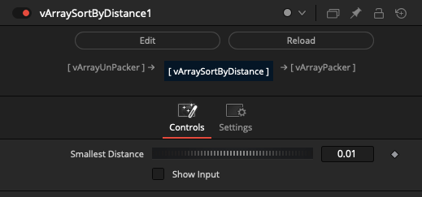

### vArrayTangentVector

Create a vector that is tangent to a curve or surface at a given point

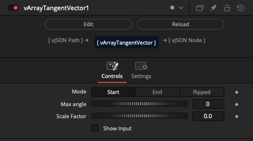

### vArrayTextWrap

Text wrap Operations on a Array

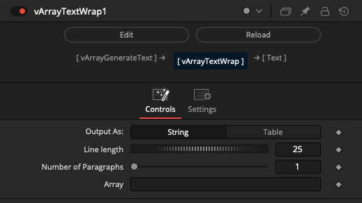

### vArrayTranslate

Transforms array positions

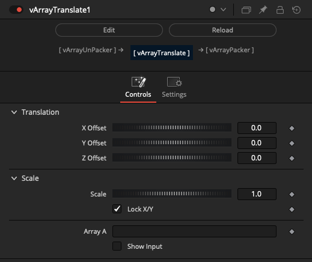

### vArrayUnPacker

Unpack Operations on an Array

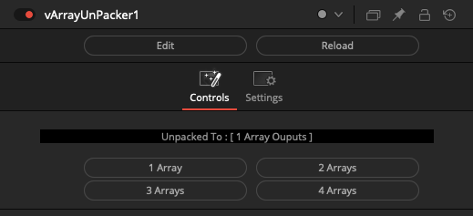

### vArrayWave

Animates an array

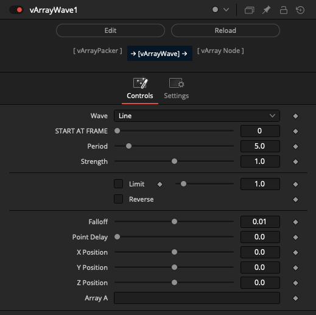

Wave options include:

- Line
- Saw
- Tri
- Square
- Sine
- Noise

### vArrayShapeRender

Create a polygon dot shapes from a Array based Lua table of XY point pairs

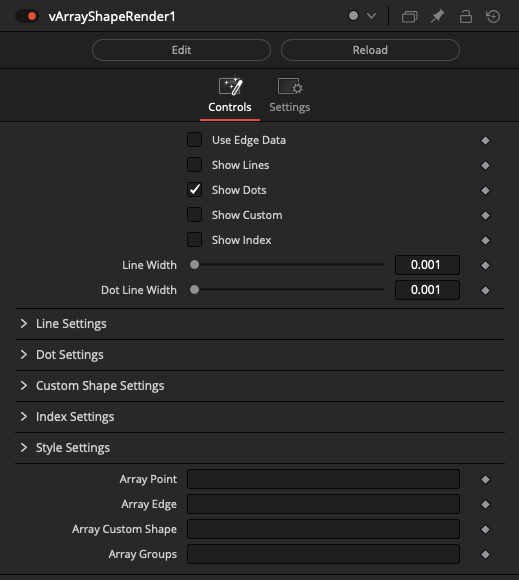

### vArrayShapeRenderTextPath

Using Text and Strings on Array based Lua table of XY points path

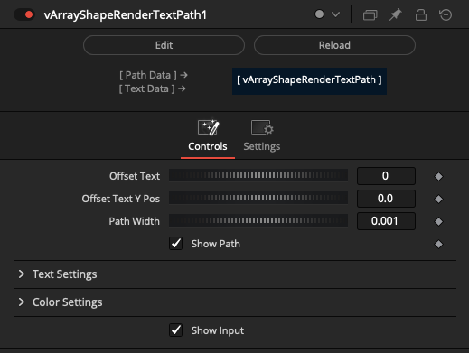

### vArrayCustom2DShapes

Dynamically create 2D Shape elements

### vArrayCustom3DShapes

Dynamically create Shape elements

### vArrayShapeText

Example, using Text and Strings

### vArrayTangentVectorItem

Create a vector that is tangent to a curve or surface at a given point

### vArrayAccumulator

Temporally concatenate array elements

### vArrayAccumulatorOBJ

Temporally concatenate Wavefront OBJ geometry with edge and point array elements

### vArrayAppend

Append Array to an array

### vArrayAppendGroup

Append Array Groups to an array

### vArrayInfo

Returns info of an array

### vArrayMerge

Dynamically join Array elements into one table

### vArrayMergeOBJ

Merge Wavefront OBJ geometry with edge and point Arrays

### vArrayReducePoints

Reduce points Operations on an Array

Decimation Method options include:

- Grid-Based
- Random Sampling
- Curvature-Based (SLOW)

### vArraySlicer

Trim the start and end of single or multi-dimensional arrays

