# JSON Nodes

## Node Listing

Create:

- vJSONBuffer
- vJSONCircularPoints
- vJSONCreate
- vJSONCreateJSONFont
- vJSONCreateList
- vJSONCreateMinMax
- vJSONCreateRandom
- vJSONCreateTextFont
- vJSONFromOBJ
- vJSONFromXYZ
- vJSONGenerateSphere
- vJSONGenerateSpirals
- vJSONGenerateText
- vJSONLissajouseSpline
- vJSONLogarithmicSpiral
- vJSONMapGeoJSON
- vJSONPhyllotaxis
- vJSONPointParticles
- vJSONPointsHexagonGrid
- vJSONPointsOnCircle
- vJSONPointsOnCube
- vJSONPointsOnGrid
- vJSONPointsOnRectangle
- vJSONPointsOnSphere
- vJSONToXYZ

Logic:

- vJSONLogicBetween

Modify:

- vJSONBoundingBox
- vJSONCameraProjection
- vJSONConvert2D-3D
- vJSONDisplaceValues
- vJSONInterpolate
- vJSONArrayIterator
- vJSONMapRange
- vJSONMath
- vJSONPacker
- vJSONParallelPointsOffSet
- vJSONPerlin3Noise
- vJSONPointsConnect
- vJSONPointsOnArc
- vJSONRotateValues
- vJSONSin
- vJSONSortByDistance
- vJSONTangentVector
- vJSONTextWrap
- vJSONTranslate
- vJSONUnPacker
- vJSONWave

ShapeRender:

- vJSONShapeRender
- vJSONShapeRenderTextPath

Shapes:

- vJSONCustom2DShapes
- vJSONCustom3DShapes
- vJSONShapeText
- vJSONTangentVectorItem

Utility:

- vJSONAppend
- vJSONAppendGroup
- vJSONInfo
- vJSONMerge
- vJSONReducePoints
- vJSONSlicer

## Node Docs

### vJSONBuffer

FIFO (first in first out) in an array

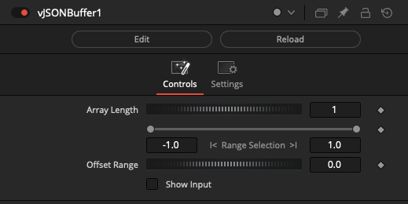

### vJSONCircularPoints

Distributes points in circular form

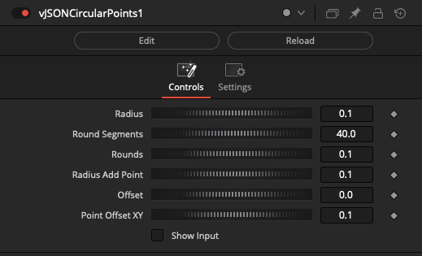

Example Node Connections:

    vJSONCircularPoints1.Output -> vJSONCameraProjection.ArrayA
    vJSONCameraProjection.Output -> vJSONShapeRender.JSONPoint
    Background.Output -> vJSONShapeRender.Input

### vJSONCreate

Creates an Array based on selected modes

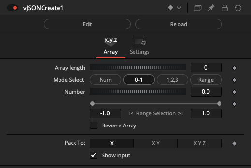

Example Node Connections:

    vJSONCreate.Output -> vJSONCameraProjection.ArrayA
    vJSONCameraProjection.Output -> vJSONShapeRender.JSONPoint
    Background.Output -> vJSONShapeRender.Input

### vJSONCreateJSONFont

Generates a JSON array-based font

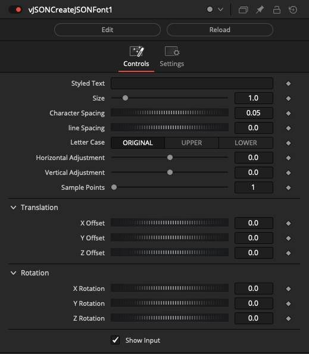

Example Node Connections:

    vJSONFromFile.Output -> vJSONCreateJSONFont.JSON_Font
    vJSONCreateJSONFont.Output -> vJSONCameraProjection.ArrayA
    vJSONCreateJSONFont.Scriptal_Groups -> vJSONShapeRender.JSONTextGroups
    vJSONCameraProjection.Output -> vJSONShapeRender.JSONPoint
    Background.Output -> vJSONShapeRender.Input

### vJSONCreateList

Create an array by entering each value manually

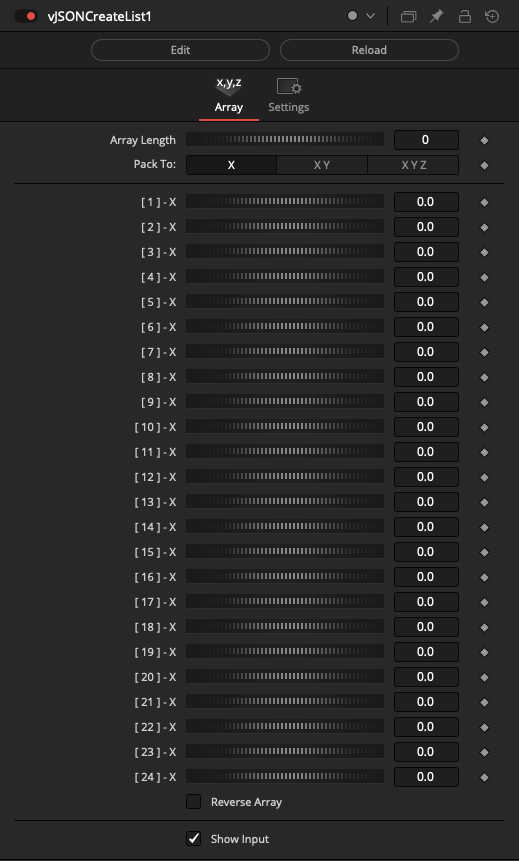

Example Node Connections:

    vJSONCreateList.Output -> vJSONCameraProjection.ArrayA
    vJSONCameraProjection.Output -> vJSONShapeRender.JSONPoint
    Background.Output -> vJSONShapeRender.Input

### vJSONCreateMinMax

Creates Array based on Max/Min operations

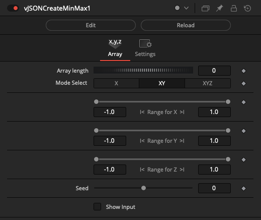

Example Node Connections:

    vJSONCreateMinMax.Output -> vJSONCameraProjection.ArrayA
    vJSONCameraProjection.Output -> vJSONShapeRender.JSONPoint
    Background.Output -> vJSONShapeRender.Input

### vJSONCreateRandom

Creates a random JSON Array

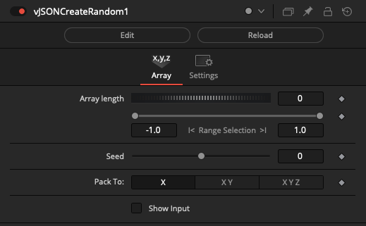

Example Node Connections:

    vJSONCreateRandom.Output -> vJSONCameraProjection.ArrayA
    vJSONCameraProjection.Output -> vJSONShapeRender.JSONPoint
    Background.Output -> vJSONShapeRender.Input

### vJSONCreateTextFont

Creates Text Font

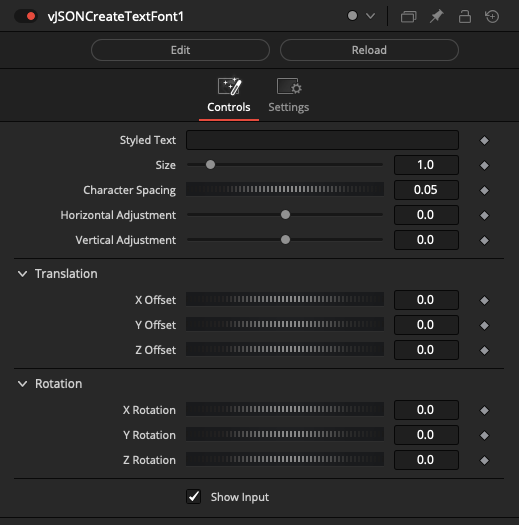

Example Node Connections:

    vJSONCreateTextFont.Output -> vJSONCameraProjection.ArrayA
    vJSONCameraProjection.Output -> vJSONShapeRender.JSONPoint
    Background.Output -> vJSONShapeRender.Input

### vJSONFromOBJ

Convert Wavefront OBJ mesh data into a JSON format

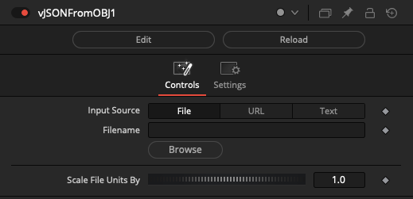

Example Node Connections:

    vJSONFromOBJ.Points -> vJSONCameraProjection.ArrayA
    vJSONFromOBJ.Edges -> vJSONShapeRender.ArrayEdge
    vJSONCameraProjection.Output -> vJSONShapeRender.JSONPoint
    Background.Output -> vJSONShapeRender.Input

### vJSONFromXYZ

Convert ASCII XYZ point cloud data into a JSON format

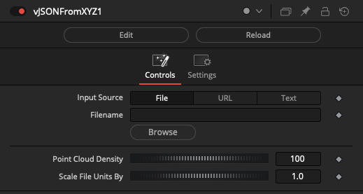

Example Node Connections:

    vJSONFromXYZ.Points -> vJSONCameraProjection.ArrayA
    vJSONCameraProjection.Output -> vJSONShapeRender.JSONPoint
    Background.Output -> vJSONShapeRender.Input

### vJSONGenerateSphere

Generates a Sphere with longitude/latitude lines

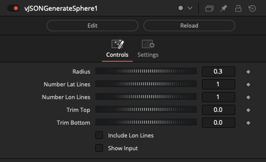

Example Node Connections:

    vJSONGenerateSphere.Output -> vJSONCameraProjection.ArrayA
    vJSONCameraProjection.Output -> vJSONShapeRender.JSONPoint
    Background.Output -> vJSONShapeRender.Input

### vJSONGenerateSpirals

Generate Spiral splines

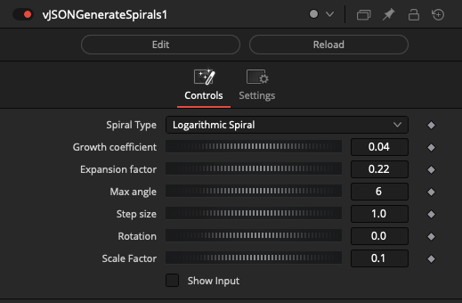

Example Node Connections:

    vJSONGenerateSpirals.Output -> vJSONCameraProjection.ArrayA
    vJSONCameraProjection.Output -> vJSONShapeRender.JSONPoint
    Background.Output -> vJSONShapeRender.Input

### vJSONGenerateText

Example, generating random Text and Strings

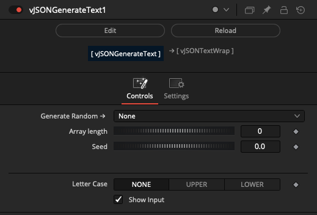

The following Generate Random options are available:

- Pick from → input Array
- Lorem ipsum

Basics:

- Bool
- Character
- Word
- Letter
- Vowel

Names:

- Name
- Male name
- Male name w/last
- Name w/last
- Female name
- Female name w/last

Numbers:

- Hash
- Integer
- Integer w/min
- Integer w/both

Color:

- rgb
- rgba
- hsl 
- hsla

Tech:

- ip
- ipv4
- ipv6

Location:

- Phone
- Address
- Street

Strings:

- String
- Syllable
- Shuffle

Lorem ipsum Node Connections:

    vJSONGenerateText.chanceOperation = "Lorem ipsum"
    vJSONGenerateText.selectMode = "Paragraph"
    vJSONGenerateText.paragraphCount = 8
    vJSONGenerateText.OutputValData -> vJSONTextWrap.Array
    vJSONTextWrap.Text -> vTextViewer.Input

Name Node Connections:

    vJSONGenerateText.chanceOperation = "Name"
    vJSONGenerateText.arrayLength = 1
    vJSONGenerateText.OutputValData -> vJSONViewer.Text

Female name with last name Node Connections:

    vJSONGenerateText.chanceOperation = "Female name w/last"
    vJSONGenerateText.arrayLength = 1
    vJSONGenerateText.OutputValData -> vJSONViewer.Text

RGB Color Node Connections:

    vJSONGenerateText.chanceOperation = "rgb"
    vJSONGenerateText.arrayLength = 12
    vJSONGenerateText.OutputValData -> vJSONViewer.Text

IPv4 Node Connections:

    vJSONGenerateText.chanceOperation = "ipv4"
    vJSONGenerateText.arrayLength = 1
    vJSONGenerateText.OutputValData -> vJSONViewer.Text

### vJSONLissajouseSpline

Generate a Lissajouse spline

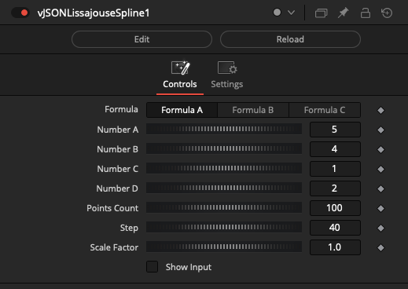

Example Node Connections:

    vJSONLissajouseSpline.Output -> vJSONCameraProjection.ArrayA
    vJSONCameraProjection.Output -> vJSONShapeRender.JSONPoint
    Background.Output -> vJSONShapeRender.Input

### vJSONLogarithmicSpiral

Generate a Logarithmic Spiral spline

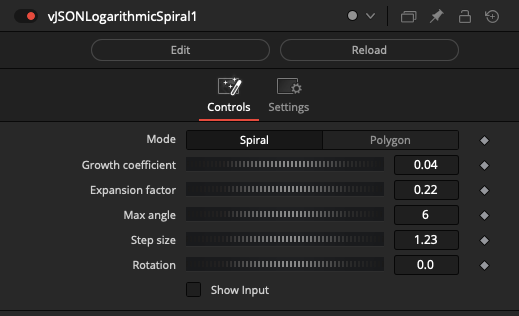

Example Node Connections:

    vJSONLogarithmicSpiral.Output -> vJSONCameraProjection.ArrayA
    vJSONCameraProjection.Output -> vJSONShapeRender.JSONPoint
    Background.Output -> vJSONShapeRender.Input

### vJSONMapGeoJSON

Map from geographic coordinates

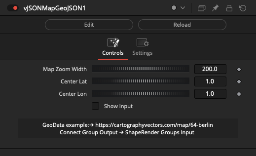

Example Node Connections:

    vJSONFromFile.Output -> vJSONMapGeoJSON.ArrayA
    vJSONMapGeoJSON.Output -> vJSONCameraProjection.ArrayA
    vJSONCameraProjection.Output -> vJSONShapeRender.JSONPoint
    vJSONMapGeoJSON.ScriptVal_Groups -> vJSONShapeRender.JSONTextGroups
    Background.Output -> vJSONShapeRender.Input

### vJSONPhyllotaxis

Generate points on Phyllotaxis

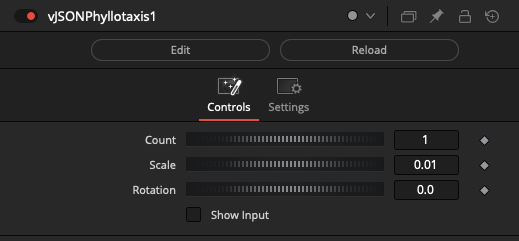

Example Node Connections:

    vJSONPhyllotaxis.Output -> vJSONCameraProjection.ArrayA
    vJSONCameraProjection.Output -> vJSONShapeRender.JSONPoint
    Background.Output -> vJSONShapeRender.Input

### vJSONPointParticles

Simple particle generator

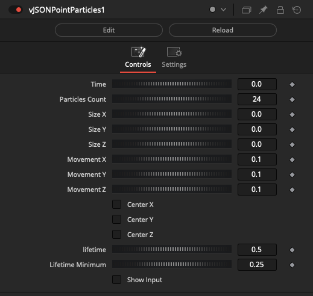

Example Node Connections:

    vJSONPointParticles.Output -> vJSONCameraProjection.ArrayA
    vJSONCameraProjection.Output -> vJSONShapeRender.JSONPoint
    Background.Output -> vJSONShapeRender.Input

### vJSONPointsHexagonGrid

Generate points on Hexagon Grid

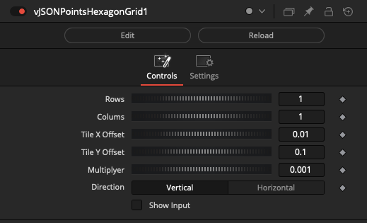

Example Node Connections:

    vJSONPointsHexagonGrid.Output -> vJSONCameraProjection.ArrayA
    vJSONCameraProjection.Output -> vJSONShapeRender.JSONPoint
    Background.Output -> vJSONShapeRender.Input

### vJSONPointsOnCircle

Generate points on a cricle

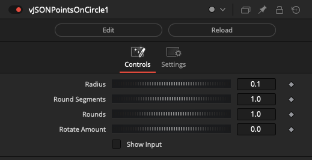

Example Node Connections:

    vJSONPointsOnCircle.Output -> vJSONCameraProjection.ArrayA
    vJSONCameraProjection.Output -> vJSONShapeRender.JSONPoint
    Background.Output -> vJSONShapeRender.Input

### vJSONPointsOnCube

Generate points on cube

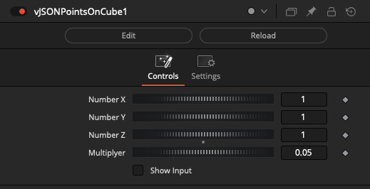

Example Node Connections:

    vJSONPointsOnCube.Output -> vJSONCameraProjection.ArrayA
    vJSONCameraProjection.Output -> vJSONShapeRender.JSONPoint
    Background.Output -> vJSONShapeRender.Input

### vJSONPointsOnGrid

Generate point on Array Grid

Example Node Connections:

    vJSONPointsOnGrid.Output -> vJSONCameraProjection.ArrayA
    vJSONCameraProjection.Output -> vJSONShapeRender.JSONPoint
    Background.Output -> vJSONShapeRender.Input

### vJSONPointsOnRectangle

Generate points on Rectangle

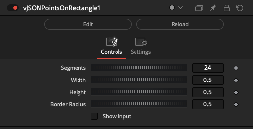

Example Node Connections:

    vJSONPointsOnRectangle.Output -> vJSONCameraProjection.ArrayA
    vJSONCameraProjection.Output -> vJSONShapeRender.JSONPoint
    Background.Output -> vJSONShapeRender.Input

### vJSONPointsOnSphere

Generate points on Sphere

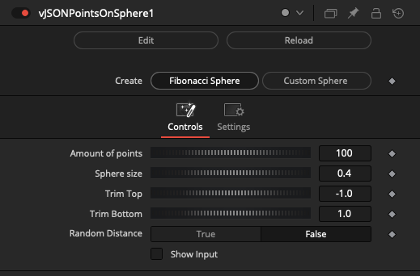

Example Node Connections:

    vJSONPointsOnSphere.Output -> vJSONCameraProjection.ArrayA
    vJSONCameraProjection.Output -> vJSONShapeRender.JSONPoint
    Background.Output -> vJSONShapeRender.Input

### vJSONToXYZ

Convert a JSON Array into XYZ ASCII Text

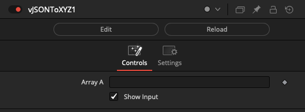

Example Node Connections:

    vJSONFromXYZ.Points -> vJSONToXYZ.ArrayA
    vJSONToXYZ.Output -> vTextToFile.Input

### vJSONLogicBetween

Logic Between Operations on an Array

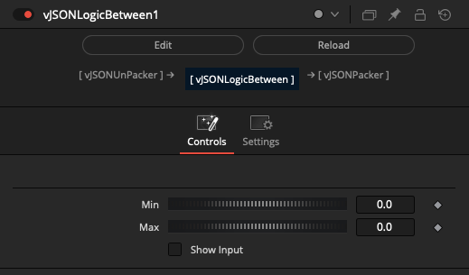

Example Node Connections:

    vJSONUnPacker.OutputArray -> vJSONLogicBetween.ArrayA 
    vJSONLogicBetween.Output -> vJSONSortByDistance.Array
    ArraySortByDistance.Output -> vJSONPacker.ArrayA
    vJSONPacker.Output -> vJSONViewer.Text

### vJSONBoundingBox

Calculate a 3D, 2D, or 1D bounding box volume from a JSON array of XYZ/XY/X points

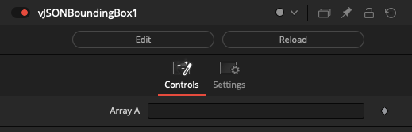

Example Node Connections:

    vJSONFromOBJ.Points -> vJSONBoundingBox.ArrayA
    vJSONBoundingBox.Points -> vJSONCameraProjection.ArrayA
    vJSONCameraProjection.Output -> vJSONShapeRender.JSONPoint
    vJSONBoundingBox.Edges -> vJSONShapeRender.JSONEdge
    Background.Output -> vJSONShapeRender.Input

### vJSONCameraProjection

Transforms arrays using a perspective projection matrix

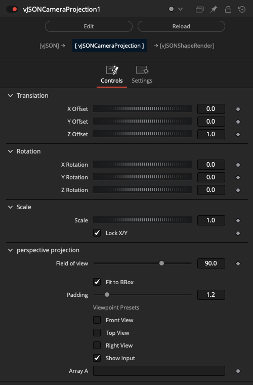

Example Node Connections:

    vJSONFromXYZ.Points -> vJSONCameraProjection.ArrayA
    vJSONCameraProjection.Output -> vJSONShapeRender.JSONPoint
    Background.Output -> vJSONShapeRender.Input

### vJSONConvert2D-3D

Convert 2D array to 3D array

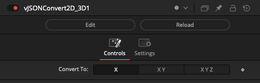

Example Node Connections:

    vJSONCameraProjection.Output -> vJSONConvert2D_3D.ArrayA
    vJSONConvert2D_3D.Output -> vJSONShapeRender.JSONPoint
    Background.Output -> vJSONShapeRender.Input

### vJSONDisplaceValues

Displace XYZ positions using noise with spherical falloff

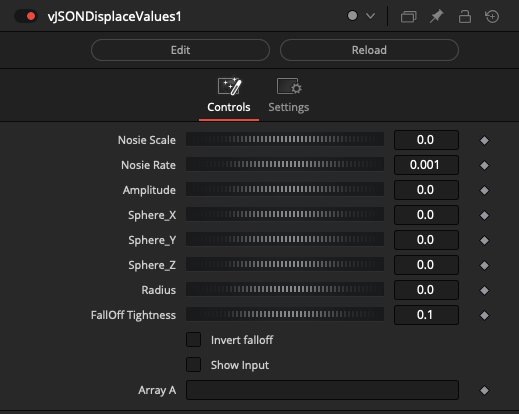

Example Node Connections:

    vJSONCircularPoints.Output -> vJSONDisplaceValues.ArrayA
    vJSONDisplaceValues.Output -> vJSONCameraProjection.ArrayA
    vJSONCameraProjection.Output -> vJSONShapeRender.JSONPoint
    Background.Output -> vJSONShapeRender.Input

### vJSONInterpolate

Interpolate between corresponding values in two arrays

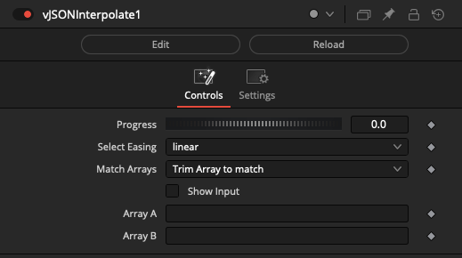

Select Easing options include:

- linear
- easeInQuad
- easeOutQuad
- easeInOutQuad
- easeInExpo
- easeOutExpo
- easeInOutExpo

Match Array options include:
- Trim Array to match
- Add Zeros to match

Example Node Connections:

    vJSONCircularPoints1.Output -> vJSONInterpolate.ArrayA
    vJSONCircularPoints2.Output -> vJSONInterpolate.ArrayB
    vJSONInterpolate.Output -> vJSONViewer.Text

### vJSONArrayIterator

Loop an array

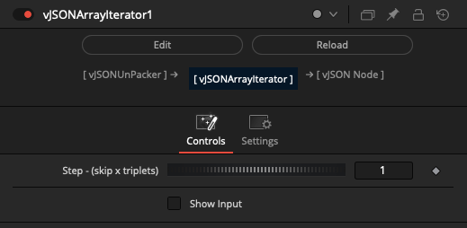

Example Node Connections:

    vJSONUnPacker.OutputArray -> vJSONIterator.ArrayA 
    vJSONIterator.Output -> vJSONPacker.ArrayA
    vJSONPacker.Output -> vJSONViewer.Text

### vJSONMapRange

Apply range mapping operations to an array

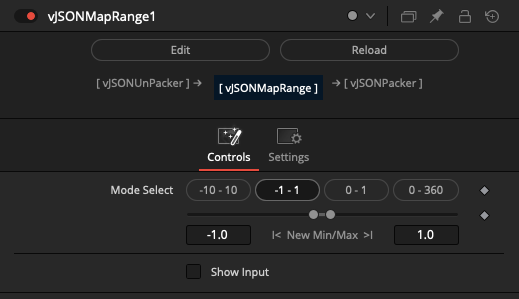

Example Node Connections:

    vJSONUnPacker.OutputArray -> vJSONMapRange.ArrayA 
    vJSONMapRange.Output -> vJSONPacker.ArrayA
    vJSONPacker.Output -> vJSONViewer.Text

### vJSONMath

Apply mathematical operations to an array

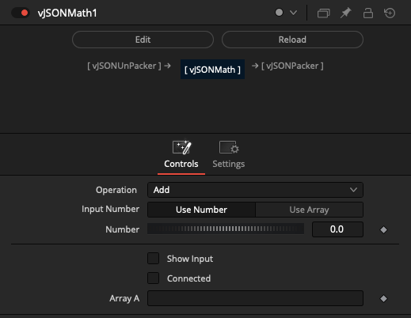

Tip: If you want to apply math operations to arrays of XY or XYZ value pairs, the vJSONUnPacker node will extract all the values into a single linear sequence of numbers. You can then use the vJSONMath node to modify the values. Then a vJSONPacker node can remux the linear sequence of numbers back into XY or XYZ value pairs.

Example Node Connections:

    vJSONGenerateSpirals.Output -> vJSONUnPacker.ArrayB
    vJSONUnPacker.OutputArray -> vJSONMath.ArrayA 
    vJSONMath.Output -> vJSONPacker.ArrayA
    vJSONPacker.Output -> vJSONViewer.Text

The following math operations are supported:

- Subtract A-B
- Multiply
- Divide A/B
- Min
- Max
- Average
- Difference
- Modulo A/B
- Power A^B
- Arc Tangent A/B
- Sine
- Cosine
- Tangent
- Arc Sine
- Arc Cosine
- Arc Tangent
- Log
- Log 10
- Exponential
- Degrees to Radians
- Radians to Degrees
- Absolute Value
- Ceiling
- Floor
- Square Root
- Reciprocal
- Negate
- Random
- Randomseed

### vJSONPacker

Pack an array into a new array

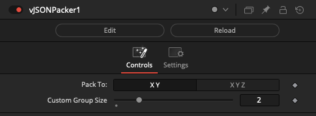

Example Node Connections:

    vJSONPointsOnCircle.Output -> vJSONUnPacker.ArrayB
    vJSONUnPacker.OutputArray -> vJSONSin.ArrayA 
    vJSONSin.Output -> vJSONPacker.ArrayA
    vJSONPacker.Output -> vJSONCameraProjection.ArrayA
    vJSONCameraProjection.Output -> vJSONShapeRender.JSONPoint
    Background.Output -> vJSONShapeRender.Input

### vJSONParallelPointsOffSet

Offset the parallel points in an array

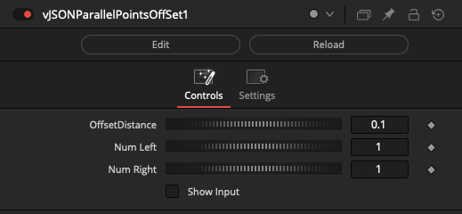

### vJSONPerlin3Noise

Perlin Noise function on array values

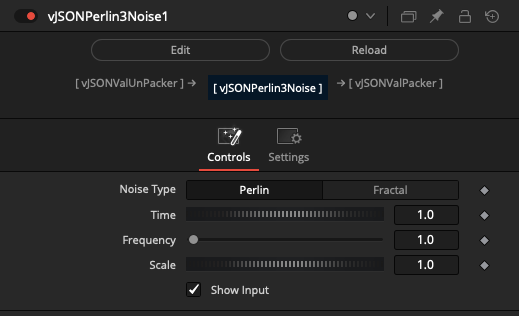

Example Node Connections:

    vJSONCircularPoints.Output->  vJSONUnPacker.ArrayA
    vJSONUnPacker.OutputArray -> vJSONPerlin3Noise.Input
    vJSONPerlin3Noise.Array ->  vJSONPacker.ArrayA
    vJSONPacker.Output -> vJSONCameraProjection.ArrayA
    vJSONCameraProjection.Output -> vJSONShapeRender.JSONPoint
    Background.Output -> vJSONShapeRender.Input

### vJSONPointsConnect

Connect points in an array

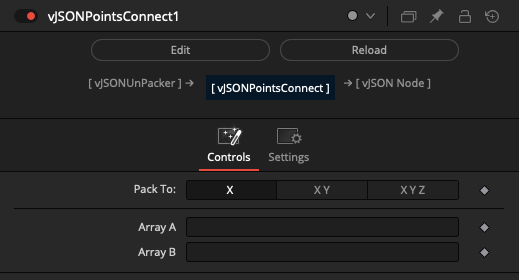

Example Node Connections:

    vJSONLissajouseSpline1.Output->  vJSONUnPacker1.ArrayA
    vJSONLissajouseSpline2.Output->  vJSONUnPacker2.ArrayA
    vJSONUnPacker1.OutputArray -> vJSONPointsConnect.ArrayA
    vJSONUnPacker2.OutputArray -> vJSONPointsConnect.ArrayB
    vJSONPointsConnect.Output -> vJSONCameraProjection.ArrayA
    vJSONCameraProjection.Output -> vJSONShapeRender.JSONPoint
    Background.Output -> vJSONShapeRender.Input

### vJSONPointsOnArc

Generate points on an arc

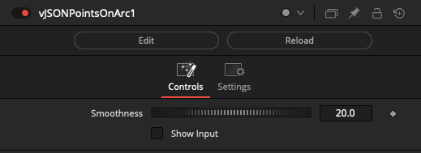

Example Node Connections:

    vJSONCreateMinMax.Output -> vJSONPointsOnArc.ArrayA
    vJSONPointsOnArc.Output -> vJSONCameraProjection.ArrayA
    vJSONCameraProjection.Output -> vJSONShapeRender.JSONPoint
    Background.Output -> vJSONShapeRender.Input

### vJSONRotateValues

Rotate an array indexes and values

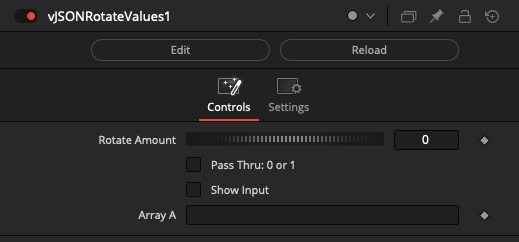

Example Node Connections:

    vJSONPointsHexagonGrid.Output -> vJSONRotateValues.ArrayA
    vJSONRotateValues.Output -> vJSONCameraProjection.ArrayA
    vJSONCameraProjection.Output -> vJSONShapeRender.JSONPoint
    Background.Output -> vJSONShapeRender.Input

### vJSONSin

Math Sin - Cos Operations on an Array

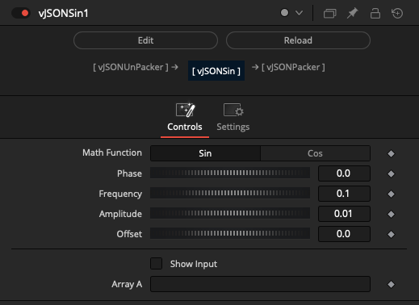

Example Node Connections:

    vJSONPointsOnCircle.Output -> vJSONUnPacker.ArrayB
    vJSONUnPacker.OutputArray -> vJSONSin.ArrayA 
    vJSONSin.Output -> vJSONPacker.ArrayA
    vJSONPacker.Output -> vJSONCameraProjection.ArrayA
    vJSONCameraProjection.Output -> vJSONShapeRender.JSONPoint
    Background.Output -> vJSONShapeRender.Input

### vJSONSortByDistance

Sort array by point distance

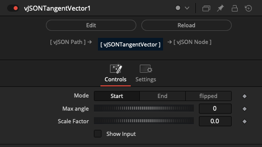

Example Node Connections:

    vJSONUnPacker.OutputArray -> vJSONLogicBetween.ArrayA 
    vJSONLogicBetween.Output -> vJSONSortByDistance.Array
    ArraySortByDistance.Output -> vJSONPacker.ArrayA
    vJSONPacker.Output -> vJSONViewer.Text

### vJSONTangentVector

Create a vector that is tangent to a curve or surface at a given point

### vJSONTextWrap

Text wrap Operations on a JSON

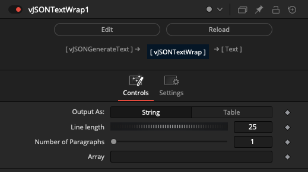

### vJSONTranslate

Creates a vector from an array

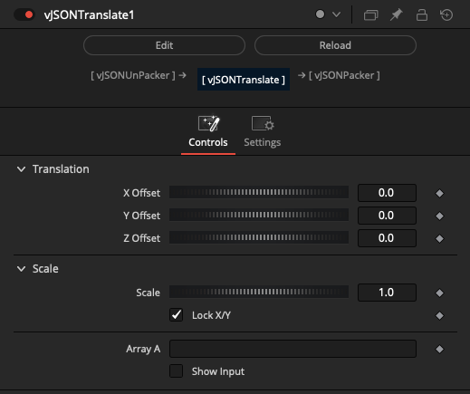

### vJSONUnPacker

Unpack Operations on an Array

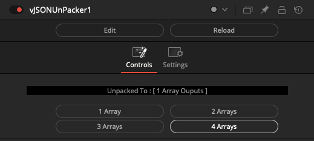

### vJSONWave

Animates an Array

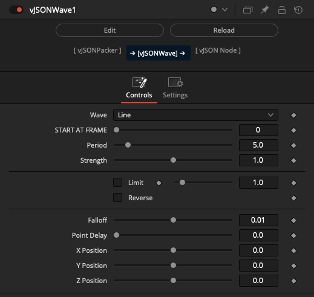

Wave options include:

- Line
- Saw
- Tri
- Square
- Sine
- Noise

### vJSONShapeRender

Create a polygon dot shapes from a JSON based Lua table of XY point pairs

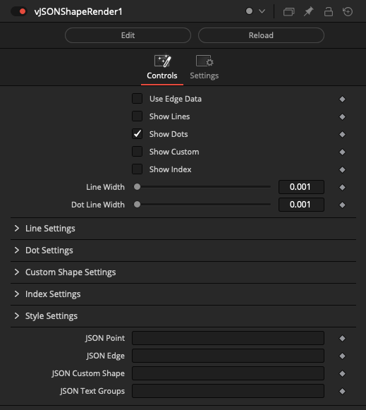

### vJSONShapeRenderTextPath

Using Text and Strings on Array based Lua table of XY points path

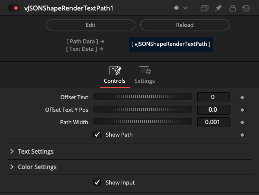

### vJSONCustom2DShapes

Dynamically create 2D Shape elements

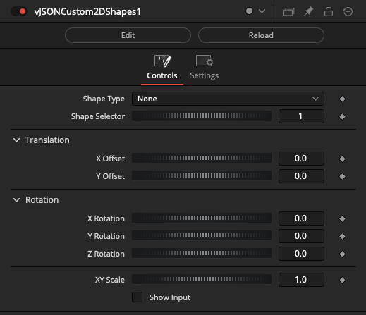

### vJSONCustom3DShapes

Dynamically create Shape elements

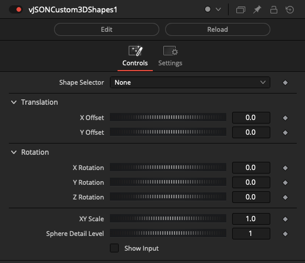

### vJSONShapeText

Example, using Text and Strings

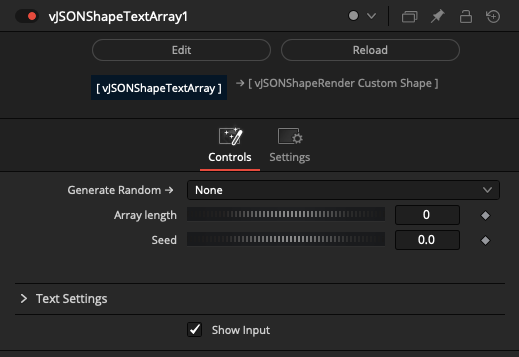

### vJSONTangentVectorItem

Create a vector that is tangent to a curve or surface at a given point

### vJSONAppend

Append Array to an array

### vJSONAppendGroup

Append Array Groups to an array

### vJSONInfo

Returns info of an array

### vJSONMerge

Dynamically join JSON elements into one table

### vJSONReducePoints

Reduce points Operations on an Array

Decimation Method options include:

- Grid-Based
- Random Sampling
- Curvature-Based (SLOW)

### vJSONSlicer

Trimming the start and end of single or multi-dimensional arrays

