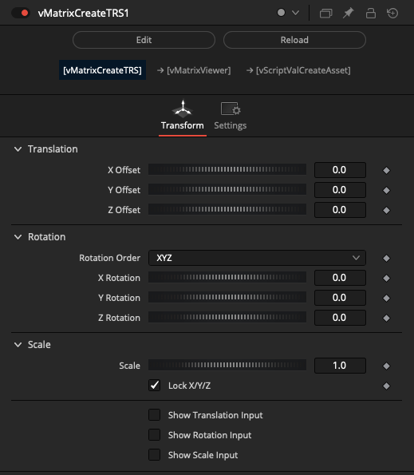
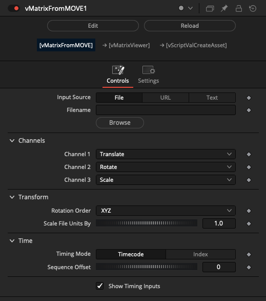
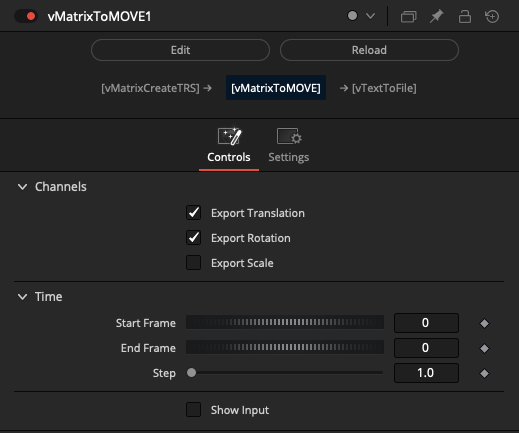

# Matrix Nodes

## Node Listing

Create:

- vMatrixCreateTRS

IO:

- vMatrixFromMOVE
- vMatrixToMOVE

## Node Docs

### Create

#### vMatrixCreateTRS

Creates a 4x4 matrix using traditional XYZ translation, rotation, and scale controls

Example Node Connections:

    vMatrixCreateTRS.Output -> vScriptValLocatorAsset.Matrix
    vScriptValLocatorAsset.Output -> vScriptValMergeAsset.ScriptVal
    vScriptValMergeAsset.Output -> vScriptValRenderAsset.vGeometry
    Background.Output -> vScriptValRenderAsset.Input

### IO

#### vMatrixFromMOVE

Import translation matrix content from the Maya MOVE ASCII format

Example Node Connections:

    vTextCreateMultilineCode.Output -> vMatrixFromMOVE.Input
    vMatrixFromMOVE.Output -> vMatrixViewer.Matrix1

#### vMatrixToMOVE

Export translation matrix content to the Maya MOVE ASCII format

Example Node Connections:

    vMatrixCreateTRS.Output -> vMatrixToMOVE.Input
    vMatrixToMOVE.Output -> vTextViewer.Input
    vTextViewer.Input -> vTextToFile.Input
