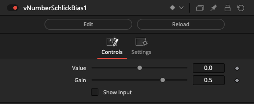
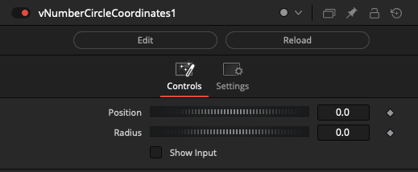
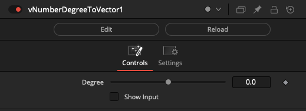
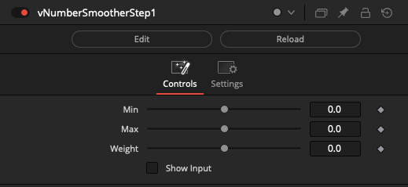
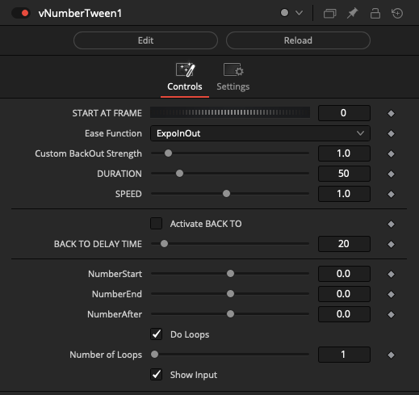
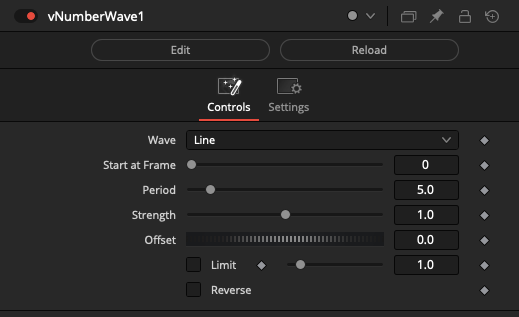

# Number Nodes

## Node Listing

Modify:

- vNumberSchlickBias

Trigonometry:

- vNumberCircleCoordinates
- vNumberDegreeToVector

Utility:

- vNumberMaterialEasing
- vNumberSmootherStep
- vNumberTween
- vNumberWave

## Node Docs

### Modify

#### vNumberSchlickBias

Custom easing curve via schlick bias and gain

Example Node Connections:

    vNumberSchlickBias.Output -> vJSONInterpolate.Progress

### Trigonometry

#### vNumberCircleCoordinates

Calculates a vector (x and y) coordinates of a circle

Example Node Connections:

    vNumberCircleCoordinates.Output -> vJSONConvert2D_3D1.ArrayA
    vJSONConvert2D_3D1.Output -> vJSONCameraProjection1.ArrayA
    vJSONCameraProjection1.Output -> vJSONShapeRender.JSONPoint
    Background.Output -> vJSONShapeRender.Input

#### vNumberDegreeToVector

Calculates a vector (x and y) based on an angle in degrees

Example Node Connections:

    vNumberCompCurrentTime.Output -> vNumberDegreeToVector.Degree
    vNumberDegreeToVector.Output -> vJSONViewer.Text

### Utility

#### vNumberSmootherStep

Performs a interpolate smoothly between two input values, ensuring smooth acceleration and deceleration

Example Node Connections:

    vNumberSmootherStep.Output -> vNumberDegreeToVector.Degree
    vNumberDegreeToVector.Output -> vJSONViewer.Text

#### vNumberTween

Tween numbers

Example Node Connections:

    NumberCreate1.Output -> vNumberTween.NumberStart
    NumberCreate1.Output -> vNumberTween.NumberEnd
    vNumberTween.Number -> vNumberViewer.Number1

#### vNumberWave

Creates a Delay while passing a Fusion Number object

    vNumberWave.Number -> vNumberViewer.Number1
