# ScriptVal Nodes

## Node Listing

Create:

- vScriptValBuffer
- vScriptValCircularPoints
- vScriptValCreateAsset
- vScriptValCreateJSONFont
- vScriptValCreateList
- vScriptValCreateMinMax
- vScriptValCreateRandom
- vScriptValCreateTextFont
- vScriptValFromAudio
- vScriptValFromOBJ
- vScriptValFromXYZ
- vScriptValGenerateSphere
- vScriptValGenerateSpirals
- vScriptValGenerateText
- vScriptValLissajouseSpline
- vScriptValLocatorAsset
- vScriptValLogarithmicSpiral
- vScriptValMapGeoJSON
- vScriptValPhyllotaxis
- vScriptValPointParticles
- vScriptValPointsHexagonGrid
- vScriptValPointsOnCircle
- vScriptValPointsOnCube
- vScriptValPointsOnGrid
- vScriptValPointsOnRectangle
- vScriptValPointsOnSphere
- vScriptValToOBJ
- vScriptValToXYZ

Logic:

- vScriptValLogicBetween

Modify:

- vScriptValArrayIterator
- vScriptValBoundingBox
- vScriptValCameraProjection
- vScriptValConvert2D-3D
- vScriptValDisplaceValues
- vScriptValInterpolate
- vScriptValMapRange
- vScriptValMath
- vScriptValPacker
- vScriptValParallelPointsOffSet
- vScriptValPerlin3Noise
- vScriptValPointsConnect
- vScriptValPointsOnArc
- vScriptValRotateValues
- vScriptValSin
- vScriptValSortByDistance
- vScriptValTangentVector
- vScriptValTextWrap
- vScriptValTranslate
- vScriptValUnPacker
- vScriptValWave

ShapeRender:

- vScriptValRenderAsset
- vScriptValRenderAssetSVG
- vScriptValShapeRender
- vScriptValShapeRenderTextPath
- vScriptValWireframeRender
- vScriptValWireframeRenderSVG

Shapes:

- vScriptValCustom2DShapes
- vScriptValCustom3DShapes
- vScriptValShapeText
- vScriptValTangentVectorItem

Utility:

- vScriptValAppend
- vScriptValAppendGroup
- vScriptValInfo
- vScriptValMergeAsset
- vScriptValMergeOBJ
- vScriptValReducePoints
- vScriptValSlicer

## Node Docs

### vScriptValBuffer

FIFO (first in first out) in an array

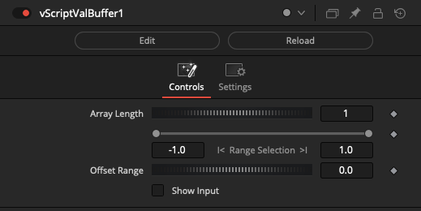

### vScriptValCircularPoints

Distributes points in circular form

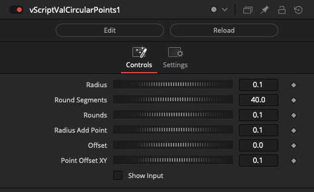

### vScriptValCreateAsset

Create a ScriptVal based 3D asset from Edge, Point, and vMatrix data

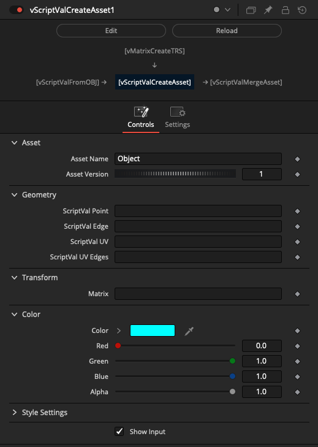

### vScriptValCreateJSONFont

Generates a JSON array-based font

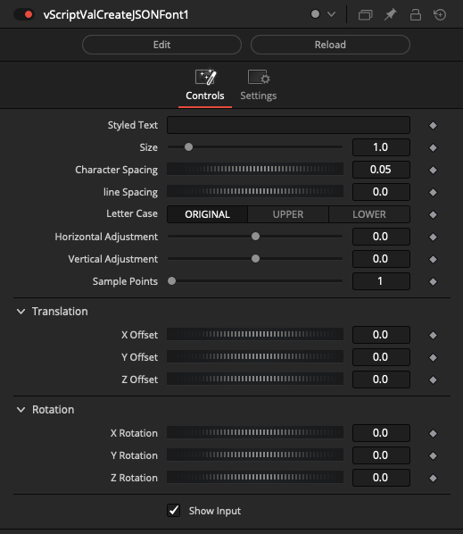

### vScriptValCreateList

Create an array by entering each value manually

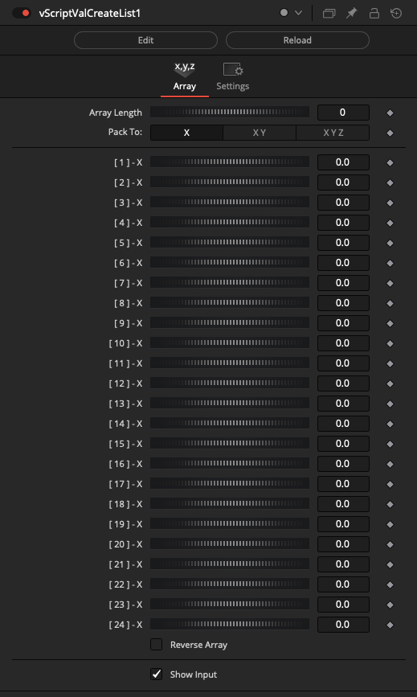

### vScriptValCreateMinMax

Creates Array based on Max/Min operations

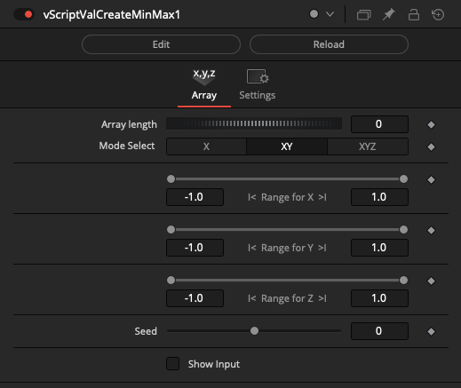

### vScriptValCreateRandom

Creates a random JSON Array

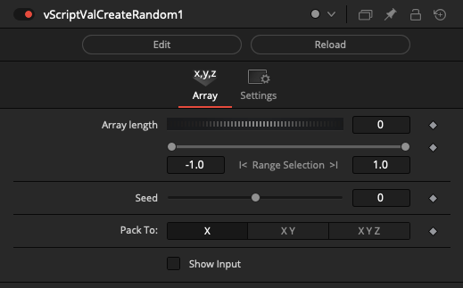

### vScriptValCreateTextFont

Creates Text Font

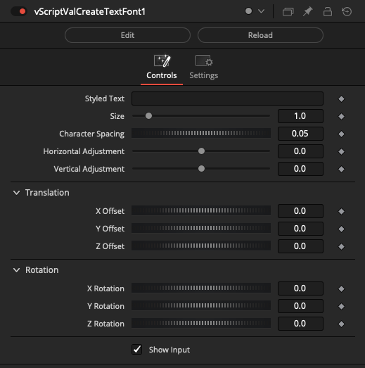

### vScriptValFromAudio

Convert .wav audio data into a ScriptVal

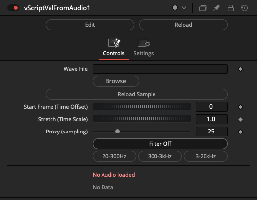

### vScriptValFromOBJ

Convert Wavefront OBJ mesh data into a ScriptVal

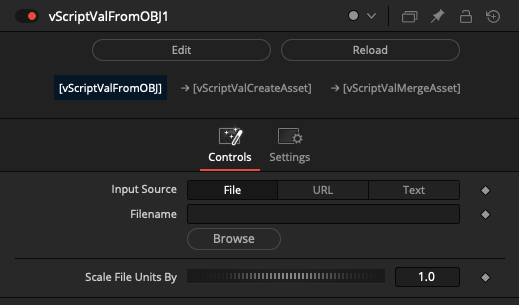

### vScriptValFromXYZ

Convert ASCII XYZ point cloud data into a ScriptVal

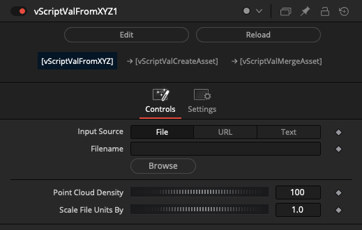

### vScriptValGenerateSphere

Generates a Sphere with longitude/latitude lines

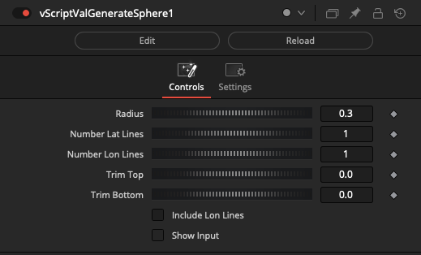

### vScriptValGenerateSpirals

Generate Spiral splines

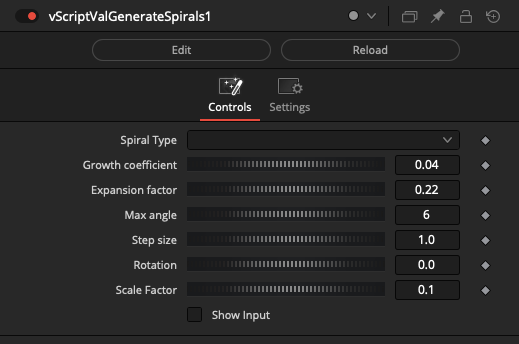

### vScriptValGenerateText

Example, generating random Text and Strings

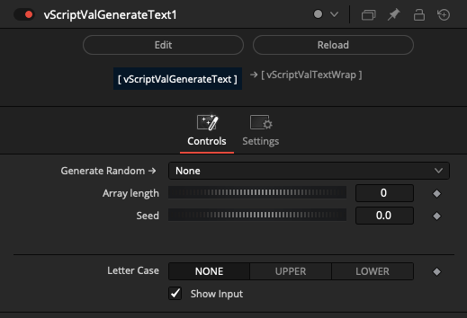

### vScriptValLissajouseSpline

Generate a Lissajouse spline

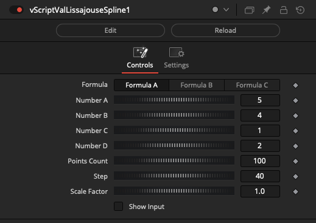

### vScriptValLocatorAsset

Create a ScriptVal based 3D locator cursor asset

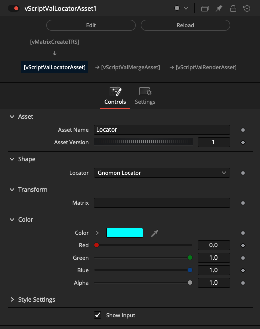

### vScriptValLogarithmicSpiral

Generate a Logarithmic Spiral spline

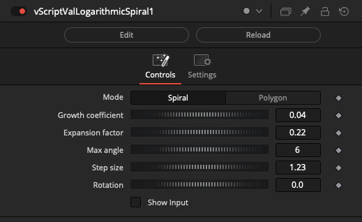

### vScriptValMapGeoJSON

Map from geographic coordinates

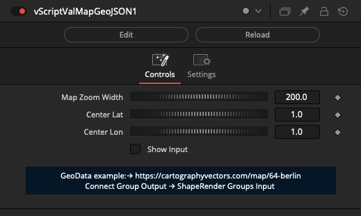

### vScriptValPhyllotaxis

Generate points on Phyllotaxis

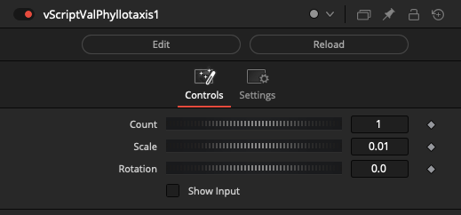

### vScriptValPointParticles

Simple particle generator

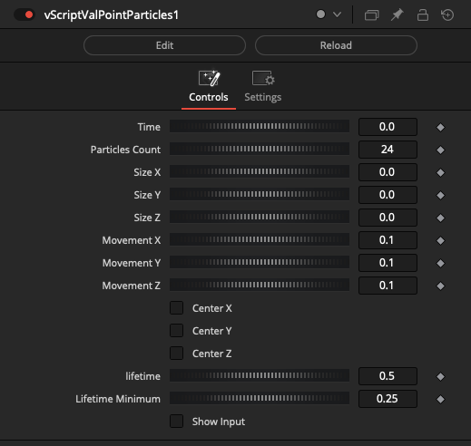

### vScriptValPointsHexagonGrid

Generate points on Hexagon Grid

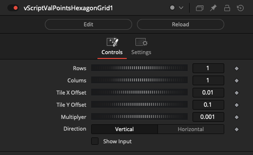

### vScriptValPointsOnCircle

Generate points on a cricle

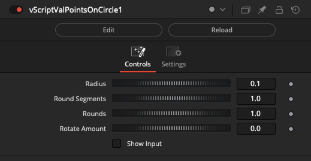

### vScriptValPointsOnCube

Generate points on cube

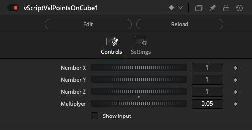

### vScriptValPointsOnGrid

Generate point on Array Grid

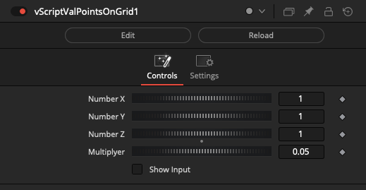

### vScriptValPointsOnRectangle

Generate points on Rectangle

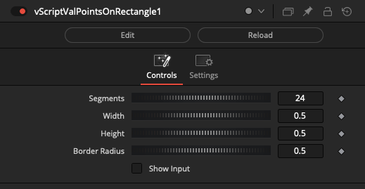

### vScriptValPointsOnSphere

Generate points on Sphere

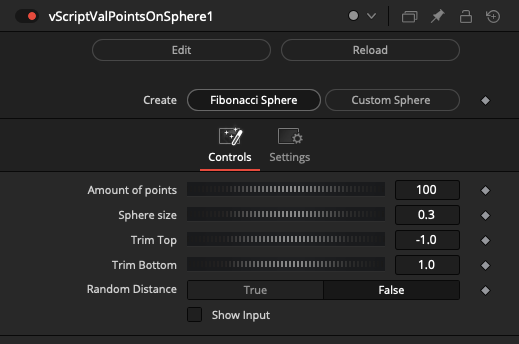

### vScriptValToOBJ

Convert a Fusion ScriptVal object into Wavefront OBJ ASCII Text

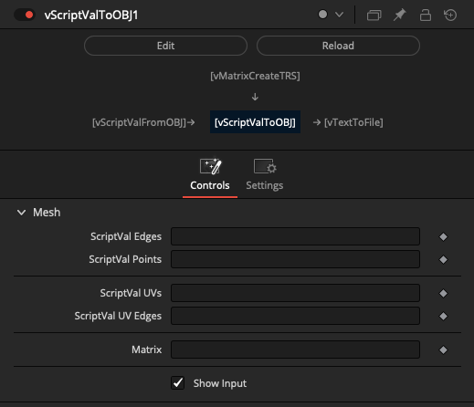

### vScriptValToXYZ

Convert a Fusion ScriptVal object into XYZ ASCII Text

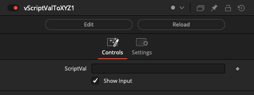

### vScriptValLogicBetween

Logic Between Operations on an Array

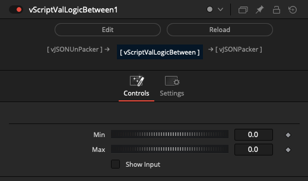

### vScriptValArrayIterator

Loop an array

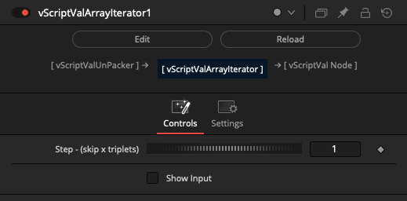

### vScriptValBoundingBox

Calculate a 3D, 2D, or 1D bounding box volume from a ScriptVal object of XYZ/XY/X points

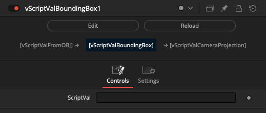

### vScriptValCameraProjection

Transforms ScriptVals using a perspective projection matrix

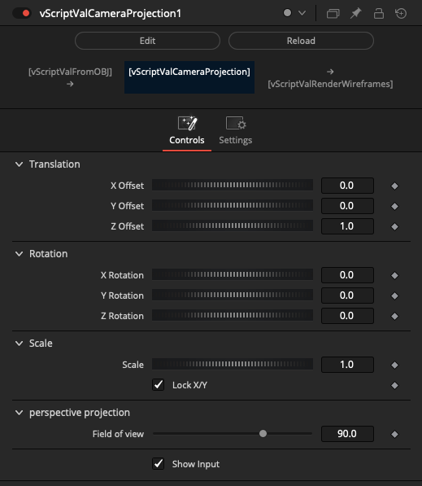

### vScriptValConvert2D-3D

Convert 2D array to 3D array

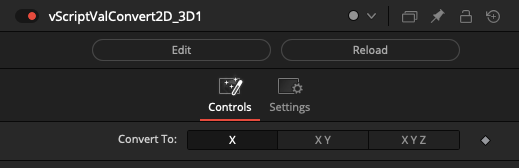

### vScriptValDisplaceValues

Displace XYZ positions using noise with spherical falloff.

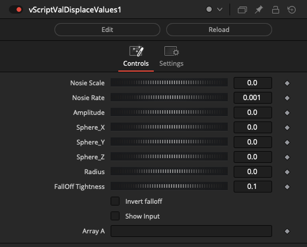

### vScriptValInterpolate

Interpolate between corresponding values in two arrays

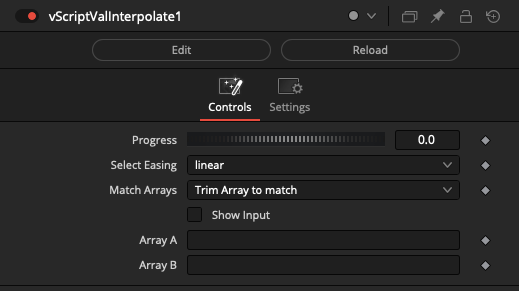

### vScriptValMapRange

Apply range mapping operations to an array

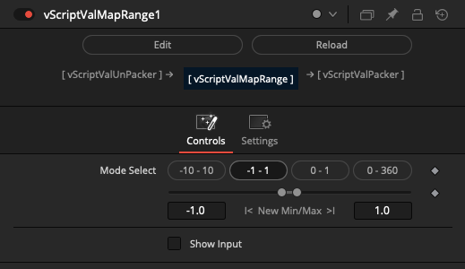

### vScriptValMath

Math Operations on a ScriptVal

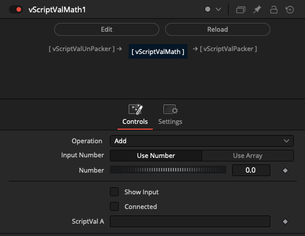

### vScriptValPacker

Pack Operations on a ScriptVal

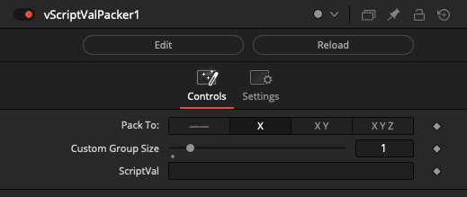

### vScriptValParallelPointsOffSet

Offset the parallel points in an array

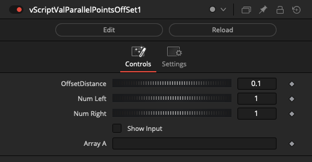

### vScriptValPerlin3Noise

Perlin Noise function on array values

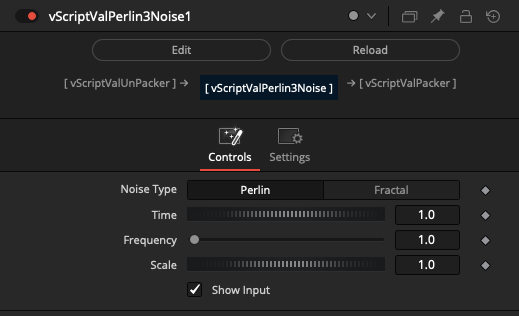

### vScriptValPointsConnect

Connect points in an array

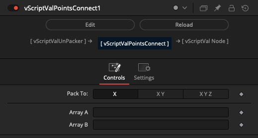

### vScriptValPointsOnArc

Generate points on an arc

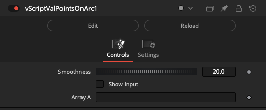

### vScriptValRotateValues

Rotate ScriptVals Between Operations on a ScriptVal Object

### vScriptValSin

Math Sin - Cos Operations on an Array

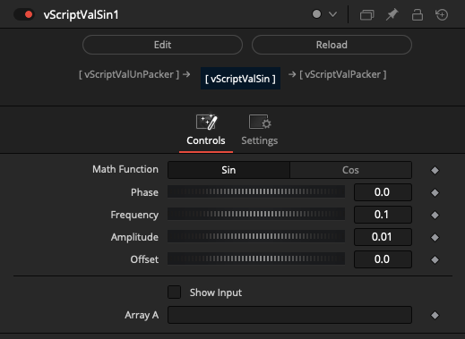

### vScriptValSortByDistance

Sort array by point distance

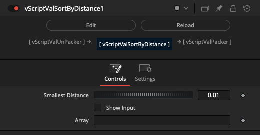

### vScriptValTangentVector

Create a vector that is tangent to a curve or surface at a given point

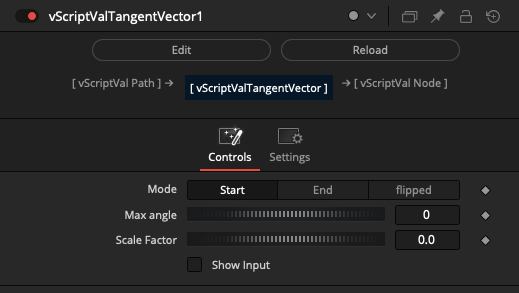

### vScriptValTextWrap

Text wrap Operations on a ScriptVal

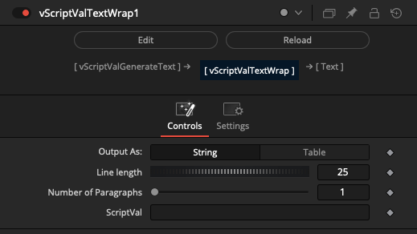

### vScriptValTranslate

Transforms a array positions

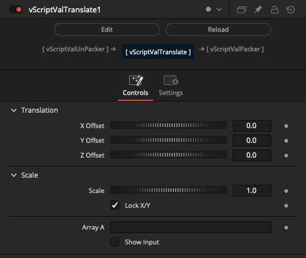

### vScriptValUnPacker

Unpack Operations on a ScriptVal object

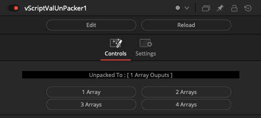

### vScriptValWave

Animates an Array

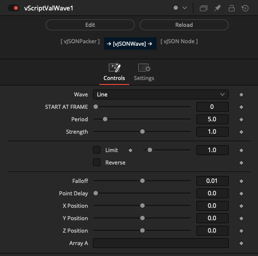

### vScriptValRenderAsset

Render 3D wireframe from a ScriptVal Lua table of vGeometry mesh data

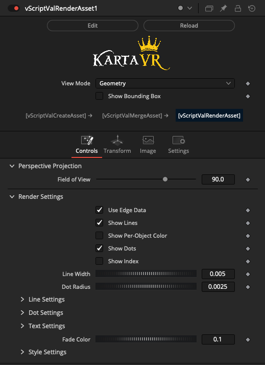

### vScriptValRenderAssetSVG

Export an SVG wireframe from a ScriptVal Lua table of vGeometry mesh data

### vScriptValShapeRender

Create a polygon dot shapes from a ScriptVal based Lua table of XY point pairs

### vScriptValShapeRenderTextPath

Using Text and Strings on Array based Lua table of XY points path

### vScriptValWireframeRender

Create a polygon wireframe shapes from a ScriptVal based Lua table of XY point pairs, and a ScriptVal Lua table of edge index values

### vScriptValWireframeRenderSVG

Export an SVG wireframe from an array of XY point pairs, and an array of edge index values

### vScriptValCustom2DShapes

Dynamically create 2D Shape elements

### vScriptValCustom3DShapes

Dynamically create Shape elements

### vScriptValShapeText

Example, using Text and Strings

### vScriptValTangentVectorItem

Create a vector that is tangent to a curve or surface at a given point

### vScriptValAppend

Append Array to an array

### vScriptValAppendGroup

Append Array Groups to an array

### vScriptValInfo

Returns info of an array

### vScriptValMergeAsset

Dynamically join ScriptVal Asset elements into one table

### vScriptValMergeOBJ

Merge Wavefront OBJ geometry with edge and point ScriptVal Arrays

### vScriptValReducePoints

Reduce points Operations on a ScriptVal

### vScriptValSlicer

Trim the start and end of single or multi-dimensional arrays

