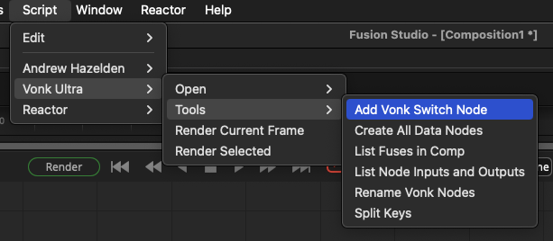
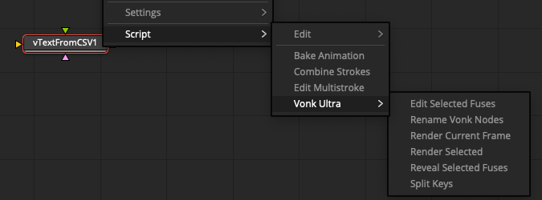

# Vonk Scripts

## Comp Scripts Menu

Menu Items:

- Render Current Frame
- Render Selected

### Open

- Show Comps Folder
- Show Docs Local
- Show Docs Online
- Show Fuses Folder
- Show Lua Modules Folder
- Show Macros Folder
- Show Temp Folder

### Tools

- Add Vonk Switch Node
- Create All Data Nodes
- List Fuses in Comp
- List Node Inputs and Outputs
- Rename Vonk Nodes
- Split Keys

## Tool Scripts Menu

Menu Items:

- Edit Selected Fuses
- Rename Vonk Nodes
- Render Current Frame
- Render Selected
- Reveal Selected Fuses
- Split Keys

